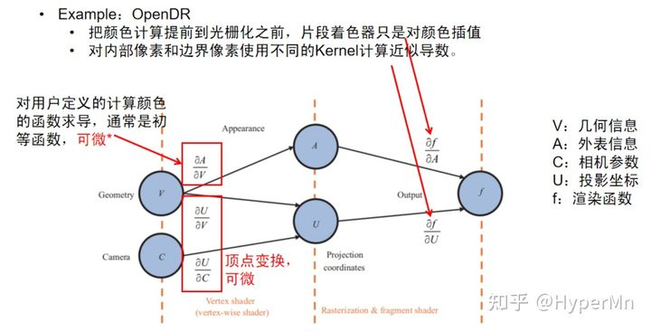
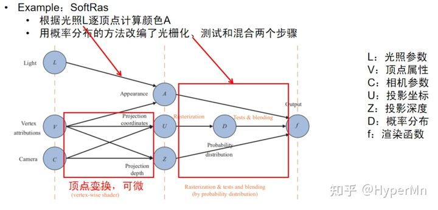

# 三维重建相关的图形学知识补充
## Content
- 可微渲染
- 神经渲染
- 体渲染

 

------
## 可微渲染
<b>解决逆渲染问题，并可以把前向渲染集成到概率推理、机器学习等更大的优化模型中</b>  
可优化、调整各种场景参数  

<a href = "https://zhuanlan.zhihu.com/p/632637886">一文快速了解可微渲染与神经渲染</a>   
对于传统光栅化渲染管线：
- 顶点着色器：对顶点进行各类操作，包括平移、缩放、旋转和投影，本质上都是矩阵乘法，均是线性操作，所以天然可微。
- 图元装配：把顶点装配成不同的几何结构（三角形、线段等）
- 几何着色器：可选阶段，一般用于产生新图元或做LOD操作。
- 光栅化：通过将几何图元（如线段、三角形）映射到像素网格，对每个像素的采样和插值来确定像素的颜色。由于这是一个离散的过程，光栅化步骤不是在连续的参数空间上操作，因此 <b>不可微</b>。
- 片段着色器：首先找到片段所在的三角形并计算片段中心的重心坐标, 通过重心插值把顶点的属性赋给每个片段。对许多常用模型来说都是可微的，但也 <b>可能会包含不可微的部分</b>。
- 测试与混合操作，包括深度测试、模板测试和颜色混合等。这些操作都是非线性操作，求导很困难，因此通常被认为是 <b>不可微</b>的。 

### OpenDR 基于局部光照模型
  

OpenDR提出了一种对渲染过程求近似导数的方法，限定了计算颜色的过程，要求颜色逐顶点确定的，顶点的颜色在光栅化之前已经计算完成。之后片段着色器只是对顶点颜色进行插值得到片段的颜色  
由于 OpenDR 对顶点颜色进行插值得到片段的颜色，所以像素对顶点颜色的导数就是该像素对应的可见片段在其三角形的重心坐标，只需在正向过程中保存每个片段的重心坐标以及每个像素对应的可见片段即可  
深度测试上，OpenDR根据像素跟遮挡边界的关系，把像素分为了内部像素和边界像素。对于不同种类的像素使用了不同的滤波核进行滤波操作来求得近似导数

### SoftRas 基于局部光照模型
  

和OpenDR类似，SoftRas也是通过逐顶点光照和顶点变换保证左边的几组偏导数可微  
SoftRas使用概率分布的方法改编了光栅化、测试与混合这两个步骤。也就是说传统的深度测试、光栅化这种非0即1的操作，都变成了0到1之间按概率分布的值，从而保证了可微  

### 基于全局光照模型
路径追踪是基于GI的可微渲染方法的基础，基于GI的可微渲染所面临主要的难点：
- 需要对渲染方程（积分方程/路径积分）的解进行微分，而这些解和场景参数之间的关系可能是非常复杂的
- 需要处理非常多的梯度矩阵（可能10^12或更多），因为一张图片可能有几百万像素，而场景参数也可能会有百万级别的规模，矩阵数量已经多到已经不好存储的地步  

 

------
## 神经渲染
Siggraph2021Course中，对神经渲染的定义是：用于图像或视频生成的深度神经网络，允许显式或隐式地控制场景属性  

 

------
## 体渲染
体渲染：对光线进行追踪（ 从相机“发出光线” ），并对光线进行积分或累计以生成图像的方法；最初用在非刚性物体（如云彩）上  
定义光线 `r(t) = o + t·d`  

<a href = "https://blog.csdn.net/YuhsiHu/article/details/124318473">NeRF中的数学公式推导</a>  
