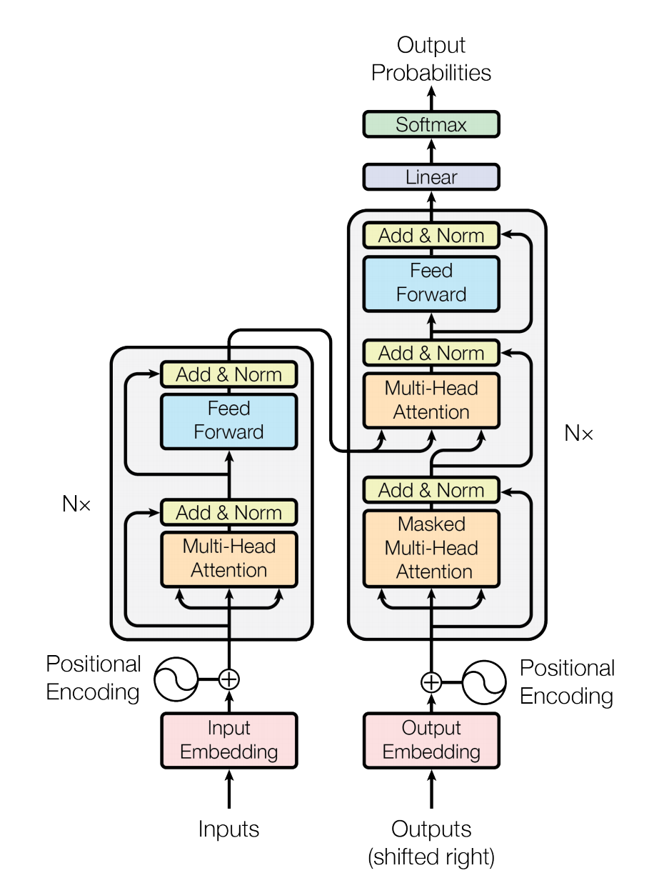
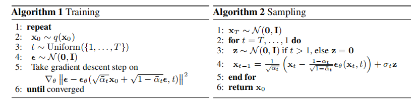
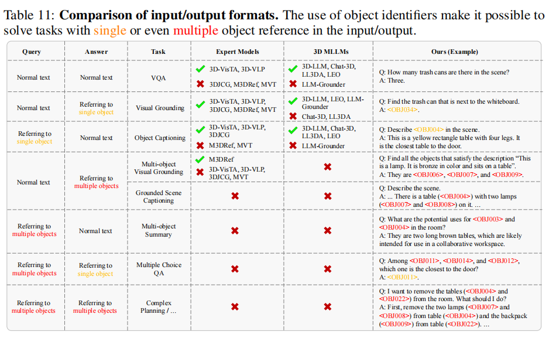
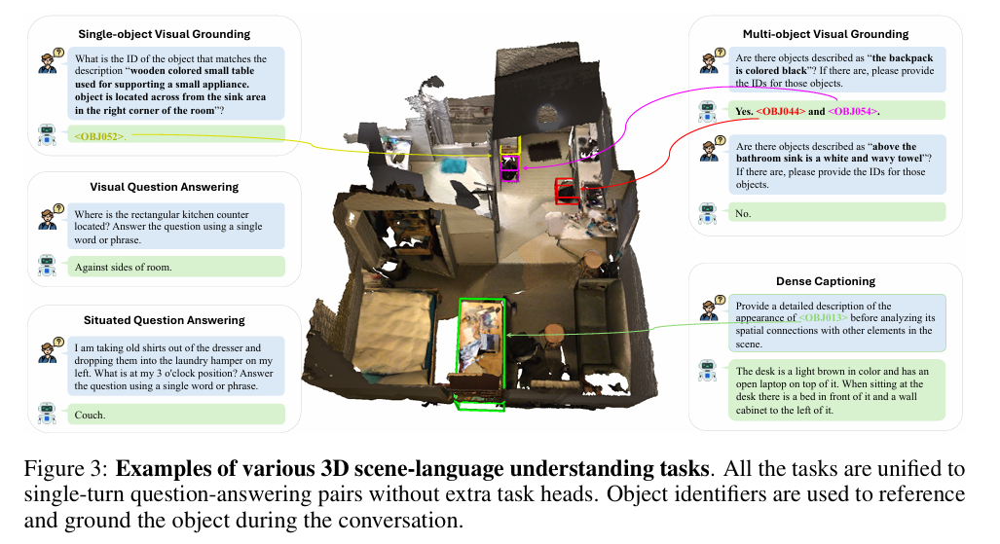

# Paper Reading Record
## Content
- Machine Learning Arch
- Visual-Language Pre-training
- 2D Semantic 
- 3D Graphics 几何
- 3D Semantic

[TOC]

------
# Machine Learning Arch
---
## （2017NeurIPS）Attention is all you need
keyword: Transformer；深度学习  

提出了一个**仅基于注意力机制**的simple的架构transformer，不依赖于递归或卷积  
<b>把传统 encoder-decoder 架构的递归循环层全部替换成了 multi-head self-attention</b>   

attention对整个模型所做的假设更少，导致需要更多的数据和更大的模型才能训练出来   

同样一个模型架构适用于不同的领域  
可以融合不同模态的数据（都用同一个架构抽取特征）  

### Background：
当前主流的序列转录模型依赖于CNN或RNN实现，包含一个encoder和一个decoder架构  

RNN依赖于前序隐藏状态的计算结果，难以并行  
RNN的历史信息一步一步向下传递；如果时序较长，早期时序信息可能会丢失（或者导致内存开销增大） 

注意机制对依赖关系进行建模，而不考虑它们在输入或输出序列中的距离（当前主要用于如何把编码器的信息有效地传给解码器） 

CNN对比较长的序列难以建模（每次卷积 “看一个小窗口”，两个信息在序列中距离较远时，需要经过比较多层的卷积才能联系起来）  
卷积的优势是 **“可以实现多个通道输出”**，可以认为每个输出通道对应识别不一样的模式  

<br>

### 问题：
1、如何保留RNN和CNN的良好性质同时解决RNN和CNN的问题（使用attention聚合序列信息）  
2、如何使用注意力层？（自注意力 & 在encoder和decoder间传递信息）  
3、如何传递序列信息？（通过 “encoder-decoder attention” 层）  
4、attention没有维护时序信息（引入position encoding）  
5、为什么采用自注意力？（相对于传统的卷积层和循环层）  

<br>

### 编码器 & 解码器
编码器把`(x1,..., xn)`序列映射成`(z1,...,zn)`，`zi`为元素`xi`的向量表示  
解码器根据编码器输出的`z`生成长度`m`的序列`(y1,...,ym)`  
对于解码器，元素是一个个生成的（过去的输出会作为输入，自回归auto-regressive）  
<br>

### 架构
   

编码器：  
每层有两个子层 Multi-head Attention + MLP + 子层间残差连接  
`LayerNormal(x + Sublayer(x))`
残差连接需要输入输出同样大小，为简单起见将每一个层的输出维度取为512  

LayerNorm：对batch中的每一个样本做normalization，而非对batch中的每一个特征  
对于处理序列的模型来说，输入一般是三维的（batch，样本seq(n)，样本元素特征feature）  
使用layernorm的原因：  
在时序序列模型中，每个样本的长度可能不同；若使用batchNorm，在batch中样本长度变化比较大时，均值和方差的结果抖动可能比较大  

解码器：  
解码器是自回归的（前序输出会作为输入）；由于注意力机制每次能看到完整的输入，采用带掩码的注意力机制（防止训练时看到后续输入）  
<br>

### Multi-head Self-attention
注意力函数：将一个query和一系列key-value映射到一个输出  
output是value的加权和（输出维度和value维度一样）  
由query和key的相似度计算出value的权重
*不同的相似函数对应不同的注意力机制*
$Attention=softmax({QK^T\over\sqrt{d_k}})*V$  
当$d_k$比较大时，点积结果值之间的相对差距可能比较大，导致最大值的softmax结果更加接近1，其他结果更加接近0，从而会导致梯度比较小；因此，对结果值除以$\sqrt{d_k}$  
时序mask：对第t时间的$q_t$，在做计算时只留下$k_1$至$k_{t-1}$对应的结果值是有效的，其他换成大负数（softmax结果为0）  

多头注意力：  
单纯的点积注意力机制没有什么可以学习的权重参数。多头注意力先将输入Q、K、V经过不同的并行线性层投影（投影的w是可以学习的），共h个线性层（对应h个头、h个输出），使得**在投影结果的度量空间中可以匹配不同的模式**；合并连接多个注意力结果并投影得到最终输出  

自注意力（用于encoder和decoder）：  
同样的输入复制为三份，既作为key、又作为value和query   
*把序列中的信息抓取出来，并作一次汇聚*，再分别输送给MLP映射到语义空间

"encoder-decoder attention" layers 连接encoder和decoder：  
encoder输出作为key和value，previous decoder layer的输出作为query；允许decoder中的每个位置都能关注输入序列中的所有位置    
<br>

### Position Encoding
<a href="https://blog.csdn.net/weixin_43406046/article/details/130745363">position encoding</a>  

在输入里加入时序信息（编码词所处的位置`i`）  
方法：采用 <b>周期不同的sin和cos函数</b>，映射成`d=512`维向量，与输入的词向量相加（编码没有集成到模型本身，通过注入字词的顺序来加强模型的输入）  
（对于不同句子，即使长度不同，相同距离的时间戳有相同的意义）  

$PE(pos, 2i)=sin(pos/10000^{2i/d_{model}})$   
$PE(pos, 2i+1)=cos(pos/10000^{2i/d_{model}})$  
对于任何偏移量`k`，$PE_{pos+k}$可以表示为$PE_{pos}$的线性函数（允许模型掌握相对位置）  

<br>

---
## （2020NeurIPS）Denoising Diffusion Probabilistic Models

keyword：2D图像生成；概率扩散模型  
- <a href = "https://www.bilibili.com/video/BV1b541197HX/?spm_id_from=333.999.0.0&vd_source=492be4af83531f552a324868c25aa005">Probabilistic Diffusion Model 概率扩散模型理论与完整PyTorch代码详细解读</a> 
- <a href = "https://lilianweng.github.io/posts/2021-07-11-diffusion-models/#forward-diffusion-process"> What are Diffusion Models? </a>

一类受 **非平衡热力学** 启发的 **隐变量模型**  
使用变分推理训练的参数化马尔可夫链，在有限时间后产生匹配数据的样本  

扩散模型的采样过程是一种渐进式解码方法  

扩散过程：在原始分布上逐渐加高斯噪声，最后得到各项独立的高斯分布  
逆扩散过程：基于噪声分布推导目标分布，从而在目标分布中采样获得新的样本   

扩散模型和其他隐变量模型（如VAE、flow-based model）最大区别是它的扩散过程（近似后验）$q(x_{1:T}|x_0)$固定到一个马尔可夫链过程中，根据方差列 $\beta_1$ ... $\beta_T$ 逐渐添加高斯噪声；同时隐变量是高维的（和原始数据一样）   

  
<br>  

### Background:
VAE从x到z不是无参的过程，而是通过网络预测的，且最终得到的z不一定与x无关  

与常见的生成模型的机制不同，Diffusion Model 不再是通过一个“限制”（比如种类，风格等等）的输入，逐步添加信息，最终得到生成的图片/ 语音；而是从高斯噪音中 **逐步依照一定条件 “采样” 特殊的分布**。 从而使得合成质量和合成速度之间的权衡变得可控   
<br>

### 问题：

<br>

### 扩散过程 forward
$q(x_t|x_{t-1})$  
**给定初始数据分布 $x \thicksim q(x)$ ，向分布中不断添加高斯噪声（均值和标准差不含可训练参数）**，该过程是一个<b>马尔可夫链</b>  
标准差由指定值 $\beta_t$ 确定  
均值由指定值 $\beta_t$ 和当前 $t$ 时刻数据 $x_t$ 确定; $\beta_t$ 随着 $t$ 的增大（数据越来越接近噪声分布）而增大   

$x_t$ 是一个关于 $x_0$ 的概率分布：$q(x_t|x_0)=N(x_t;\sqrt{\bar{\alpha_t}}x_0, (1-\bar{\alpha_t})I)$ （通过高斯分布表示），其中$\alpha_t:=1-\beta_t$，$\bar{\alpha_t}=\prod_{s=1}^t{\alpha_s}$  
随着 $t$ 的不断增大，**最终数据分布 $x_T$ 变为各项独立（各向同性）的高斯分布**   

VAE中x和z维度不一定是一样的；但在扩散模型的扩散过程中，维度始终与x保持一致   

*forward process允许在任意时间步 $t$ 对 $x_t$ 进行采样*  
正向过程的近似后验概率$q$不含可学习参数，$L_T$可以视为常量  
<br>

### 逆扩散过程 reverse
**迭代 从高斯噪声中恢复原始数据 $x_0$**；可以假设它也是一个高斯分布，但无法逐步地去拟合分布，需要构建一个参数分布去估计。逆扩散过程仍然是一个马尔可夫链过程   
通过网络 $\theta$ 构建条件概率：$p_\theta(x_{t-1}|x_t) = N(x_{t-1};\mu_\theta(x_t, t),\sum_\theta(x_t, t))$ （网络以 $x_t$ 和 $t$ 作为输入）  
联合概率分布：$p_\theta(x_{0:T})=p(x_T) \prod_{t-1}^T p_\theta(x_{t-1}|x_t)$  

由$p_\theta(x_{t-1}|x_t) = N(x_{t-1};\mu_\theta(x_t, t),\sigma_t^2I)$ 得到：  
$L_{T-1}=E_q[{1\over{2\sigma_t^2}}||\widetilde{\mu_t}(x_t,x_0)-\mu_\theta(x_t,t)||^2]+C$  
$\mu_\theta$ 最直接的参数化是一个预测 $\widetilde{\mu_t}$（正向过程的后验均值）的模型   
或者进一步根据 $x_t(x_0,\epsilon)=\sqrt{\bar{\alpha_t}}x_0+\sqrt{1-\bar{\alpha_t}}\epsilon, \epsilon \sim N(0,1)$ 进行参数重整化  

<br>

### 目标函数的意义
目标函数的物理意义直观理解就是让 模型输出和随机生成的噪音 距离差值最小  
估计 在生成真实信号与标准高斯分布噪音之间多余的那部分噪音信号

------
# Visual Language Pre-training
多模态任务的关键：向量对齐问题  

---
## （2021ICML）（CLIP）Learning Transferable Visual Models From Natural Language Supervision
 
keywords：图像-文本；  

借鉴了NLP领域中 从大量原始文本中预训练模型（具有上下文语境的学习方式）
构建 **（image,text）数据对** 作为训练的输入  
**设置训练任务为对比任务：判定image和text是否为配对**    
基于 <b>特征之间的相似度</b> 进行判断

特点：
- 打破了固定种类标签的模型训练范式
- 利用 自然语言作为监督信号 训练视觉模型 而非标签值；使得模型的输入、输出有更高的自由度
- 利用自然语言的好处：不需要标注数据，且不需要设计如何标注数据
- 可以直接迁移到下游任务，无需在下游任务的数据集上重新训练（高泛化性）
- 由于训练时把视觉和文字绑定在一起，所学习到的不仅是视觉特征，而是**多模态的特征**
- 之前的自监督或无监督的方法主要是在学习一种特征表示的能力（学习一种泛化性比较好的特征）
- 借助文本训练后，使用文本作为引导，实现zero-shot的迁移学习

<br>

### Background：
NLP领域中，使用大量原始文本进行自监督地预训练，可以得到具有高泛化性的特征；但传统计算机视觉方法都需要数据集的固定类别集合，限制了模型本身的泛化性   
传统有监督的方法最后的softmax分类头都是固定的（固定的输出分类数量）  

由于图片本身语义的多重性与复杂性，对比配对型任务可以优于等效的预测型任务（采用对比型的目标函数，而非预测型的目标函数）；对比学习的方式也具有更高的训练效率  

<br>

### 问题：
1、怎么训练？如何引入自然语言的监督信号？  
2、如何实现 Zero-Shot Transfer

<br>

### 模型训练过程
通过自然语言的监督信号，直接从关于图像的原始文本中学习关于图像的知识  
每个 batch 有 $n$ 个图像-文本对，对比学习（$n$ 个正样本，$n^2-n$ 个负样本）  

```python
I[n, h, w, c]
T[n, l]
I_f = image_encoder(I)  # [n, d_i]
T_f = text_encoder(T)  # [n, d_t]

# 映射到模态融合特征空间 W为线性投射层 投射后作归一化
I_e = l2_normalize(np.dot(I_f, W_i), axis=1)  # W_i[d_i, d_e] 
T_e = l2_normalize(np.dot(T_f, W_t), axis=1)  # W_i[d_t, d_e] 

# 余弦相似度
logits = np.dot(I_e, T_e.T) * np.exp(t) # t为可学习的温度系数

# 交叉熵目标函数
labels = np.arrange(n) # 创建GroundTruth 1到n 由于正样本在对角线上
loss_i = cross_entropy_loss(logits, labels, axis = 0)
loss_t = cross_entropy_loss(logits, labels, axis = 1)
loss = (loss_i + loss_t) / 2 # 对称交叉熵损失
```

不同于单一模态的对比学习，采用了线性投射层  
数据增强上，只使用了随机裁剪  
由于大模型调参困难，`temperature`没有作为超参数，而是设置成了一个可学习的标量  

<br>

### Zero-Shot Transfer
之前的自监督或无监督方法主要研究特征学习的能力，目标是学一种泛化性比较好的特征；但这样在应用到下游任务时，还是需要有标签的数据作微调  

利用文本作引导，通过文本特征与图像特征的相似度计算，实现 Zero-Shot Transfer  

只用一个单词作prompt，很容易产生歧义问题  
采用不同的prompt模板，匹配不同的可能的上下文情况  

<br>

### 思考
1、如何进一步变成生成式模型（GPT化）？输出图像的文本标签  
2、多模态融合模块的实现比较简单；适合抽特征、retrieve等任务；无法分析更复杂的关系  

<br>

---
## （2023 NeurIPS）3D-LLM: Injecting the 3D World into Large Language Models
 
keywords：3DLLM；  

**任务：将3D点云及其特征作为输入，并能执行一组不同的3D相关任务的LLM**  

3D-LLM的输入：场景整体的3D特征  
3D-LLM被期望具有潜在的三维空间信息感知信息  

通过3D包围盒与用户交互？  

首先使用一个三维特征提取器，从渲染的多视图图像中获得三维特征  
使用2D-VLM作为backbone来训练3D-LLM  

3D-LLM相比2D-VLM的优点：  
- 关于整个场景的长期记忆可以存储在整体的3D表示中，而不依赖对情景的部分视图观察
- 如功能支持和空间关系等三维属性可以从三维表示推理

难点：
- 3D数据难有、与语言描述对齐的3D数据更难有  
- 如何获得有意义的能够与3D-LLMs中语言特征相对齐的3D特征？

利用一个3D特征提取器，从渲染的多视图图像的2D预训练特征中构建3D特征  
（提取的三维特征被映射到与二维预训练特征相同的特征空间）  
开发了一种三维定位机制，以弥补语言和空间位置之间的差距；在提取的三维特征上附加三维位置嵌入，以更好地编码空间信息  
在3D-LLM中附加一系列位置tokens，可以通过输出场景中给定的对特定对象的语言描述所对应的位置tokens来训练定位能力  

<br>

### Background：
最近的研究探索了将图像和视频与LLM对齐，以训练多模态LLMs，使LLMs具有理解和推理2D图像的能力  
但当前LLM不是基于3D物理世界，而物理世界涉及更丰富的概念，如空间关系、功能支持、物理、布局等   

当前视觉语言大模型（VLM）要么用大量的图像-语言对从头开始训练模型，要么将预训练好的视觉模型和预训练好的LLM与附加的可学习的神经模块连接起来  

有许多最新的工作从2D多视图图像中构建3D特征  

<br>

### 问题：
1、如何获取训练所需的数据对？  
2、如何获得有意义的能够与3D-LLMs中语言特征相对齐的3D特征？  
3、如何获得3D信息？   
4、最终如何嵌入到LLM与用户交互？  

<br>

### “3D-语言”数据生成
如何生成一个可以用于所有类型的3d相关任务的3d语言数据集？  

在现有的3D数据集（针对于特定任务）基础上，利用GPT生成各种类型的3d语言数据  
- Boxes-demonstration-instruction based prompting：基于输入的boundingbox和场景的语义、位置信息进行query，由GPT生成
- ChatCaptioner based prompting：prompt chatGPT去提问，BLIP回答关于（不同视角下）图像信息的问题，再形成一个全局的3D描述文本  
- Revision based prompting：根据给定描述内容，生成问答形式的文本（GPT生成与描述对应的提问）

<br>

### 3D-LLM 训练
数据集体量小，不能从零开始训练；且3D场景没有预训练好的encoder（类似2D中的CLIP encoder）  

构建<b>可以与语言特征对齐的有意义的3D特征</b>：  
从渲染得到的2D多视图图像中提取三维特征  
（通过对齐策略）使用 预训练的image encoder 提取图像特征，并映射到3D数据的特征中  
由于预训练的图像特征可以作为2DVLM的输入，因此在相同特征空间中映射的3D特征也可以无缝地输入作为训练3DLLM的backbone的预训练二维2DVLM中  

获取像素对齐的密集的2D特征后，映射回3D数据的方法：
- 由RGBD图像和groundtruth相机参数，直接重建回点云
- 使用gradslam融合特征（适用于3D数据的深度图或相机参数比较noisy时）
- 重建神经体素辐射场，构建紧凑的三维表示（每个体素除了密度、颜色还带一个特征）；使用MSE loss对齐一个像素的2D特征和这条光线上的3D特征（适用于没有深度数据，相机参数比较noisy时）

获取的3D特征与2D特征在同一个特征空间中  

3D定位机制：  
- 用position embedding增强3D特征；生成三个维度方向上相应的 sin/cos position embeddings  
- 在词汇表中增加代表位置的特殊token（要定位的区域可以表示为一系列离散的tokens <xmin,ymin,zmin,xmax,ymax,zmax>，以AABB的形式表示边界框）；在语言模型的input&ouput embedding中，解冻这些tokens的权重  

训练中finetune的部分：
- QFormer(BLIP) / perceiver(Flamingo)
- location tokens 在 input&output embedding 中的对应权重

在定位的推理阶段，相对于其他baseline model，我们的方法不使用任何显式的对象建议模块或gt边框，而是直接使用LLM的损失来预测token以输出边界框的位置  

<br>

### 思考
特征还是依靠2D图像的特征聚合得到的？  
空间位置编码的“学习”？    

<br>

---
## （2024CVPR）Alpha-CLIP: A CLIP Model Focusing on Wherever You Want
 
keywords：图像-文本；  

在CLIP的基础上，识别特定区域（由点、笔画或掩码定义）的能力  
获取 **region-focused CLIP features**  
引入了额外的alpha通道，通过SAM等构建了数百万个RGBA区域-文本对进行微调训练  
模型的输出空间与CLIP一致，可以无缝应用到CLIP的下游任务中   
同时不影响原始CLIP的效果（想注意全局时依然有CLIP的能力）  

应用前景：
- 图像区域识别
- 可以在MLLM（Multi-modal Large Language Models）框架内促进区域级理解和VQA（与Large Language Model结合）
- 2D、3D生成（与Diffusion Model 结合）；能够从复杂的图像中提取subjects（根据用户提供的区域prompt，使 BLIP-Diffusion 能够聚焦于参考图的某个区域的内容进行生成），用于 <b>subject-driven generation</b>（使用原始CLIP部署BLIP-diffusion时，只支持简单图像中的单个主题）    

<br>

### Background：
CLIP建立了 **从图像和文本中提取语义上一致的特征** 的框架；广泛应用于MLLM框架中，作为vision backbone  
但CLIP对齐了文本和视觉模式来理解整个图像，包括所有的细节，甚至是那些与特定任务无关的细节  
原始CLIP的视觉特征混合了不同的物体和太多的前景对象  

现今取得 region-focused CLIP features 的方法：  
- 将感兴趣的区域裁剪成不同的patch，或者通过masks，排除非相关区域（这种方法破坏了全局上下文信息）
- 通过圆或mask轮廓等突出感兴趣的区域后再输入给CLIP（这种方法改变了图像原有内容）  

*这些方法的不足主要是其导致了 图像的局部特征 或 全局上下文 的改变，  或微调时和原始CLIP预训练的数据集形式不一样*  

<br>

### 问题：
1、如何让CLIP可以根据用户输入的点、boxes、masks或SAM等模型 去关注特定区域以实现更精细的理解和可控制的内容生成？（如何取得region-focused CLIP features？）  
2、如何构造 region-text dataset 进行训练？（使用SAM分割、BLIP2生成文本prompt）

<br>

### 构建RGBA区域-文本对
grounding data：（生成带alpha通道的自然图像的区域-文本对）基于GRIT数据集，使用GLIP和CLIP自动提取 box region-text的数据对，再用SAM对每个box生成mask region-text数据对   

classification data：（生成只含有前景对象的区域-文本对）使用SAM为imageNet数据集的每个图像生成多个masks，裁切、居中、放大后用CLIP计算每个mask对各个类别的得分；将前景对象放置在一个纯白色的背景后，使用BLIP-2生成文本注解   

<br>

### Alpha-CLIP 设计
在CLIP图像编码器的ViT结构中，第一层对图像进行RGB卷积  
引入一个平行于RGB卷积层的alpha卷积层，使得CLIP图像编码器能够接受一个额外的alpha通道作为输入（初始化alpha卷积核权值为零，以使得初始的Alpha-CLIP忽略了alpha通道作为输入）  
alpha通道输入被设置为来自`[0,1]`的范围，其中1表示前景，0表示背景  
  

【模型训练】：  
保持CLIP文本编码器fixed，只训练Alpha-CLIP图像编码器（意思是固定RGB Conv，只训练Alpha Conv？）  
对后续的transfomer块采用较低的学习率  
为了保持CLIP对全图像的全局识别能力，在训练过程中采样一些原始image-text数据对替代RGBA数据对（设置alpha通道全1）  

<br>

### Alpha通道的使用
用户画出的prompt区域  
（我感觉缺陷是，当前由用户指定时无法很好地确定alpha具体取值）  

与Nerf集成做生成式任务时，**对应Nerf的density integration（密度积分？）**；梯度可以从alpha通道回传，以优化生成   
Alpha-CLIP能够直接**优化三维表示的密度参数**，并且**在某一单一视角下只关注前景区域**；有助于生成更加连贯、整体一致且与输入文本紧密匹配的场景对象  

<br>

### 不足
AlphaCLIP当前的结构和训练过程限制了它 <b>关注多个对象</b> 或 <b>建模不同对象之间的关系</b>的能力  
目前的训练方法限制了alpha通道推广超过0与1的中间值
用户无法指定注意的幅度  
另一个在Alpha-CLIP和原始CLIP都存在的限制是低分辨率，这阻碍了对小物体的识别  

<br>

---
## （2024 NeurIPS）Chat-Scene: Bridging 3D Scene and Large Language Models with Object Identifiers
 
keywords：3DLLM；  

**任务：将3D点云及其特征作为输入，并能执行一组不同的3D相关任务的LLM**  

使用对象标识符引用三维场景 & 使用训练好的以对象为中心的表示法来表示三维场景  

使用 对象标识符 和 以对象为中心的表示形式，定义 <b>对象级别上的三维场景</b> 并可进行交互   
将输入的三维场景分解为一组对象建议，每个建议分配一个唯一的标识符token  

由于“场景-语言”数据稀缺，将场景嵌入建模为一个显式的对象级嵌入序列，这些嵌入（以对象为中心的表示）从训练好的二维和三维的模型中获得（提取对象特征）  
通过简单的线性层，将它们投影到语言模型的嵌入空间中；对象级的嵌入与对象标识符结合后构成三维场景表示，并输入LLM  

通过对象标识符，将不同的3D场景语言任务转换为一个 统一的问答格式  

通过3D detectors（如mask3D）将整个三维场景分解为一组对象建议，以在对象级别上建模场景嵌入；为每个对象分配标识符（一组可学习的标识符tokens），以在语言模型中区分对象，允许LLM使用离散标识符tokens引用各自的对象   

<br>

### Background：
传统的专家模型以针对特定任务的固定格式生成输出，而基于llm的模型可以产出适用于更广泛的应用范围的开放式输出  
目前很多3Dmllm工作需要使用额外的 prompt encoder 来理解用户指定的对象  

3DLLM在定位上效果并不理想，这可能主要由于位置tokens在3D域中的无效主要是由于场景语言区域的显著的（关于grounding的）数据稀缺   
3DLLM使用position embeddings、学习location tokens，并将3D特征投影到预先训练过的2D视觉语言模型（vlm）的输入空间中  

大多数现有的3Dmllm将3D场景转换为隐式的3D场景嵌入（如使用基于Q-Former的模块）；这种架构本质上缺乏有效地**解释单个对象实例**的能力  

场景级别的表示需要大量“场景-语言”数据进行训练  

<br>

### 问题：
1、对于LLM，如何进行场景的特征表示？  
2、如何学习空间关系？（依靠DINOv2？）   

<br>

### Pipeline
- 先用detector（如mask3D）将点云分解为对象proposals，以及相应在各个视角下的2D masks  
- 再使用预训练的3D和2D encoders，分别从点云和多视图图像中推导出以对象为中心的表示，再映射到语言模型的token embedding空间中  
  - 3D encoder：（使用Uni3D）从每个对象的点云中提取空间属性和形状属性
  - 2D encoder：（使用DINOv2）从每个对象的多视图图像的所有mask区域中提取并聚合局部特征；同时考虑mask区域和多视图信息，不同图像特征之间的权重由mask大小确定
  - 使用3D语言projector `fp`和2D语言projector `fv`将3D点云特征和2D视觉特征映射到语言模型的token嵌入空间中（论文实现为3层MLP），组成 3D/2D object token embeddings $F^p_i$、$F^v_i$
- 通过将n个可学习的对象标识符标记 $\{<{OBJ}_i>\},i=1...n$ 并入到语言模型的词汇表中，将这些标识符与相应的对象proposals连接起来；这些标识符由 tokenizer 处理产生相应的 object identifier token embeddings $\{O_i\},i=1...n$  
- 由 对象embeddings的序列 组成的场景embeddings输入到LLM中

系统消息将场景中的对象信息编码为 $<{OBJ}_i><object>$序列  

<br>

### prompt模板
所有任务统一为使用对象标识符（identifier）  

系统信息将场景信息编码为“$<{OBJ}_i><object>$”的序列，其中$<{OBJ}_i>$表示第i个对象proposal的identifier token，$<object>$是object tokens的占位符  
language tokenizer将$<{OBJ}_i>$转换为$O_i$，将 $<object>$转换为$F^p_i$、$F^v_i$   

用户可以直接使用identifier token来引用特定的对象  

   
  

<br>

### 训练策略 & 损失函数
大多数现有的MLLM采取两阶段训练，先在特征对齐阶段对projector进行专门训练，再微调projector和Language Model  

本工作选择了一个单阶段的过程，同时训练projector和Language Model  
将所有的任务统一为单轮Q-A对，不需要额外的任务头  

为了进一步简化多模态任务的训练，将下游任务的数据集标准化为统一的Q-A指令格式（从而无需依赖任务特定的head）  

唯一的训练损失是语言模型的交叉熵损失：  
$L(\theta)=-\sum^k_{i=1}logP(s^{res}_i|s^{res}_{[1,...,i-1]},s^{prefix})$，$s^{prefix}$为给定的前缀序列，包含系统消息和用户指令  
最小化由该算法生成的目标响应序列$s^{res}$的负对数似然值  
可训练参数包含：两个vision-language projectors、n个object identifiers的token embeddings、Language Model本身  

<br>

### 思考    
训练的数据集如何转换成QA对以及object标识符？  
在复杂场景中，定位能力的表现一般；空间位置理解的问题？对墙壁、天花板和地板等内部结构元素的理解有限（因为它们本身并不被视为对象，所以这部分不会被训练）  

<br>

------
# 2D Semantic

---
## （2023SIGGRAPH）LayerDiffusion: Layered Controlled Image Editing with Diffusion Models
 
keywords：2D图片语义编辑；分层编辑；diffusion  

基于语义的分层控制图片编辑方法   
利用目标文本描述来微调模型，并可以进行各种图像编辑操作   
采用分层控制的优化策略，并结合分层的diffusion训练  

可以对特定subjects进行非刚性编辑和属性修改，生成与文本描述一致的图像，同时保持和背景特征以及输入图像的一致性  
允许使用单一的输入图像同时编辑特定的subjects和背景  

使用LatentDiffusion   
pipeline：  
1、首先，利用mask消除来自前景物体的干扰；  
2、然后，应用分层控制优化策略来优化从文本编码器获得的text embedding，根据目标文本进行分割，从而生成与参考图像具有显著相似性的图像背景；  
3、再采用分层扩散训练策略对模型进行微调，以增强其保持特定主题、背景和输入图像之间的相似性的能力   
4、最后，在使用微调后模型的diffuison process中，采用迭代的引导策略，迭代地采用高度约束的text embedding对图像进行去噪  

<br>

### Background：
现今由文本驱动的图像编辑任务主要由结合预训练模型的文本引导Diffusion实现（利用预训练模型作为生成性的先验）  

现今方法很难在新的背景中保留特定主题的独特特征，并确保它们无缝而自然地整合到场景中  

<br>

### 问题：
1、如何在新的背景中保留特定主题的独特特征，并确保它们无缝而自然地整合到场景中，同时适应多种编辑指令？   

<br>

### LayerDiffusion设计
fine-tune 了 LatentDiffusion   
对背景和特定的前景对象的分层进行编辑  

应用一种分层控制的优化策略来优化从来自目标文本的text encoder中获得的分割文本embedding   
识别与目标文本嵌入附近的期望目标背景一致的最佳文本嵌入  

分离背景和前景，以减少不同文本信息之间的干扰  
将文本$T$分解为分别描述对象的属性和背景的$T_a$和$T_b$，再输给text encoder，得到$e_a$、$e_b$   
优化$e_a$、$e_b$ 使$e_a$和$e_b$ 尽可能匹配我们的输入图像背景，并在一个close embedding space 中  
冻结diffusion model的参数，使用diffusion model的目标来优化$e_a$和$e_b$：  
$[\widehat{e_a},\widehat{e_b}]=argmin E_{x_t,\epsilon \thicksim N(0, I)}[||M*(\epsilon -f_\theta(x_t,t,[e_a,e_b]))||^2]$， 其中M由SAM获得   

通过线性插值对多个优化的文本嵌入，得到了最终的文本嵌入$e_{opt} = \alpha*\widehat{e_a}+(1-\alpha)*\widehat{e_b}$  
（优化后的文本嵌入，使得调整$e_a$和$e_b$ 的线性插值具有意义）  

<br>

### diffusion process中的迭代引导策略
*在diffusion process中缺乏与被编辑属性的文本描述对应的强约束*  
由于diffusion process中网络倾向于初始图像的物体属性，采用一种迭代的扩散过程，以强化文本的物体属性：  
$I_{t-1}=\begin{cases}
        D(I_t|\widehat{e_a}),\ if\ t \% 2 ==0\\
        D(I_t|\widehat{e_{opt}}),\ otherwise
        \end{cases}$  

<br>

---
## （2023ICCV）Segment Anything 
 
keywords：2D图像分割；  

promptable的分割任务 + SAM model + SA-1B data collect engine  

**图像分割任务的基础模型**  
模型被设计和训练成promptable的，因此它可以将zero-shot transfer到新的图像分布和任务（通过 prompt engineering 实现zeroshot transfer）  
输入prompt（或者如交互时点击、方框），返回分割区域  

*参考NLP基础模型的训练任务 “预测下一个token”*  

通过 <b>prompt engineering</b> 解决下游任务   
prompt可以是指示在图像中分割什么的任何信息  
对模棱两可的prompt可以返回多种备选  

模型可以作为一个更大的系统中的一个组件，并在推理时执行新的、不同的任务  

<br>

### Background：
大语言模型作为一种“基础模型”效果以及泛化都很好；**探索视觉任务上的“基础模型”**    

CLIP 和 ALIGN 使用对比学习来训练文本和图像编码器，以对齐这两种模态  
这些 encoder 还可以与其他模块结合应用到各种下游任务上   

<br>

### 问题：
1、task如何设计？（借鉴了NLP，用prompt引导，但prompt不局限于文字，而还可以是一个点、一个box）
2、如何设计模型，对于prompt输入和image输入产生mask输出（一个图像编码器计算图像嵌入，一个prompt编码器计算prompt嵌入，然后将这两个信息源组合在一个轻量的mask decocder中来预测分割masks）    
3、如何处理模棱两可的prompt（让模型能够感知歧义）？（输出3个mask备选，训练过程中只反向传播masks中最小的损失）  
4、用什么样的数据来训练？如何构建数据集？  

<br>

### image encoder
MAE pre-trained Vision Transformer (ViT)  
相对耗时，但一张图只用运行一次（相同的图像嵌入可以被不同的提示重复使用）    

<br>

### prompt encoder
*借用现有模型*  
将prompt分为稀疏的（如文本、点、boxes）和稠密的（如mask）
**不同类型的prompt对应不同的encoder模块**（如文本可以使用CLIP的文本编码器；points和boxes可以采用位置编码；而对于稠密的mask，可以采用卷积）  

<br>

### mask decoder
采用基于transformer的decoder模块和动态mask预测头  
**在两个方向（prompt to image embedding及其反向）上使用自注意力和交叉注意力（以实现更好的特征融合）**    

最后对图像嵌入进行上采样，并用MLP映射将输出token映射到linear classifer，得到每个图像位置对应的 mask foreground probability  

每个prompt输出三个masks；训练过程中只反向传播masks中最小的损失  

<br>

### Data Engine设计
用模型不断产生数据，又用这些数据不断优化模型性能  

<br>

### 思考
由text生成mask还不是很稳定  
？dataengine没看懂  

<br>

---
## （2023 NeurIPS）Imagine That! Abstract-to-Intricate Text-to-Image Synthesis with Scene Graph Hallucination Diffusion
 
keywords：文生图；文本的空间语义；Scene Graph  

**任务：文生图**  

提出了一个 <b>场景图幻想机制（SGH）</b> 扩展输入提示符的初始场景图  
利用场景图的结构化有语义确保了内在场景想象的高可控性   

基于离散diffusion，迭代地添加新的场景元素来发展原始文本的SG结构  

<br>

### Background：


### 问题：
1、  


### 
如


### 思考
   

<br>

---
## （2024CVPR）MESA: Matching Everything by Segmenting Anything 
 
keywords：2D图像特征匹配； 

p  

利用 **图结构** 进行特征匹配
模

<br>

### Background：
大  

<br>

### 问题：
1、  
2、如何进行匹配？（在另一张图对应的结构中找到与节点对应区域最匹配的节点）   

<br>

### 图模型区域匹配
两种类型的边分别将AG转化成两类图模型：无向边对应 Markov Random Fields；有向边对应 Bayesian Network  
区域匹配问题可以在图模型的框架中自然地表示  


---
## （2024CVPR）MASA: Matching anything by Segmenting Anything 
 
keywords：2D图像特征匹配；实例分割；多目标检测； 

利用SAM中丰富的对象分割，MASA通过全面的数据转换来学习实例级别的对应关系  
将SAM输出视为稠密的的对象区域proposals  

MASA pipline目标是从无标签数据集中学习对象级关联，并能将这种可推广的实例跟踪能力与任何检测和分割方法相结合，以帮助他们跟踪他们已经检测到的任何对象   
关注于如何利用SAM丰富的实例分割知识，学习通用的关联模块  

<b>自监督信号</b>：  
数据增强（不同的几何变换）中可以直接得到像素级的对应关系  
而SAM能够获得基于实例的像素分组，促进像素级到实例级的转换  

<br>

### Background：
目前的方法多是基于带标签数据集，不能保证模型所提取的相似度特征跨领域的泛化性  
学习有效的对象关联通常需要大量的注释数据  

可以通过对比性的自监督学习技术来学习普遍的外观特征  
但目前对比学习方法依赖于干净的、以物体为中心的图片/视频，且主要关注于不同帧之间的相似性；它们无法充分利用实例信息，且难以在具有多个实例的复杂域中学习有区别性的实例表示  

<br>

### 问题：
1、如何训练以克服当前通过对比学习获取特征的方法的局限？（从两个角度增加多样性：训练图像多样性 和 实例多样性）  
2、对于多个实例，如何挖掘包含在这些原始图像中的各实例信息？（使用SAM对像素进行分组，并提供检测到实例的形状和边界信息）  
3、要使不同对象实例的特征可判别，一个位置的对象必须能够意识到其他位置的对象实例的出现（使用可变形卷积来生成跨空间位置和特征级别的动态偏移量和聚合信息）   

<br>

### MASA training pipeline
通过数据增强获得不同视图以其像素级对应关系  

SAM生成一个密集和多样化的实例proposals集合，从而使数据增强的像素级对应转化为实例级对应，构建自监督信号，学习一个有区别的对比嵌入空间：  
对比学习损失：$L_c = -\sum_{q\in Q}log\frac{e^{\frac{sim(q, q^+)}{\tau}}}{e^{\frac{sim(q, q^+)}{\tau}} + \sum_{q^- \in Q^-}e^{\frac{sim(q, q^-)}{\tau}}}$，其中sim为余弦相似度，$\tau$为温度系数    
SAM生成的密集的实例proposals 天然地为对比学习提供了负样本  

<br>

###  MASA Adapter
用于扩展现有的分割、检测的预训练模型（如SAM）  
由于并不是所有预训练的特征都具有跟踪的对象可鉴别性，首先将这些冻结的backbone的特征转换为更适合tracking的新特征   

构建多尺度特征金字塔  
使用可变形卷积来生成跨空间位置和特征级别的动态偏移量和聚合信息：  
$F(p)=\frac{1}{L}\sum_{j=1}^L \sum_{k=1}^K w_k · F^j(p+p_k +\Delta p_k^j) · \Delta m_k^j$，其中 L 为特征级别，K 为一个卷积核的采样位置数，$\Delta p_k^j$ 和 $\Delta m_k^j$ 是可学习的偏移量和调制因子  

<br>

### 思考

<br>

---
## （2024）Synergistic Dual Spatial-aware Generation of Image-to-Text and Text-to-Image 
 
keywords：2D图像空间关系；生成；文生图；图生文；对偶学习；3D Scene Graph 

**任务：双边协同、空间感知的生成**   
通过充分<b>建模空间三维场景表示</b>，进一步成功地推进了<b>两个任务之间的协同学习</b>  

用一种新颖的 三维场景图（3D Scene Graph）表示法 表示三维空间场景特征，以用于文生图/图生文的任务中  
**用语义结构表示表示空间对象、它们的关系和三维场景中的布局**  

利用CLIP（文本encoder、图像encoder）抽取对齐的多模态特征的能力

提出了 对偶空间离散diffusion（SD3）框架 同时考虑 SI2T 和 ST2I  
**利用 3D->X 过程的中间特征来指导困难的 X->3D 的过程**  
3DSG 由 SI2T 和 ST2I 过程的共享图扩散模型得到  

不同过程中互相补充信息  
两个对称任务都需要对各自的3D特征进行建模，这种3D视角的立体洞察力在两个过程中可以本质上彼此共享和互补  

视觉提供了描述空间场景的非常具体的线索（例如对象、属性），而来自文本的3D特征更有可能定义面向语义的关系或约束，这通常是抽象和粗糙的  

Spatial Dual Discrete Diffusion由三部分构成：
- 1、3DSG生成
- 2、SI2T生成
- 3、ST2I生成
  
在对偶学习过程中，SI2T 和 ST2I 首先通过一个共享的 graph diffusion 分别从输入图像或文本中诱导出 3DSG表示，在 3DSG 中同时保留模态变异特征，用于三维空间场景的无偏和整体建模  
再通过两个独立的离散扩散模型进行图像合成（ST2I）和文本生成（SI2T），这两个过程使用了3DSG特征  

<br>

### Background：
Spatial Image to Text（SI2T）的目的是理解给定图像中物体的空间关系，而Spatial Text to Image（ST2I）的重点是基于输入的文本提示合成一个与空间一致的图像  
现有方法只视作I2T问题（采用一个图像编码器和一个文本解码器的视觉-语言生成框架）和T2I问题（采用diffusion model）
没有引入Visual Spatial Understanding（VSU）任务中的的空间语义建模  

在SI2T过程中，由于布局重叠和透视错觉（二维图像的固有问题，缺少3D特征建模），空间关系经常被错误地识别  
在ST2I过程中，语言prompt的抽象性质导致只对内容空间信息进行了一般的描述，而不是对空间场景的详细描述  
（ST2I任务应该更注重空间关系建模）  

SI2T和ST2I是对称过程，每个任务的输入和输出都是另一个任务的反向  

Scene Graph 用于描绘图像或文本中场景的内在语义结构  
在SG中，关键对象和属性对应的nodes 通过成对关系连接来描述语义上下文  
场景图的node类型：物体node、属性node、关系node  

<br>

### 问题：
1、如何对称地双边学习？如何建模两个过程共享的3D信息？  
2、扩散过程？（采用离散diffusion；离散diffusion对离散性数据有自然适应性）   

<br>

### 3D Scene Graph
3DSG 用层级组织起来；包含更丰富的元素，如高级空间概念的节点  
空间对象、它们的关系和三维场景中的布局都用语义结构的表示来表示  

统一 VSG/TSG/3DSG 表示，通过编码物体、属性、关系对应的标签，为对象节点vobj、属性节点varr和关系节点vrel建模维为统一的表示  

3DSG由SI2T和ST2I过程的共享图扩散模型得到  
   
Graph Diffusion模型的学习目标：通过添加所有必要和合理的空间细节，推导和进化初始的二维视觉SG（从SI2T侧的输入图像解析）或文本SG（从ST2I侧的输入文本解析）到最终的3DSG  

<br>

### 扩散过程
为什么采用离散扩散？  
- 对于VSU来说，决定场景的最关键的空间信息由对象及其关系组成，在空间布局中表现出离散化和组合的特征，而其他与背景和空间无关的信息则存在噪声；因此，离散的表示更适合于在我们的场景中建模纯空间语义   
- 文本token和SG表示都具有离散的特征  

离散diffusion中，采用转移概率矩阵$Q_t$ 表示$x_0$如何在正向过程的每一步中转换到$x_t$  
$[Q_t]_{ij} = q(x_t=i|x_{t-1}=j)$  

三个部分：  
- 3DSG diffusion model：X->3D  
- ST2I diffusion model：3D->image  
- SI2T diffusion model：3D->text  

3DSG diffusion model：  
首先，通过现成的VSG和TSG解析器从输入的图像和文本描述中获取初始的VSG和TSG，节点由离散图自动编码器（DGAE）编码到潜在的量化表示；再经由离散扩散得到3DSG   
在对偶学习中，3DSG扩散模型利用了 3D->X 过程的中间特性来帮助 TSG->3DSG 和 VSG->3DSG 的生成过程  

对于TSG->3DSG，模型采用全局文本特征 和 对偶SI2T扩散的中间特征  
对于VSG->3DSG，模型采用全局图像特征 和 对偶ST2I扩散的中间特征  

ST2I diffusion model：采用向量量化的变分自动编码器作为量化模型将图像数据编码到embedding vectors中  
ST2I diffusion model 有两个条件：通过CLIP模型提取的全局文本特征$c^Y$、共享的3DSG特性$c^G$  
$p^{ST2I}_\theta(z^I_{t-1}|z^I_t, c^Y \oplus c^G)$  
利用VQ-VAE的解码器从潜在编码中生成图像   

对于SI2T，另一个diffusion model作用再文本隐变量$z^Y$上：$p^{SI2T}_\phi(z^Y_{t-1}|z^Y_t, c^I \oplus c^G)$  

获取了图像、文本和3DSG的预测的潜在表示   

生成阶段：
- ST2I：采用注意力机制降生成图向量融到视觉向量中，再喂给image decoder
- SI2T：在文本编码后append图的编码，再喂给 text decoder

<br>

### 对偶学习框架
对偶学习常用于增强具有相同输入和输出但方向相反的对称任务  
在对偶双向学习下，模型可以从主要任务和对偶任务中捕获潜在的互信息  
对偶学习的关键是**对“对称任务之间成对、互补的特征”进行建模，然后在学习过程中它们能够相互强化**  
<b>用 共享的三维空间特征 连接SI2T和ST2I任务</b>，并使用对偶学习来增强三维特征的构建   

**对偶学习损失**：  
$L_{ST2I}=E_{i,y}logp_{\theta}(i|y)$  
$L_{SI2T}=E_{i,y}logp_{\phi}(y|i)$  
对偶学习中，理想的SI2T与ST2I模型间满足：$p(i)p_\theta(y|i)=p(y)p_\phi(i|y)=p(i,y)$  
损失函数加入相应正则项：  
$L_{dual}=L_{SI2T}+L_{ST2I}+||log\hat{p}(i) + logp_\theta(y|i) - log\hat{p}(y) - logp_\phi(i|y)||$  

**3D特征互学习损失**：   
3DSG diffusion model用于估计TSG或VSG的三维场景信息  
$L_{I23D}=E_{i,y}logp_{\theta}(g|i)$  
$L_{T23D}=E_{i,y}logp_{\phi}(g|y)$  
$L_{mutual}=L_{I23D} + L_{X\_I23D} + L_{T23D} + L_{X\_T23D}$

**特征空间对齐损失**：  
通过共享的3DSG空间表示，对齐分布从图像和从文本获取的不同特征空间下的特征对  
VAE decoder重建损失：$L_{v-dec}=||I-G_V(z^{I+}_0)||^2$  
next token预测损失：$L_{t-dec}=-\sum^{|y|}_{i=1}log(p(y_i|y_{<i}),[z^Y_0;z^G_0])$  

**3DSG重建损失**：（训练初始化graph encoder&decoder 的参数）  
$L_{DGAE}=-E_{\hat{Z}^G}ln(p(G_{host}|\hat{Z}^G))$  
其中$\hat{Z}^G$是预测的3DSG的隐变量，$G_{host}$是最佳3DSG  

<br>

### Pipeline
- DGAE预训练：$L_{DGAE}$训练 Graph encoder&decoder；在3DSG数据集上进行自监督训练
- 空间对齐：$L_{v-dec}+L_{t-dec}$训练 visual-decoder 和 text-decoder
- 2DSG->3DSG训练：$L_{I23D}+L_{T23D}$训练 graph diffuser；使用构建的对齐的3DSG-图像-文本数据
- 全局训练：对偶学习；$L_{dual}+L_{mutual}$训练graph diffuser、Image diffuser、Text diffuser

### 思考

<br>

------
# 3D Graphics
---
## （2023 SIGGRAPH）3D Gaussian Splatting for Real-Time Radiance Field Rendering 
 
keywords：3D高斯；场景表示；可微渲染  

输入：SfM相机校正获得的稀疏点云  
通过一系列三维高斯参数的优化步骤，即位置、协方差、𝛼和SH系数与高斯密度的自适应控制操作交织，**创建辐射场表示**  

基于 像素中心到splat中心的距离 得到 高斯分布上的概率 从而计算对像素点的贡献值  

3D高斯保留了连续体积辐射场的理想特性以进行场景优化，同时避免了在空白空间中不必要的计算   
3D高斯的交替优化/密度控制（优化各向异性协方差）  

提出了一种快速的可感知可见性的可微渲染算法   
对各向异性协方差的优化、交叉优化/密度控制、以及高效的渲染深度排序，使之能够处理完整的、复杂的场景，包括背景，包括室内和室外，并具有较大的深度复杂性  

<br>

### Background：
NeRF建立在连续场景表示的基础上，通常使用体积射线优化MLP；通过对存储在如体素或哈希网格或点上的值进行插值； &emsp; 这些方法的连续性有助于优化，但渲染所需的随机采样代价高昂，并可能导致噪声  
NeRF优化的三个常见策略：空间数据结构存特征，通过体射线插值；不同的编码测量；不同的MLP容量   
但同时，依然无法有效表示场景中空的部分  

<br>

### 问题：
1、如何进行场景表示？（采用包含各属性的3D高斯）  
2、如何进行基于点的渲染？  
2、如何优化场景表示？（对于 缺乏几何的under-reconstruction区域 & 高斯覆盖太多的over-reconstruction区域）（可微渲染与梯度回传、自适应密度控制策略）  

<br>

### 3D Gaussian
属性：三维位置，不透明度𝛼，各向异性协方差，球谐（SH）系数   
以一个点为mean，在世界坐标系中定义的三维协方差矩阵 $\sum$  
<b>继承了可微体积表示的属性，同时是非结构化的、显式的</b>   

- 点是一种非结构化的、离散的表示，它足够灵活，通过优化不透明度和位置，允许创建、破坏和类似NeRF的几何置换   
- 高度各向异性的体积splats可以紧凑地表示精细的几何结构  
- 辐射场的方向性外观分量（颜色）通过球谐函数（SH）表示   

世界坐标系：$G(x)=e^{-\frac{1}{2}(x)^T\sum^{-1}(x)}$  
变换到相机坐标系：$\sum'=J W \sum W^T J^T$，J 为射影变换的仿射近似的jacobian矩阵，W 为viewing transformation

进行优化的方法：  
*协方差矩阵要求是半正定的，直接梯度回传不能保证保持这一性质*   
重参数化： <b>使用缩放矩阵与旋转矩阵构成相应的协方差矩阵</b> $\sum = R S S^T R^T$（三维高斯分布的协方差矩阵类似于椭球体的表示）
用一个三维向量`s`和一个四元数`q`来表示旋转，分别进行存储、优化    

优化过程应既能够创建高斯，又能够删除被错误放置的高斯   
3D高斯的协方差矩阵参数的质量对于表示的致密性至关重要，因为少量的大的各向异性高斯即可捕获大的齐次区域   

显式地推导了所有参数的梯度   

<br>

### 基于点的渲染（splat）
在基于点的高质量渲染方面，开创性工作通过 “splat” 范围大于像素的点图元来解决这些问题   
基于点的α混合方法和NeRF体渲染中的图像生成模型本质上相同，但*相较于NeRF（连续表示），在算法实现上不需要随机采样（导致噪声与时间开销）*  

文中的设计目标：**不应需要初始的MVS几何图形，并在已排序的splats上保持（近似的）传统的𝛼混合，以具有体积表示的优势**  
关键：<b>对于一张图像根据可见性对图元进行排序、并在一个像素的所有splats上反向传播梯度</b>  

<br>

计算高斯splat后覆盖的像素时，用圆形近似投影后的椭圆，以减小数据量   

将屏幕划分为 16*16 的 tiles（每个 tile 对应后续一个渲染 thread block，每个 pixel 对应 block 中的一个 thread），根据视锥和每个tile对高斯们进行裁切，只保留与视锥相交具有99%置信度的高斯  
（近似地认为tiles中每个像素都与这个高斯有交集）  

根据覆盖tiles的数量实例化每个高斯核，为**每个实例分配一个组合了视图空间深度和tileID的key `(tileID, depth)`**  
每个tile上根据这个key排序，$\alpha$-混合根据这个排序得到的每个tile的列表进行   

渲染时，每个thread block首先协作地**将高斯数据加载到 共享内存 中**，然后，对于给定的像素，通过从前到后遍历列表来累积颜色和 $\alpha$ 值，在一个像素中的 $\alpha$ 值达到目标饱和时，相应的线程停止；定期查询一个tile中的线程，当所有像素都已经饱和时（$\alpha$ 到 1）时，整个tile的渲染终止   

反向传递过程中，倒序遍历每个tile的列表   
只有在深度低于或等于forward过程中（该 tile 中这一个像素的）最后一个产生颜色贡献的点时，才进行overlap test  
每个点在forward过程中只存储最终累积的不透明度 ，将其除以后-前遍历中每个点自身的$\alpha$，以得到梯度计算所需的系数  

<br>

### 自适应密度控制
每100轮迭代进行一次densify，并删除那些几乎透明（$\alpha$低于某一阈值）的高斯  

缺乏几何的 under-reconstruction区域 和 高斯覆盖太多的over-reconstruction区域 都是需要densify的区域；且它们具有共同特点：**较大的视图空间上的位置差异梯度**  
- under-reconstruction：朝着梯度方向复制一个高斯核  
- over-reconstruction（高方差区域中的大高斯分布）：分裂成两个小高斯核，使用原始的3D高斯分布作为PDF进行采样得到初始位置  

周期性地去除在世界坐标系中非常大的高斯和在视图坐标系中有很大footprint的高斯，以控制高斯总数    

<br>

### 训练细节
使用 随机梯度下降 进行优化  
使用 *sigmod激活函数* 将 α 约束在`[0−1)`范围内，并获得平滑的梯度  
对协方差、尺度使用 *指数激活函数*   

初始化协方差矩阵为一个各向同性高斯矩阵，其轴等于到最近的三个点的距离的平均值  

每100次迭代进行一次densify，并删除接近透明（α 小于阈值）的高斯分布

<br>

### Code & Pipeline
由于每个pixel对应高斯数量不同，需要使用cuda并行（若使用pytorch并行化要求各计算是相同的）   
cuda 需要手动实现forward和backward   

渲染pipeline（forward）：  
- 1、计算投影的圆（近似）的圆心和半径（`forward.cu`：`preprocessCUDA(...)`）
- 2、计算这些圆覆盖了哪些像素（近似为覆盖了哪些tiles）（`forward.cu`：`preprocessCUDA(...)`）
- 3、计算高斯的前后顺序（`rasterizer_impl.cu`：`forward(...)`）
- 4、计算每个像素的颜色（`forward.cu`：`renderCUDA(...)`）

`rasterize_points.cu`：接口，调用CUDA计算，返回torch张量  
`rasterizer_impl.h`：
- `GeometryState`
- `ImageState`：维护 ranges
- `BinningState`：维护了 tile 对应的高斯点的序列  

<br>

------
# 3D Semantic
---
## （2019 ICCV）3D Scene Graph, A Structure for Unified Semantics, 3D Space, and Camera

**问题：各种语义信息（objects、scene catagories、material types、3D shapes、relationships等）应该以什么样的结构定义在什么样的空间中？**  

融合语义、3D空间、相机  

理想的定义空间：  
- 不随各种变化而改变
- 可以轻松且确定地连接到不同域与任务所需的各种输出接口

将语义信息保存在3D上  

将3D场景图视为一个分层图；每层代表一个不同的实体：如buildings、rooms、objects、cameras  
类似与2D Scene Graph，每个实体都带有多个属性，并与其他实体连接，以形成不同类型的关系  

### Background：

### 问题：
1、  

<br>

###  

<br>

### 思考
1、使用的是预定义的类别？  

<br>

---
## （2023NeurIPS）OpenMask3D: Open-Vocabulary 3D Instance Segmentation
 
keywords：3D场景分割；物体实例查询；open-vocabulary

相较于基于点的特征计算方法，提出了一种**基于实例mask的特征计算方法**  
能够在给定的3D场景中分割对象实例，通过描述对象属性的开放词汇表查询，如语义、几何、启示、材料属性和情境上下文  

学习场景中每个实例的可查询mask-feature  
在估计出的类不可知的3Dmask的指引下，通过**融合多个视图的基于clip的图像嵌入**来聚合每个mask的特征  
【两阶段pipeline】：
1、生成类无关的mask  
2、查找该实例高度可见的视图，聚合mask特征  

zero-shot使用CLIP特征，不进行微调或任何额外的训练，并使用预测的3D实例mask计算2Dmask  

<br>

### Background：
Open-vocabulary 2D image segmentation：  
依赖于基础模型获取text-image embeddings  
其中像素级嵌入的方法，强依赖于2D分割mask的准确性，并且需要一定程度的训练

一些方法基于迁移这些2D open-vocabulary的特征到3D中  
为场景中的每个三维点获得一个与任务无关的特征表示（特征向量），它可用于查询具有开放词汇表描述的概念，如对象语义、功能支持或材料属性  
它们的查询输出通常是场景中各点上的热图，这在某些方面的应用程序有限，例如处理对象实例   

（图像分割的基础模型）SAM能够为一个对象实例生成一个与类无关的2D mask，并给定属于该实例的一组点  

当前的open-vocabulary 3d分割方法对物体“instances”的理解有限  

<br>

### 问题：
1、语义嵌入的过程
2、如何让实例的语义能够感知它的“状态”  

<br>

### 类无关的mask proposals
生成M个类无关的3D mask proposals（binary mask，用二进制$m_{ij}$值表示属于哪个mask）  
将Mask3D的模型架构调整为专门使用binary mask，并完全丢弃预测的类标签和置信度分数  
保留了Mask3D的掩码模块所提出的所有mask，不做任何排序、过滤  

对于非空间连续的mask，原始Mask3D采用了DBSCAN聚类，将其分解为一系列更小的、空间连续的mask类  

query paremeter指定了从基于transformer的体系结构中所需获取mask  proposals的数量

### 计算mask特征
<b>1、选出该物体最可见的`k`个视图</b>   
基于每个视图`j`中的每个掩模`i`的可见性分数$s_{ij} = \frac{vis(i,j)}{max_{j'}(vis(i, j'))}$（$vis(i, j)$ 为 $mask_i$ 在 $frame_j$ 中**可见的点数量**）来选择  

<b>2、精细化mask并选出视图的最优裁切尺度</b>   
*简单地考虑掩模的所有投影点往往会导致不精确和有噪声的边界框，很大程度上受到异常值的影响*   
每一个instance的视图由3Dmask投影计算出2Dmask，再用SAM精细化这些mask   
借鉴了RANSAC的思想，迭代地采样几个初始mask点作为给SAM的输入点（prompt），每次输出一个2Dmask和一个置信得分，选择最终得分最高的2Dmask  

根据精细化的2Dmask及其包围盒在该视图上生成级数`L=3`的图像裁切  

<b>3、获取并聚合CLIP特征</b>   
对一个实例，总共`k*L`张图像  
利用CLIP编码器获得基于计算得到的2Dmask的多尺度image-crops的图像嵌入（通过average pool 聚合）  

*可以通过 将给定的文本或基于图像的query送入同样的 CLIP encoder，来用于各种基于实例的任务*  

<br>

### mask模块的泛化性能评估实验
*由于mask模块是在封闭词汇数据集ScanNet200上训练的，需要评估泛化性*   

1、将ScanNet200标签分为两个子集：基类和新类（与ScanNet20中的类相似度较小），使用小数据集ScanNet20训练mask模块，评估它在更大数据集上的泛化性   
2、使用ScanNet200训练，在另一个数据集Replica上评估  

<br>

### 不足和思考
1、如何提升初始 3Dmask proposals的质量？（用Mask3D感觉很奇怪）  
2、观测物体实例mask的帧是怎么来的？  
3、只能在相机视锥范围内感知场景上下文，缺少对场景全局以及场景中所有元素的空间关系的理解   
4、先分割好了物体的mask 无法适应不同的分割粒度（需要看看Mask3D的实现）？& mask之间的层级关系定义（如泰迪熊、泰迪熊的头部）  
5、聚合CLIP特征的方式（当前average pool）

<br>

---
## （2023 ICLR） DreamFusion: Text-to-3d using 2d diffusion

keywords: **基于文本的3D生成**；diffusion；

不需要3D数据，使用 <b>预训练的 2d text to image diffusion model </b>来执行文本到3D的生成；给定文本的结果三维模型可以从任何角度查看，通过任意照明进行恢复，或合成到任何三维环境中    

引入了一种 **基于概率密度蒸馏（probability density distillation）的损失**，以使用2d diffusion model作为优化参数图像生成器的先验   
通过使用一种新的 Score Distillation Sample方法 和一种新的 类似NeRF的渲染引擎  
最小化 “基于正向扩散过程的共享均值的高斯分布族” 和 “预训练的diffusion model学习的score function” 之间的 KL散度  
所得到的分数蒸馏采样（SDS）方法可以通过可微图像参数化的优化来实现采样  

*SDS在应用于图像采样时并不是一个完美的损失函数，相对于 ancestral sampling，往往会产生过饱和、过平滑的结果；且使用SDS生成的二维图像样本往往缺乏多样性*   
由于使用64*64的图像模型，生成的三维模型不够精细  

<br>

### Background：
2D图像生成模型的发展得益于大型对齐的图像-文本数据集以及可扩展的生成模型架构  

### 问题：
1、如何从参数空间而不是像素空间中采样？  

### 训练过程
根据随机采样的camera的位置，将与视图相关的文本附加到所提供的输入文本中  

<br>

---
## （2024 CVPR） LangSplat: 3D Language Gaussian Splatting

keywords: 语义场重建；3D高斯；

每个3D高斯编码从 CLIP 中提取的语言特征，来表示语义场  
为了降低内存成本，进一步提高渲染效率，**使用场景先验压缩CLIP特征**，提出了**首先学习一种场景语言自动编码器，将场景中的CLIP嵌入映射到一个低维的潜在空间**，在特定场景的隐空间上学习语言特征  
每个语义高斯都只包含低维的潜在语言特征   
通过 *decode所渲染的特征*，得到最终的语义嵌入  

**使用SAM定义并学习层次化语义**，从而消除了跨不同尺度广泛地查询语义场和正则化DINO特征的需要   
（*使用 SAM 优化 CLIP 的特征提取*）
对于每一2D图像，使用SAM获得了三个不同语义级别的分割良好的maps；随后提取每个具有精确对象边界的mask的CLIP特征，并将该特征分配给相应mask上的每个点    
解决了点的语义模糊问题，使三维语义场更加精确和可靠  

给定任意的文本查询，可以生成精确的对象mask  

<br>

### Background：
现今方法的语义场模糊、不精确，不能清晰地划分物体  

构建3D语义场的两方面问题：  
1、用什么方法构建3D模型，连接2D与3D  
2、设定渲染目标，要为每一个3D点学习什么  

基于image crops的方法，语义特征从不同的绝对物理尺度下以v为中心的图像斑块中获得； 假设在某一个尺度下，patch可以完全包含物体    
使用来自image crops的CLIP嵌入也带来了歧义问题，因为相同的3D位置可以与不同尺度的语义概念相关联   
（patch特征并不精确，因为经常包含额外的上下文对象信息，导致过度光滑的语义场和模糊的对象边界）（对于这一问题，现今方法常引入DINO监督）   
为解决这一问题，现有方法向NeRF *引入额外的绝对尺度输入，训练不同尺度上的patch的CLIP特征，并在查询过程中在多个尺度上密集地渲染2D map以选择最优的一个* （需要以多个不同的尺度进行渲染，这样的方法导致了效率和有效性的降低，且这些尺度patch常常不能有效的包围物体）   

同时，基于NeRF的方法受到其耗时的渲染过程的限制   

<br>

### 问题：
1、如何获取像素对齐的语义特征？ 
2、如何往高斯里嵌入语义？（先训练一个场景特定的语义编码器） 
3、如何解决点具有语义层级模糊性的问题？（依赖SAM的语义级别）
4、如何定义（融合）不同层次的语义，生成层次化的语义向量？  

<br>

### 基于SAM的层次语义计算方法
使用基于SAM具有的预定义好的语义尺度s，p，w  

一个场景中所有的分割区域都稀疏地分布在CLIP隐空间中，允许我们使用一个场景特定的autoencoder进一步压缩这些CLIP特征  
使用SAM masks的CLIP特征来训练一个对应于场景的CLIP特征的autoencoder  

训练损失函数（encoder-decoder重建损失）：  
$L_{ae}=\sum_{level\in\{s,p,w\}}\sum_{t=1}^Td_{ae}(\Psi(E(L_t^l(v))),L_t^l(v))$，其中$d_{ae}$为距离函数（采用了L1和cosine），$L_t^l(v)$为CLIP特征  

让3D高斯在此压缩后的语义空间中学习语义（代码中取`d=3`）  

<br>

### 3D高斯的语义嵌入
扩展每一个3D高斯，增加三个语义向量$\{f^s,f^p,f^w\}$  
渲染图像素`v`在语义级别`l`处的特征向量：  
$F^l(v)=\sum_{i\in N}f_i^l\alpha_i\prod_{j=1}^{i-1}(1-\alpha_j), l\in\{s,p,w\}$  

图像的CLIP特征由autoencoder压缩编码为$H_t^l$  
训练的语义损失函数：  
$L_{lang}=\sum_{l\in\{s,p,w\}}\sum_{t=1}^T d_{lang}(F_t^l(v),H_t^l(v))$   

<br>

### Open-vocabulary Query
$F_t^l(v)$经过decoder得到CLIP特征向量 $\Psi(F_t^l(v))$，从而可以与CLIP text encoder实现开放词汇查询  

与LERF类似，计算每个query的相关性得分  
$RelevancyScore = min_i \frac{exp(\phi_{img}*\phi_{qry})}{exp(\phi_{img}*\phi_{qry})+exp(\phi_{img}*\phi_{canon}^i)}$，其中$\phi_{canon}^i$是预定义的正则短语CLIP embeddings  

对于每个文本查询，获得三个相关性maps，每个map表示在特定的语义级别上的结果；选取具有最高相关性得分的级别   

对于3D语义分割任务，过滤相关性分数低于设定阈值的点，并预测剩余区域的对象mask  

<br>

### Code & Pipline
- 先colmap恢复相机位姿，用原始GS训练几何（保存30000轮的ckpt）    
- `preprocess.py`：对每一输入图像的三个尺度的SAM Masks，经过裁切、padding后，提取CLIP特征，存放到`output/language_features`目录下  
- 训练autoencoder（`train.py`）、并用训练好的autoencoder得到各输入图像的低维CLIP特征（`test.py`），存放到`output/language_features_dim3`目录下
- 在不同语义级别上训练LangSplat

<br>

### 思考：
1、对应于场景的CLIP特征的自动编码器，不灵活，且需要额外训练&依赖原始图像输入    
2、语义损失部分，编码后的监督图CLIP特征是如何对应到渲染像素的？ 
3、基于SAM定义语义层级 是否可有更好的方案？   
4、依赖渲染出2D语义图（依赖alpha-blending的弊端 遮挡、半透明等）
5、几何和语义分开训练？  

<br>

---
## （2024CVPR）GaussianEditor: Swift and Controllable 3D Editing with Gaussian Splatting
 
keywords：**基于文本的3D编辑（分割、变换、生成、删除）**；3D高斯；  

通过自然语言编辑GS场景；**利用GS的显式表示的典型特性来提升3D编辑的效果**；在随机梯度引导下获得精细的结果     
既能通过自然语言进行隐式控制，又能通过类似bounding-box进行显式编辑  
*采用 2D diffusion model 进行编辑；* &emsp; 目前的2D扩散模型难以为某些复杂的提示提供有效的指导（局限性）   
提出了：1、高斯语义跟踪；2、扩展原生高斯表示为分层高斯HGS   

编辑任务分为 edit、remove、integrate 三类  

对于大场景的编辑，在编辑过程中使用的相机姿态是从最初用于重建的多视图图像数据集的一个子集中选择的；对于指定目标对象的编辑，生成了一组紧密围绕着分割物体的相机位姿；此外，当目标对象与场景的关联程度较低时，选择只渲染目标对象    
<br>

### Background：  
在三维表达上，传统表示方式（网格、点云）难以描述复杂场景，而神经隐式表达方式处理慢且难以人为控制指定区域  

<b>基于高维MLP的方法（如NeRF）对场景进行了隐式编码</b>，限制了对场景特定部分的直接修改，很难进行inpaint和decompose   
（某种观点认为）与隐式表示的方法有神经网络作为缓冲不同，<b>GS在训练时直接受到损失的随机性影响</b>，gaussian的属性在训练中直接改变，导致训练不稳定，难以达到收敛  

3D编辑的两种思路：
- 将3D模型的噪声渲染作为输入，计算SDS损失（如DreamFusion）；由扩散模型生成的分数来指导模型更新  
- 根据prompt对3D模型的多个渲染视图进行2D编辑

<br>

### 问题：  
1、如何识别需要编辑的gaussian？（作者提出了 **gaussian semantic trace**）  
&emsp; 同时，gaussian semantic trace 可以视为一种动态的mask <b>控制编辑区域</b>  
2、如何解决编辑时随机性（具有高度随机性的生成引导）带来的不稳定更新等问题？（作者提出了 **HGS**）  
3、如何解决物体删除带来的边缘空洞or填入物体？ （作者提出了一种 **3D inpainting** 的方法）  
&emsp; image to 3Dmesh，再转为GS  
4、2D diffusion guidance 难以编辑负责场景中的小物体；（用靠近小物体的相机额外渲染这些小物体，以增加分辨率） （当目标对象与场景的关联程度较低时，只渲染目标对象，以减少计算负荷）
<br>

### Gaussian semantic tracing
*确保只有目标相关区域被修改，使得编辑精准、可控*  
**将 渲染图的二维分割mask 投影到三维高斯，并为每个高斯分配一个语义属性（j类语义标签 j维向量）**   
对于一组3D高斯，生成多个渲染图并运用2D分割（用了 Segment Anything），再将2D分割语义标签投影回GS模型   

编辑时只更新目标高斯  
选择性地 **只在目标类别的高斯上应用梯度、致密化和剪枝**  
致密化过程中，新致密的高斯继承其父高斯的语义属性  

在大场景编辑中 不使用Gaussian semantic tracing  
<br>   

### 2D语义mask逆投影
为每个高斯核维护一个 <b>权重</b> 和一个 <b>计数器</b>    
$w_i^j$表示第`i`个高斯对第`j`个标签的权重；根据一个高斯的 平均权重是否超过一个手动设置的阈值 来确定它是否属于第`j`个语义类   
对于语义map的一个像素`p`，$w_i^j=\sum{o_i(p)*T_i^j(p)*M^j(p)}$
<br>

### Hierarchical Gaussian splatting (HGS)
普通GS在重建任务中的有效性在于SFM点云提供了高质量的初始化与
有groundtruth的稳定监督，但在生成式任务上，GS在面对生成引导的随机性时表现出了局限性（由于GS本身作为一种类点云表示的性质）   

*模拟了通过神经网络隐式表示实现的缓冲函数，对于生成式任务，使能够连续优化出更好的结果*   
**基于在编辑任务的训练过程的多个致密化过程中的序列，将GS组织成代**  
早期致密化中形成的高斯具有更严格的约束（保持原始状态）  

引入<b>Anchor Loss</b>。训练开始时，HGS记录了所有高斯分布的属性作为锚点；在各属性的锚点状态和当前状态之间分别计算 <b>MSE损失</b> （$L_{anchor}^P = \sum\lambda_i(p^i-\widehat{p^i})^2$、 $Loss = L_{edit} + \sum_{P\in{\{x,s,q,\alpha,c\}}}\lambda_PL_{anchor}^P$），确保高斯不会偏离各自的锚点状态太远   
通过 *调整不同属性、不同代 AnchorLoss 的权值* 实现控制编辑   

对于致密化过程，有选择地只密化那些三维位置梯度在 top k% 内的高斯  
<br>

### 3D inpainting algorithm
*对于去除对象后的局部修复算法，以及提供 prompt 和 2D mask 的对象添加算法*   
删除物体后，**使用KNN识别最接近被移除物体的高斯**（很可能是在交接处），再投影到多个视角下（得到2D mask），调用2D inpainting算法   

对于要添加的物体，先使用2D inpainting（用户提供2D mask和prompt）（ *# SDXL Improving latent diffusion models for high-resolution image synthesis*），再使用 image to 3D 将生成的前景对象分割出来后转换成粗糙网格mesh，再转成HGS并精细化（使用HGS的AnchorLoss）（感觉好不优雅...）   

对于 新加物体GS与原场景GS的坐标系对齐 问题：
- 1、估计出新生成的2D图像的深度
- 2、使用最小二乘法将这个深度与原高斯 θ 在相机姿势 p 处渲染的深度图对齐  

<br>

### 问题与思考
不是语义嵌入的 
实际要跑起来对显卡要求高？  

<br>

------
## （2024CVPR）Language Embedded 3D Gaussians for Open-Vocabulary Scene Understanding
  
keyword：语义嵌入三维表示；3D高斯；open-vocabulary    

提出了一种新的支持open-vocabulary query的三维表示  

针对3D高斯，提出了一种**新的语义特征量化方法**，不在3D高斯上嵌入原始语义特征；**利用局部语义特性的冗余特性**，构造更精简的语言特征，并紧密地存储在3D高斯上  
提出了一种**新的特征嵌入过程**，实现了更平滑而又高精度的查询，以应对基于点的表示中的多视图特征不一致性和高频归纳偏差；利用三维高斯分布的空间位置和语义不确定性来解决由视图间不一致引起的语义模糊问题  

<br>

### Background：  
语义嵌入式三维场景可以与LLMs或人类用户直接交互  
与传统的带标签的语义方法相比，来自CLIP和DINO等视觉语言模型的语言特征提供了更全面的语义理解能力  

语义嵌入式三维领域的主要问题是：**如何在嵌入语义后保持其效率和视觉质量？**  

现今语义嵌入三维表示的效果在很大程度上依赖于在训练和渲染中资源密集型的神经网络   
MLP-based的三维表示因为不能准确得显式识别3D区域，直接合并语义是困难的；一些方法 *从多视图二维图像中提取密集的语言特征，并在场景表示中加入额外的输出分支来预测语义特征*； &emsp; 然而，这样语义特征的质量将严重依赖于场景表示，且简单地扩展输出通道并不一定能很好地恢复场景中高精度、健壮的语义    

多视图语义歧义问题：由于观察角度、部分遮挡（由于缺乏对其整体的检测而导致其语义特征提取不准确）、光照、高光、半透明物体等，同一空间点在多个不同视角下得到的语义特征向量可能表现出较大的方差  

<br>

### 问题：
1、如何存语义特征？直接向3D高斯嵌入语言特性会导致高昂的内存使用和性能下降（不在3D高斯上嵌入原始语义特征；而提出了一种新的特征量化方法，利用 **局部语义特性的冗余特性**，构造更精简的语言特征，并紧密地存储在3D高斯上）  
2、如何解决多视图不一致导致的语义歧义问题？（实现一种基于学习不确定性值的指导下降低语义特征空间频率的机制）  

<br>

### 语义特征的提取与处理
为提取像素级的语义特征，采用了一种略微不同的分层随机裁剪技术来提取CLIP特征    
从CLIP中提取的特征只提供了不同语义区域的粗略边界；再提取了DINO特征作为补充，以增强所提取的语言特征的细节  
对于像素（x，y），将从多视图图像中提取的密集CLIP和DINO特征连接，作为最终的混合语言特征映射  

为减轻嵌入原始语义特征的存储和计算成本，利用 <b>语义特征中固有的冗余</b>（ 1、对于单个对象内的高斯而言，语义特征共享非常相似的语义含义 & 2、单个场景的语义仅仅只覆盖了原始CLIP特征空间的一小部分 ）     

使用 N个特征向量的离散化特征空间集合S，通过index定位S中最近的语义特征向量 （选取S中具有最大相似度的index）  
经过这个量化过程后，每个图像的语义结果是一个**语义索引映射map**（H x W x 1）   
*将原始连续语言特征空间压缩为离散的基*

在对所有语言特征进行量化的过程中，通过最小化语言特征$F_i$与量化后$\hat{F}_i$之间的余弦相似性损失，同时实现 <b>对离散特征空间S的优化</b>  
$L_{cos}(F_i)=(1-cos<F^{CLIP}_i*\hat{F}^{CLIP}_i>)+\lambda_{DINO}(1-cos<F^{DINO}_i*\hat{F}^{DINO}_i>)$

提出负载均衡损失（防止量化折叠（quantization collapse），确保每个特征在特征空间中的最大利用，优化离散语义索引映射M）：对利用率r和平均选择概率p的N维向量元素级乘法求和  
$L_{lb}=\sum^N(r \circ p)$

<br>

### 语义特征的嵌入
为了能够在可微渲染中迭代优化，对每一个高斯不是直接嵌入离散的索引，而是学习另一个连续且紧凑的语义特征向量   
渲染得到2D特征图后，使用一个微小的 MLP解码器 **将2D特征图解码为离散语义索引m**  
在训练过程中，对解码器的输出进行softmax操作，得到语义特征id分布  
$\hat{M}=softmax(D_{MLP}(R_S(G; p_{cam})))$  

<br>

### 语义多视图不一致问题
引入了一种平滑策略，限制了3D高斯上语义特征的空间频率  
对每个3D高斯应用一个**基于可学习的不确定性值的自适应损失**  

**记录每个点上的可优化的语义不确定性** $u\in[0,1]$（初始设置为0，u值越高，说明语义特征在优化过程中可能表现出不稳定性和频繁的变化）  
**将不确定度引入到语义特征的训练过程**： $L_{CE}=\frac{\sum CE(\hat{M},M)\circ (1-R_u(G; p_{cam}))}{H*W}$  
同时，需要对这些不确定性值进行正则化： $L_u=\frac{\sum R_u(G;p_{cam})}{H*W}$，以避免收敛到所有3D高斯都具有最大不确定性的平凡解   
语义损失函数： $L_s=\lambda_{CE}L_{CE}+\lambda_uL_u$  

平滑策略：由于空间相邻位置通常显示出相似的语义特征，故降低了3D高斯中嵌入的紧凑语义特征的空间频率（尤其是对于不确定值较高的高斯）  
对于一个基于坐标的MLP，将各3D高斯的空间位置进行低频的位置编码，再输入到MLP中，$S_{MLP}=MLP(PE(point))$   
$L_{smo}=||S_{MLP}-S_G^*||_2+max(u_G^*,w_s)*||S_{MLP}^*-S_G||_2$，其中$*$表示停止梯度计算，$w_s$为最小平滑因子   

最终损失函数： $L=\lambda_{s}L_{s}+\lambda_{smo}L_{smo}$   

<br>

### 思考
总的来说，语义嵌入是把当前场景提取出所有语义特征离散化，改为在高斯上存id（同时学习一个decoder）；  
1、平滑策略有点难评（也许能work，但不是理想的解决思路）  

<br>

---
## （2024 CVPR）Segment Any 3D Gaussians
  
keyword：分割；3D高斯；    

**任务：通过 2D点的prompt 对3D高斯进行分割**  

distill SAM，为每个高斯新增一个尺度关联的分割特征，实现多粒度分割  
提出了一个具有尺度感知能力的对比训练策略  

**将不同尺度的高斯关联特征映射到不同尺度的不同子空间**，从而保留了多粒度信息，同时减少了多粒度模糊给特征学习带来的干扰  

Pipeline：  
- 每个高斯带一个关联特征，可以通过尺度门映射到不同子空间  
- 首先获取每张图像的所有SAM masks，对于每个mask $M_I^i$（子部分2D点），使用预估相机的参数与深度，投影到3D，计算其三维物理尺度$s_{M_I^i}$；
- 再使用有尺度感知能力的对比训练，以将嵌入在多视图2Dmask中的多粒度分割能力（SAM特征）提取到尺度门控制的3D关联特征中  
- 推理过程中，对于给定视角，将2D point prompt（以及尺度）转换为相应的 3D scale-gated查询特性   

可以直接通过聚类实现三维场景分解  

<br>

### Background：  
基于prompt的3D分割依然未怎么被探索（数据不足、标注困难）   

显式的三维高斯结构可以作为三维分割的理想载体，因为分割可以作为一个内在属性集成到3DGS中，而不需要额外的庞大的分割模块   

3D高斯分布的平均值表示其位置，而协方差表示其尺度  

<br>

### 问题：
1、如何在保证3D高斯效率的同时，为赋予高斯核可被分割的属性？  
2、如何解决多尺度下的语义模糊 & 语义歧义问题？   

<br> 

### 关联特征 affinity feature
为每个高斯新增一个尺度关联特征  
两个关联特征之间的相似性表明了对应的三维高斯分布是否属于同一个三维目标  

空间局部先验：在训练过程中，采用KNN点的平均特征替代原始特征（平滑）  

<br>
   
### 特征尺度门 soft scale gate mechanism
尺度门将一个标量$s\in[0,1]$映射为一个向量，然后与特征作 **向量Hadamard 积**（每个元素值相乘）  
将特征空间分割成不同的三维物理尺度的不同的子空间  
scale-gated feature：将高斯的关联特征通过不同的“门”（表示尺度的向量）投影到不同尺度的特征子空间中  

根据给定的物理尺度，尺度门调整每个特征通道的重要性  
对于一个尺度`s`，所有的高斯关联特征共享同一个尺度门（尺度门可以直接作用到最后的特征2D渲染图上）    

在推理过程中，尺度门直接作用于3D高斯的特征，进行三维分割  

<br>

### 尺度感知的对比学习策略
将SAM特征迁移学习到尺度门控制的关联特征上  
基于给定的3D尺度，确定输入2D图像中每对像素之间的相关性  
这些相关性通过correspondence distillation loss来监督渲染得到的关联特征  

首先，将输入2D图像检测的masks转化为尺度感知的监督信号  
mask投影到3D中，计算出其尺度$s$  

每个像素，对应一个尺度感知的实例向量$V(s,p)\in\{0,1\}^{N_i}$，$N_i$为图像I的masks数量（标识像素`p`在尺度`s`下是否属于某个mask）  
如果两个像素在尺度`s`下至少共享一个mask（$V(s,p_1)·V(s,p_2)>0$），它们在尺度`s`下应对应相似的特征向量  
获取向量$V$：根据masks的尺度降序排序  
如果一个像素在给定的尺度上属于一个特定的mask，那么它将在更大的尺度上继续属于该mask   

<br>

### 损失函数
由渲染3D高斯特征得到2D特征图  
$corr_m(s, p_1, p_2)=f(V(s, p_1), V(s, p_2))$，f：输入大于0时为1，输入等于0时为0  
$corr_f(s, p_1, p_2)=<F^s(p_1), F^s(p_2)>$，尺度门关联特征的余弦相似度  
$Loss_{corr}(s, p_1, p_2)=(1-2corr_m(s, p_1, p_2))max(corr_f(s, p_1, p_2), 0)$

特征正则约束（2D特征由alphablending渲染得到，导致学不到很好的3D特征）：  
在特征渲染过程中，三维特征首先被归一化为单位向量  
$F(p)=\sum^{|G_p|}_{i=1}\frac{f_{g^P_i}}{||f_{g^P_i}||_2}\alpha_{g^P_i}\prod^{i-1}_{j=1}(1-\alpha_{g^P_i})$  
$Loss_{norm}(p)=1-||F(p)||_2$  

$L = \sum_{(p_1,p_2)\in \delta(I) \times \delta(I)}Loss_{corr}(p_1, p_2) + \frac{1}{HW}\sum_{p\in \delta(I)}Loss_{norm}(p)$

在每次迭代中，我们从视图中随机抽取8个不同的尺度和1000个像素（10002个像素对）进行训练  

<br>

### 应用：推理阶段
输入2D点prompt和尺度，将 尺度门控的3D高斯关联特征 与 根据prompt点从渲染的特征图中得到的2D查询特征 进行匹配  

对于场景的自动划分，采用HDBSCAN在3D上根据关联特征进行聚类  

结合CLIP作开发词汇分割时，由于不同mask的分割特征可能在不同的特征子空间中，需要寻找一个跨尺度一致的全局特征（？）  
多视图特征融合本质上是一种<b>投票机制</b>  

先计算每个mask的相关性得分；再对于每一个高斯实例（聚类）将其对应的二维masks的相关性得分进行聚合，形成其最终的相关性得分  

文章提及语义相关工作的问题：不同粒度的分割因为包含相同物体而可能有相同的语义 & SAM分割导致上下文context丢失  

<br>

### 思考
推理（分割）过程需要给定尺度  

文章中提到的局限：  
- 对尺度变化其实不敏感：很多像素对的正负样本关系在尺度变化下不变，这导致scale gate 坍缩到一个常数输出
- 正负样本数据不平衡：大多数像素对呈负对应关系
- 在图像中占用较多像素的大目标对优化的影响更大，导致小目标的分割性能不佳

<br>

---
## （2024）GLS: Geometry-aware 3D Language Gaussian Splatting
  
keyword：3D高斯；实例分割；open-vocabulary    

**任务：同时完成3DGS重建和开放语义的实例分割**  

探索3DGS重建和开放语义实例分割两个过程的关联，建立一个同时进行的框架，并引入两个通过几何、语义优化训练的正则项  

引入 <b>法向量先验</b>，使用法线误差来优化渲染深度图的表面法线   
使用 2D CLIP特征 指导实例特征，并利用 DEVA masks 增强其视图的一致性  

精确的场景表面由清晰而光滑的物体表面组成，这说明高斯应主要分布在物体上，并保持了物体的边界；（要利用这一特性进行优化）  

在无纹理和反射对象上的阴影和高光区域总是会导致noisy的重建表面  
但是，**精确的物体mask消除了物体表面的干扰细节**，可以使用分割来提供平滑先验、指导重建以减少表面的噪声   

CLIP特征作为平滑性先验，可以加强无纹理和反射表面的精度  

用SAM、DEVA、CLIP获取2D一致的mask和实例级特征  

使用OpenGaussian中的方法渲染物体：计算三维高斯语义特征与文本特征之间的相似性，然后选择相似性较高的高斯特征，光栅化得到渲染对象  

<br>

### Background：  
目前把这两项都视作单独的任务  

2D多模态特征（如CLIP）有天然的多视图不一致性，容易产生3D高斯分割物体的噪声和模糊边界  

3D高斯重建缺乏“对象属性”  

<br>

### 问题：
1、训练过程？如何把“对象属性”建立到3D高斯重建的过程中？  
2、CLIP如何帮助平滑表面？  

<br> 

### 几何（法向量）监督和语义监督
为了让渲染深度图更平滑，引入法向量先验$\hat{N}$；使用PGSR中的方法从渲染深度图中估计3D点的梯度，并取它们为局部法向量$N_d$  
$L_n=\sum_{i,j}A(1-N^T_d \hat{N})$ （A为渲染的alpha值）   

使用DEVA masks作为渲染mask的监督  
对于渲染特征，使用一个MLP将其特征维度映射到总类数目，再使用softmax和交叉熵loss $L_m$  

再用clip特征监督渲染语义F：$L_{clip}=||F-\hat{F}||^1$  

CLIP特征提供了高维对象级的平滑性，这可以隐式地减少（要求高度平滑的）大表面的干扰  
（？这里的损失函数没看懂）  

<br>

### 思考


<br>

---
## （2024）Multiview Equivariance Improves 3D Correspondence Understanding with Minimal Feature Finetuning
  
keyword：多视图一致性    

**任务：研究对3D equivariance的能力量化衡量及其对下游任务的影响，并提高基于2D的ViT的三维认知能力**  

密集的，像素级的特征在视点变化下的不变性  
**基于3D一致性的微调策略**  

对于现在基于ViT的视觉模型，提出了三个问题：
- 视觉模型对三维结构的理解能力如何？
- 这种空间意识如何影响到在基于图像的3D视觉任务中的表现？
- 可以提高ViT的三维意识吗？  

3D等方差（3D equivariance）的质量与三个需要理解3D对应关系的下游任务的性能密切相关：姿态估计、视频跟踪、语义一致性  

对于一个Objaverse数据集中的物体，随机选择两个视角渲染并采样对应的像素，使用 SmoothAP loss 约束这些对应像素的特征一致性   

<br>

### Background：  
ViT模型通过利用自注意机制获取全局上下文信息，在图像理解方面取得了重大进展，并在图像分类和目标检测等任务上优于传统的CNN  
ViT的特征的一个关键优势是可以在不同的数据集和任务中高度泛化，并支持更广泛的应用  
但ViT在掌握3D空间关系的能力如何仍不清楚  
目前的大型视觉模型确实表现出某种程度的视图一致的特征生成（其中DINOv2表现最好）  

<br>

### 问题：
1、如何衡量ViT模型的三维认知？  
2、如何通过三维物体微调ViT模型？  

<br> 

### 对多视图特征等方差的衡量
基于同一对象跨不同视图的二维点之间的对应质量  
从Objaverase数据集（虚拟建模）和MVImgNet（真实场景colmap）获得gt像素对应关系  

对各类ViT模型，对输出的特征作L2归一化  

计算 Average Pixel Error%（APE） 和 Percentage of Correct Dense Points%（PCDP）  

<br>

### 微调策略
动机：在三维空间中增强有对应关系的像素的特征之间的相似性  

损失函数上：对比性损失并不直接优化correspondence（依赖于特别指定的正负样本对）；采用SmoothAP loss（直接优化了排名损失，从而提高了相应像素之间的特征检索的平均精度）  

架构：在使用LoRA微调外，再添加一个额外的<b>卷积层</b>，以提高ViT模型产生的密集特征图的分辨率和一致性  
*ViT将图像tokens 以 patches 形式划分处理，从而会导致更低分辨率的特征图（更多地关注了patch级别而非pixel级别）*    
获得高分辨率像素特征的标准方法是采用线性插值  
这个额外的卷积层使得模型于插值前在相邻patches间显式地交换信息  

<br>

### 探索部分
仅仅在单一物体上最少的微调就能得到显著的性能提升  

在3D场景数据集上微调并不一定能提高性能，但有时会变得更糟  
（3D物体本身已经包含了足够的空间推理信息）   

<br>

### 思考

<br>

---
## （2024）PerLA: Perceptive 3D Language Assistant
  
keyword：3D-LLM；3DLA；空间关系   

**任务：增强3DLA感知点云中更精细细节的能力,对细节和上下文都更要感知力，构建更有信息的LLM视觉表示**   
设计一种新的 <b>编码方法</b>，enhance visual representations for LLMs  

从不同的点云区域并行捕获高分辨率（本地）细节，并将它们与从低分辨率的整个点云中获得的（全局）上下文集成   

通过Hilbert Curve保持点云的局部性  
通过cross-attention和图神经网络来聚合局部到全局的信息  

通过降采样以减少要处理的点云数据规模  
首先将完整的三维场景划分为不重叠的局部部分，并进行并行处理  
再将此局部信息与从整个点云的较低分辨率表示中获得的全局上下文进行集成  

为应对点云数据的无序性，在encoding前使用Hilbert Curve方法对点云进行了序列化和划分  

通过一个高效的基于Hilbert Curve的k-NN搜索来结合局部信息和全局信息，并通过一个新的交叉注意模块和图卷积网络（GCN）来聚合这些信息，实现全局点与局部点的特征信息交换，为LLM生成富于信息的点级表示  

用一种新的损失函数训练PerLA，旨在促进局部表示的一致性，解决在局部到全局聚合过程中发散表示的问题  

<br>

### Background：  
3D Language Assistants（3DLA）由LLM驱动，结合处理自然语言和3D数据，以达到3D场景理解，可以识别对象类别、位置、外观和关系，而不需要为每类任务附上额外的模块  
当前方法要么损失局部细节，要么无法捕捉全局信息和上下文   

现有方法通过 <b>聚合多视图特征</b> 或 <b>处理点云</b> 来生成3D表示并转化为LLM tokens   
但提取多视图特征不仅计算开销大，还会丢失三维几何信息  
处理点云的方法一般要降采样  
目前，直接从3DLA的高分辨率3D数据中提取详细信息的方法仍未得到充分的探索  

随着点云规模增长而增加视觉tokens数量只会增加计算负担  

处理点云在处理图像外的独特挑战：需要处理一组无序的点，而不是栅格化的像素  

在3DLA中保留来自点云的细节特征的方法仍未得到充分的探索  
与现有3DLA中以 用有限的3D数据对齐3d和语言 为目标相反，PerLA旨在提高3DLA对场景细节的感知能力  

多粒度表征学习：结合局部和全局视图，比依赖单一的全局视图产生更多的信息表示  

Scene-LLM 和 Segment3D 通过将语义细节从多视点图像转移到点云来提高分割精度  

<br>

### 问题：
1、  

<br> 

### 架构与训练
text prompt 由 text prompt encoder（基于BLIP-2的transformer）生成文本表示，随后输入到 LLM 与 MMA（多模态适配器）中  
点云由 perceptive scene encoder 处理得到场景表示，随后输入到 MMA 和后续的encoder中  
visual prompt 由 visual prompt encoder 结合 场景表示 得到将由 MMA 进一步处理的表示  
MMA（由Q-former实现）以这些多模态表示作为输入，输出由 LLM 处理的tokens  
最后，这些投影表示由LLM进行处理，以生成输出响应  

采用3D-LLM的数据进行训练，在不同的下游任务上微调  

<br>

### Perceptive Scene Encoder
计算point-level的表示  
先划分点云，分块encode后，再基于交叉注意力和GCN进行聚合  

### 损失函数
鼓励模型学习更具有对象感知力的特征表示，提高提取细节的能力，并保留全局信息  

在per-token交叉熵损失基础上，添加共识损失$L_{con}$，$L=\lambda L_{con}+L_{pred}$  
（针对全局点云中的super-points）  
属于同一对象（如邻域中）的点应共享相似的聚合表示  
聚合的超点表示应该保持接近其原始的点表示，以保持上下文知识  
$L_{con}=L_{smt}+\mu L_{reg}$  
$L_{smt}=\sum^N_{i=1}\sum^N_{j=1}W^g_{ij}||\frac{\hat{f^g_i}}{\sqrt{d_i}}-\frac{\hat{f^g_j}}{\sqrt{d_j}}||$  
$L_{reg}=\sum^N_{i=1}||\hat{f^g_i}-f^g_j||$  

<br>

### 思考

<br>