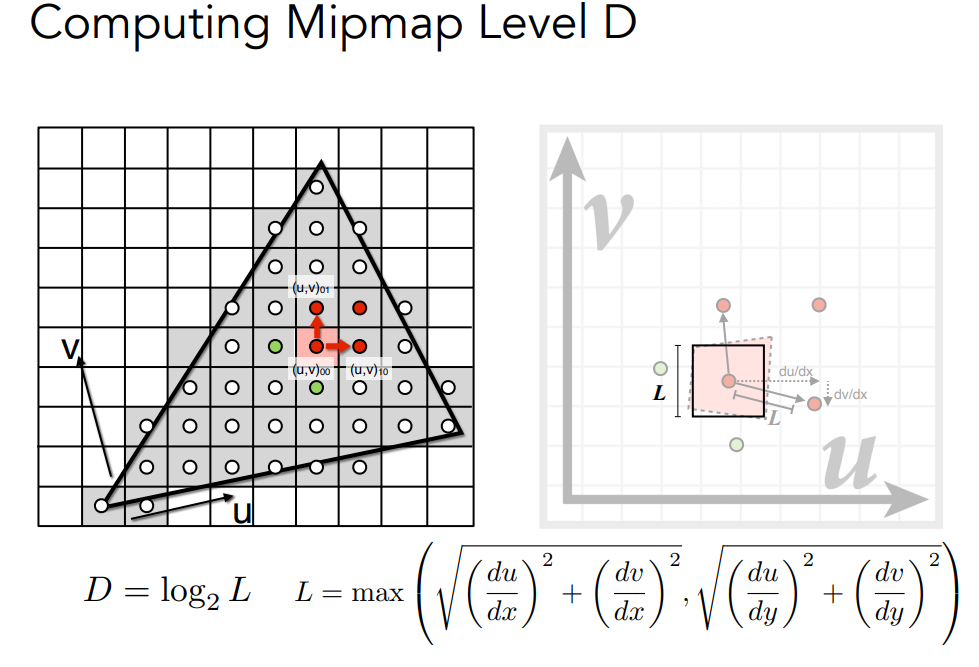

[TOC]
# GAMES101
wsl2配置环境：  
<https://www.bilibili.com/read/cv11143517>  
<https://zhuanlan.zhihu.com/p/371080057>  

------
## Content
- 1 Transformation
- 2 Rasterization
- 3 Shading
- 4 Geometry
- 5 Ray Tracing

------
## 1 Transformation
- 模型变换
- 视图变换

用矩阵描述变换 变换前后的坐标关系   
### 二维变换、三维变换  
平移、缩放、旋转、切边  
齐次坐标：增加一个维度，为了将平移变换用矩阵表示   
新的维度 点为1，向量为0（向量具有平移不变性）  

旋转矩阵的逆就是旋转矩阵的转置（*旋转矩阵是正交矩阵*）  
三维空间中的旋转   
  
绕任意轴的选择（分解为x、y、z轴上的选择）：  
  
默认起点在原点上；若不在原点上，先平移到原点上 再平移回来  

旋转矩阵不适合做插值 四元数适合作旋转与旋转之间的插值    
<br>

---
模型变换M => 视图变换V => 投影变换P => `[-1,1]^3` 立方体    
### 视图变换 View/Camera Transformation
相机的定义（观测矩阵）：一个向量表示位置、一个向量表示观测方向、一个向量表示向上方向   
约定假设相机是固定的（at Origin, up at Y, look at -Z） 而是去移动场景（模型变换）  
  
（模型变换与视图变换常常是一起的 都作用于物体）  

### 投影变换 Projection Transformation  
- 正交投影 Orthographic Projection
- 透视投影 Perspective Projection

### **正交投影**：映射一个cuboid（[l, r] * [b, t] * [f, n]）到 标准canonical cube（[-1, 1]^3） 
  

先平移、再缩放  
look at -z（右手系）导致了 `n > f` （near > far）  

### **透视投影（视锥）**：映射一个视锥到标准canonical cube（[-1, 1]^3）
先**保持近平面不变，缩放远平面及中间平面**（z不变，收缩x、y），得到一个cuboid；再作**正交投影**（两个矩阵相乘）  
   
利用 *近平面上的点不变、远平面的中心点不变*， 求解出透视投影矩阵   
``` c++
Mpersp2otho << zNear,0,0,0,
               0,zNear,0,0,
               0,0,zNear + zFar,-zNear*zFar,
               0,0,1,0;
```
处于视锥中间的点，在透视投影变换后会被推向远平面  
可参考<https://zhuanlan.zhihu.com/p/445801392>   
<br>

------
## 2 Rasterization
屏幕：一个二维数组（元素对应像素、数组大小对应分辨率）  
多边形映射到像素  

三角形的性质：
- 任意多边形都能拆分成三角形
- 三角形内部一定是一个平面
- 三角形内外定义清晰
- 定义顶点属性后，三角形内部可以通过插值计算（通过三角形<b>重心坐标</b>）  

光栅化的关键问题：**判断一个像素（的中心点）与三角形的位置关系**  
采样：离散化一个函数  
**利用像素中心对屏幕空间进行采样**  

光栅化加速：
- 只遍历三角形包围盒（轴向AABB包围盒）内像素

采样带来的锯齿问题（采样率对于信号来说不够高）  

### 反走样（频域）  
走样产生的原因：同样的采样频率去采样两种不同函数却能得到相同的结果  
在采样前先做一次模糊（滤波）  
滤波：去除特定频段  
  
傅里叶变换（展开）：将任意函数分解成不同的频率（从时域到频域）   
   
时域的卷积对应频域的乘积  

### 可见性（遮挡）问题
画家算法：先画远的； 但无法解决几个互相遮挡的三角形的绘制，故不可用  

Z-Buffer深度缓存：对每个像素（或采样点），记录最近的深度  
光栅化时，同时生成绘制图（frame-buffer）与深度图（z-buffer）  

<br>

------
## 3 Shading
对不同的物体应用不同的材质（和光线相互作用的不同方法）  
把着色分为三个部分（Bling-Phong着色模型）：镜面反射 + 漫反射 + 环境光照  

Shading is local（对于一个shading point 视作一个小平面）
   

shading的局部性：shading并不考虑阴影（不考虑其他物体的存在，只考虑自己）  

对于一个点单位面积接收到的光的能量与传播距离成反比   
Lambertian(Diffuse) Shading <b>漫反射项</b> 与观察方向无关（光线被均匀地反射出去）    
   
kd漫反射系数 定义对光线的吸收（等于0时为黑）  

<b>高光项</b> 观察方向和镜面反射方向接近，即法向量方向与半程向量方向接近  
   
<b>通过向量点乘衡量两个向量是否接近</b>  
夹角余弦加一个指数幂操作  

<b>环境光项</b> 本质是一个常数（的颜色）   

### 着色频率  
   

着色应用在每一个像素上   
插值计算三角形内部点的颜色  
法线在三角形内部进行插值（每一个像素都有自己的法线）  

### Real-time Rendering Pipeline
   

Shader对每一个顶点或每一个fragment（如像素）都会执行一次  
- Program vertex and fragment processing stages
- Describe operation on a single vertex（or fragment）

<https://www.shadertoy.com/>  

### 纹理映射
定义不同物体表面不同位置的任意点的属性  
空间中的三角形（顶点）映射到纹理（二维坐标`(u, v)`）上  
不同位置可以映射到相同纹理上  

通过TBN矩阵将存储在纹理空间中的法向量转换到模型空间中  
&emsp; 实际使用时，将光线从模型空间转换到纹理空间，然后计算反射光线（因为一般光线数量远少于法线数量）  

如果纹理相对于分辨率太小了怎么办？（在查询纹理时，如何处理计算结果为非整数坐标所对应的值？若直接取整，纹理太小时会导致模糊）  
<b>双线性插值</b> 查找这个 “非整数点” 周边的四个点  
   

如果纹理过大（一个像素覆盖纹理区域过大） 会产生走样问题   
每一个像素内使用多个采样点（超采样）计算代价高昂  
获取像素区域内的平均值（使用<b>范围查询</b>）  
对范围查询的要求：*由于不同像素在纹理上有不同的覆盖大小，范围查询应支持不同的大小*   
<b>MIPMAP：近似的正方形范围查询</b> &emsp; 一系列图片，每层分辨率缩小一半  
计算纹理在哪一层：计算相邻像素的纹理坐标，从而近似计算像素占据的纹理区域大小  
   
求这个区域在第几层（`log2(L)`层）会变成一个像素的大小  
如何让mipmap层间变化连续？ 对不同层层间插值查询结果直再进行一次插值（三线性插值）；  
插值保证了 “连续”  
mipmap的问题：只有长宽比固定的变化 会导致远处与视线比较平行的地方纹理丢失  
各向异性过滤ripmap：考虑方向性，可以生成矩形区域（长宽比可变）的范围查询  

### 重心坐标
为什么需要插值？ 得到平滑的过度  
插值的应用场景：各类逐顶点定义的属性，如纹理坐标、颜色、法线等  

也可以用重心坐标是否都大于0判断点是否在三角形内   
<a href = "https://zhuanlan.zhihu.com/p/144360079">计算机图形学补充1：重心坐标(barycentric coordinates)详解及其作用</a>  
   

重心坐标也对应于这个点将三角形分割成三个小三角形的面积  
   

重心坐标的问题：重心坐标在投影作用下不一定不变  
需要在三维空间中计算重心坐标和插值（如计算深度时），而不能在投影后再做   

### 如何理解纹理
在现代GPU里，纹理可以理解为就是一块内存，以及包括可以对这块内存区域进行范围查询（滤波）  
texture = memory + range query(filtering)  

纹理的应用：
- 环境贴图（环境光照）： 记录来自不同方向的光照（都假设为无限远）
  - cube map：环境光记录在一个立方体上，再展开成二维图
- 凹凸贴图：用纹理定义表面各属性，如相对高度
  - 相对高度变化 -》 法线变化 -》 着色结果变化
  - 使用凹凸贴图定义切线（差分法），再根据切线计算法线
    
- 定义三维空间中的噪声函数 
- 记录一些此前已计算好的信息
- 3D纹理 应用于体渲染（Volume Rendering）

着色器中，处理纹理所存储的信息  

<br>

------
## 4 Geometry
**隐式 Implicit：**  
数学式子定义描述点之间的关系  
&emsp; *隐式表示可以很容易判断点在物体内外，但无法直观地知道物体的形状*  
通过布尔运算进行组合  
定义距离函数  
假设A，B是不同时间对应的状态，`blend(SDF(A), SDF(B))`表示A，B之间的中间状态（过渡）  

**显式 Explicit：**  
直接给出各点坐标，或通过参数映射定义表面（`(u,v) -》(x,y,z)`）  
- 点云
- 多边形网格（涉及到连接关系等数据结构）
- 贝塞尔曲线 用一系列控制点定义曲线（切线方向）  
     
  贝塞尔曲线对仿射变换来说是一致的（只需对控制点作仿射变换）；但投影变换不行  
  连续的贝塞尔曲线段要求切线（控制点）方向、大小均相等  

### 曲面处理 
- 曲面细分（上采样）
- 曲面简化（降采样）
- 改进三角形质量

### 曲目细分
引入更多三角形，之后位置如何变化？（改变新/旧顶点位置的规则）  

<b>LOOP细分</b>：（先细分、再调整）只适用于三角形面  
   
   

<b>Catmull-Clark细分</b>：适用于各种类型的面    
定义奇异点：连接的边数不为4  
增加面：每一条边取中点，每一个面也取中点，然后连接起来   
在非四边形面上的点添加的点都是奇异点；但经过一次细分后，所有的非四边形面都消失了（一次细分之后，非四边形面变成了奇异点）  
   

### 曲面简化
不同情况下使用不同复杂程度的几何模型  
几何的层次结构间 如何有平滑的过渡？  

通过 <b>边坍缩</b>（一个边变成一个点） 减少三角形 每次坍缩哪条边？  
<b>二次度量误差</b>：找到一个可以最小化二次误差（同原本临接的几个面的L2距离）的新点   
贪心算法：从二次度量误差最小的边开始坍缩（优先队列）  

---
## Shadow Mapping
不在阴影里的点 既能被相机看见，也能被光源看见  
只能处理<b>点光源</b>，清晰的阴影边界（硬阴影）（软阴影意味着光源存在大小）  

流程：
- 首先，从光源看向这个场景进行光栅化，记录深度Z-Buffer（生成ShadowMap）；   
- 再从相机出发光栅化，将看到的2D点投影回光源的成像平面（测试），若对应像素深度一致，则说明这个点不在阴影内  

广泛使用但问题重重：
- Z-Buffer的浮点数数值精度问题（浮点数比较）  
- ShadowMap的分辨率取多大？

本质上的困难是 *光栅化无法处理全局的物理现象*   
  
<br>

------
## 5 Ray Tracing
光栅化无法处理全局的物理现象，如软阴影、glossy反射、间接光照等（光线不止弹射一次）  

定义光线：
- 光线沿直线传播
- 光线之间不会发生碰撞
- 光线从光源出发，经过若干次反射达到眼睛；这一条光路是可逆的

Ray Tracing 关键思想是利用光路的可逆性  
朴素的思路：从针孔相机模型（pinhole），成像平面每一个像素投射出一根光线，与场景求交求最近交点（代替了传统光栅化的深度测试）；再从交点出发，判定是否对光源可见（与光源连线），进行着色并写回像素的值  

### Whitted-Style Ray Tracing（古老的做法）
对光路传播 <b>递归</b>，假设反射、折射都是完美的    
对每一个弹射点，都计算着色值，最终汇合到目标像素值
   
