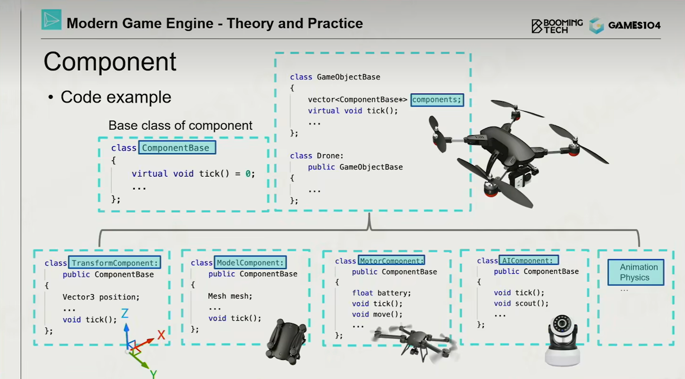
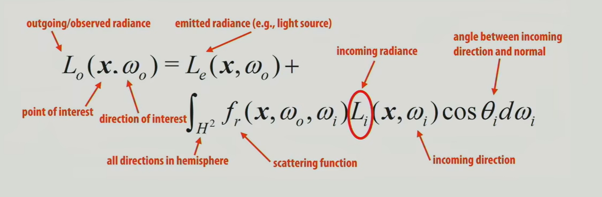
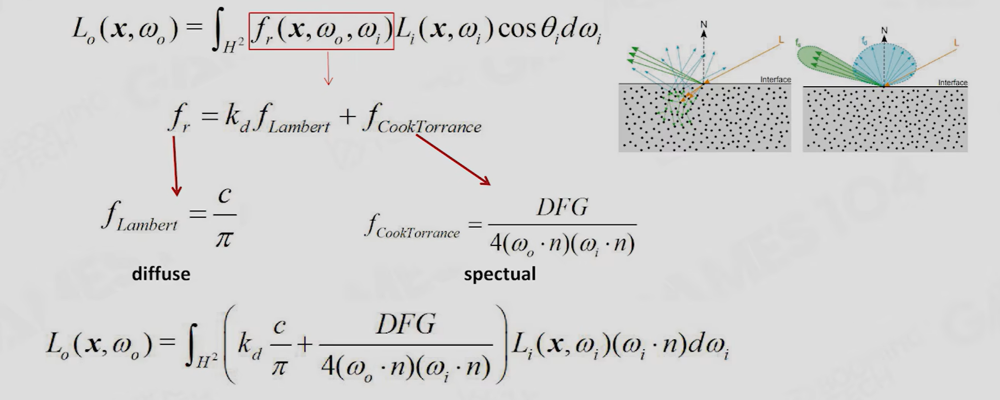

## 1 引擎架构分层
* 工具层（UI编辑器）  
* 功能层 &emsp;&emsp; 游戏绘制（三维场景到一帧二维图像）&emsp; （可视、可动、可玩）   
  tickMain -> tickLogic. tickRender 分离逻辑与绘制  
  如何从多核角度思考架构底层代码？
    > 渲染  
    > 动画  
    > 物理计算  
    > 规则（脚本、AI、状态机）  
    > 人机交互界面（如血量条）  
* 资源层 &emsp;  <u>数据是开发的核心！</u>
    > 文件转化成高效的中间格式 （resource -> asset）  
    > 定义数据关联 （唯一识别号GUID）  
    > 实时资产管理器（runtime asset manager） 管理资产生命周期
* 核心层 &emsp;    内存管理（引擎是虚拟世界的OS）
    > 调用底层代码（工具箱） 如线程管理、数学计算等（效率）   
    > 提供数据结构、容器等 &emsp; 提高内存利用率和访问效率  
        memory pool/allocator;&emsp; reduce cache miss
* 平台层 &emsp; 对接硬件设备&软件平台  
    > graphics API  
---
---
## 2 如何构建游戏世界
由哪些东西构成？如何描述？如何组织调动  
抽象成Game Object: &emsp;Property属性&Behavior行为  
GO若用面向对象来描述 父子关系太复杂  &emsp;->  &emsp;将物体组件化  
   
object-based tick()  
逐系统tick（如位置position）而不是逐对象tick  &emsp;（流水线化&并行）  
events机制实现GO间的交互  
引擎提供可扩展的消息系统  
  
### 场景管理  
---
查询机制：GOID、位置  
使用层级结构管理（八叉树、BVH（更新代价低））

---
GO间的绑定 GO tick的先后关系（父子节点）  
tick多线程并行时的时序问题  
时序问题导致的延迟（收到消息时哪一帧？ 做出反应是哪一帧？）  
  
---
---
## 3 游戏引擎中的渲染  
算法适应当前硬件架构  
SIMD SIMT ： multipleData * multipleThreads  
尽可能不从GPU读数据（CPU -> GPU 单向传输）

---
### 可绘制对象Mesh Render Component  
对GO的渲染描述  &emsp;（绘制系统核心数据对象）  
* vertexData + indexData  
* 视觉材质系统（如何和光线相互作用？）
* 纹理  
* shader代码  

通过submesh把每个物体根据材质切分  
建立Resource Pool(MeshPool & TexturePool & ShaderPool)  
实例指向Pool中资源  
  
把整个场景中的物体根据材质排序（减少GPU状态改变）  

---
### 可见性裁剪  
包围盒与视锥之间空间关系的判断  
（怎么样的包围盒？怎么样的空间管理数据结构？）  
深度图判断遮挡

---
### 对texture的压缩和管理  
block-based纹理压缩

---  
Cluster-based Mesh Pipeline

---
---
## 4 光和材质  
渲染计算：光照 + 材质（物质和光如何反应） + shader运算  
渲染方程： 
  
难点：
* 光源可见性的复杂度（阴影）   
* 光源的复杂度（点光源、面光源、锥形光源）  
* 表面积分计算的复杂度 （光和材质的卷积）
* 所有物体都是光源（多次反射 全局光照）   
How to get irradiance for any given direction?  
Integral of lighting and scatting function on hemisphere is expensive.  
To evaluate irradiance, we have to compute yet another integral(recursive rendering equation)   

---
Simple Light Soluton：Ambient Light + Dominant Light + Environment Map  

Bling-Phong: Ambient + Diffuse + Specular  
Bling-Phong的问题：能量不保守、难以表现模型细节  

ShadowMap：在光源空间中采样，基于从光源计算与从相机计算的深度比较判断可见性  
问题：从光源计算与从相机计算采样率不一样

---
### 基于预计算的全局光照  
球面空间的采样  
傅里叶变换 压缩用于存储的参数  
Spherical Harmonics函数集  
LightMap：预计算（空间换时间） 参数化游戏场景 静态场景（静态光）  
LightProbes + ReflectionProbes：空间采样 可以动态更新  

---
### 基于物理的材质  
基于微表面模型  
BRDF： 
 
D: Normal Distribution Function 根据表面法向量分布判断光滑/粗糙  
G: 表面几何内部遮挡  
F: Fresnal Equation 视线在较远处（与表面接近相切时）反射系数急剧增加 

---
参数应该符合美术设计师的直觉  
尽可能少的参数  
参数取值范围尽量控制在[0, 1]  
任意参数取值的组合都可以产生有意义的结果

Specular Glossiness用各贴图表示各项参数  
MR 添加初始颜色以及控制衡量 金属-非金属的系数

---
### 基于图像的光照 （对环境光照的描述）
Diffuse Irradiance Map：空间光场卷积 &emsp; 预计算BRDF的diffuse部分  
对不同粗糙度计算specular项 存储到对应mipmap层级  

---
### 阴影方法 
Cascade Shadow 根据视锥距离层级阴影

