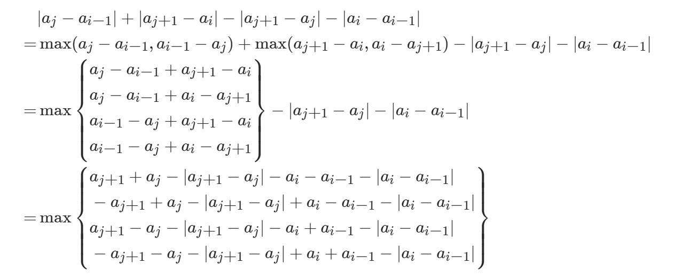

## Content

------
### 题目

---
### &emsp; 1015. 可被K整除的最小整数 MID
关键思路：  
- <b>模运算转化</b>
- （a + b）mod k == （（a mod k）+（b mod k））mod k
- （a * b）mod k == （（a mod k）*（b mod k））mod k
- 从小到大枚举，第一个 mod k == 0 的即为答案
- 根据mod运算规则，下一轮计算结果为 `x =（10 * x + 1）mod k`
- 用哈希表判断环，若出现一个已经出现过的结果，则存在环
- 也可以通过循环轮次判断，根据<b>抽屉原理</b>，最多存在k轮计算；这也说明了算法时间复杂度为O（k）

<details> 
<summary> <b>C++ Code</b> </summary>

```c++
class Solution {
public:
    int smallestRepunitDivByK(int k) {
        unordered_set<int> seen;
        int x = 1 % k;
        while(x && !seen.count(x))
        {
            seen.insert(x);
            x = (x*10 + 1) % k;
        }
        return x ? -1 : seen.size() + 1;    
    }
};
```
</details> 
<br>

---
### &emsp; 1330. 翻转子数组得到的最大数组值 :rage:HARD
关键思路：  
- <b>绝对值运算转化</b>
- 只有翻转部分和未翻转部分的交界会改变
- i 为 0 或 j 为 n-1 时，O（n）枚举
- `|x| = max(x, -x)`
- `max(a,b) + max(c,d) = max{a+c, a+d, b+c, b+d}`
- 
- 把含j的提到前，含i的置于后，可以理解为将问题转化为求（四个）f1(i) + f2(j)的最大值：**在枚举j的过程中：维护f1(i)最大值即可**

<details> 
<summary> <b>C++ Code</b> </summary>

```c++
class Solution {
public:
    static constexpr int INF = 0x3f3f3f3f;

    int maxValueAfterReverse(vector<int>& nums) {
        const int n = nums.size();
        const int a = nums[0], b = nums[n-1];
        int premax[2][2] = {-INF, -INF, -INF, -INF};
        int sum = 0, ans = 0;
        for(int i = 1; i < n; i++)
        {
            const int x = nums[i-1], y = nums[i], d = abs(x-y);
            sum += d;
            ans = max(ans, max({
                abs(x - b), // j为n-1的特殊情况 枚举子数组左端点
                abs(y - a), // i为0的特殊情况 枚举子数组右端点
                premax[0][0] - x - y,
                premax[0][1] - x + y,
                premax[1][0] + x - y,
                premax[1][1] + x + y
            }) - d);
            // 更新前缀最大值信息
            premax[0][0] = max(premax[0][0], x + y - d);
            premax[0][1] = max(premax[0][1], x - y - d);
            premax[1][0] = max(premax[1][0], -x + y - d);
            premax[1][1] = max(premax[1][1], -x - y - d);
        }
        return sum + ans;
    }
};
```
</details> 
<br>

---
### &emsp; 2671. 和等于目标值的质数对 MID
关键思路：  
- 预处理 `(1，MX]` 的所有质数
- 使用一个 `bool[MX] prime` 快速打表（遍历到一个质数时，以其作为因子记录一些非质数）

<details> 
<summary> <b>C++ Code</b> </summary>

```c++
const int MX = 1e6;
vector<int> primes;
bool np[MX + 1]; // 非质数时true

// 预处理计算质数
int init = []() {
    for (int i = 2; i <= MX; i++)
    {
        if(!np[i])
        {
            primes.push_back(i);
            for(int j = i; j <= MX / i; j++) // 避免溢出的写法
                np[i * j] = true; // i作为质因子 打表
        }
    }
    return 0;
}();

class Solution {
public:
    vector<vector<int>> findPrimePairs(int n) {
        vector<vector<int>> ans;
        if(n % 2)
        {
            if (n > 4 && !np[n - 2])
                ans.push_back({2, n - 2});
            return ans;
        }
        for(int x: primes) // 遍历质数
        {
            int y = n - x;
            if(y < x)
                break;
            if(!np[y])
                ans.push_back({x, y});
        }
        return ans;
    }
};
```
</details> 
<br>

---
### &emsp; 2681. 英雄的力量 :rage:HARD
关键思路：  
- <b>贡献法</b> 枚举作为最大值时带来的贡献 
- 由于元素的顺序不影响答案（求最大最小与顺序无关），先从小到大排序 *(有序 是一个很好的性质)*
- 子序列、子集 的问题往往对应着 “选或不选”
- 当一个数`x`作为最大值时，`x`及其左侧元素（假设从小到大a、b、c）带来的贡献为`x^3 + x^2 * (a*2^2 + b*2^1 + c*2^0)` （对于a，中间两个数字b、c可选可不选，共`2^2`种情况）
- （<b>增量法</b>）设`s = (a*2^2 + b*2^1 + c*2^0)`，`x`的贡献即`x^2 * (d + x)`
- 只需要枚举最大值，O（1）递推计算`s`

<details> 
<summary> <b>C++ Code</b> </summary>

```c++
class Solution {
public:
    int sumOfPower(vector<int>& nums) {
        const int MOD = 1e9+7;
        sort(nums.begin(), nums.end());
        int ans = 0, s = 0;
        for(long long x : nums) // x 作为最大值
        {
            ans = (ans + (x * x % MOD) * (s + x)) % MOD; // 中间模一次 防止溢出
            s = (s * 2 + x) % MOD; // 递推下一个s
        }
        return ans;
    }
};
```
</details> 
<br>  

