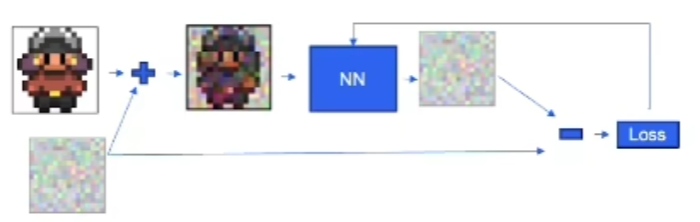

# 机器学习
[TOC]

------
## 模块
### 残差连接


---
### Self Attention
相较于卷积，可以在单单一个layer中关注全局信息  
$Attention=softmax({QK^T\over\sqrt{d_k}})*V$  
其中$QK^T$得到相似度矩阵  
softmax将其转化为对“元素之间注意力”的度量  

### Cross Attention
场景：向模块中注入额外的条件信息  
Q是原始信息的映射，而K、V是条件信息（context）的映射  

在 encoder hidden state（得到K、V、context vector） 和 decoder hidden state（得到Q） 间传递信息  

### Causal Attention
因果注意力机制，处理**序列生成任务**（如GPT）  
每个位置的输出只能依赖于其自身位置以及之前位置的信息，而不能 “看到” 未来位置的信息  
在计算注意力分数$A_{ij}$时，当$j > i$（即位置在位置之后），将注意力分数$A_{ij}$设为`0`   

<br>

------
## 损失函数  

### MSELoss
均方误差损失  

------
## 优化
通过最小化损失函数，调整神经网络模型的参数（如权重和偏差）的算法  

### Stochastic Gradient Descent 随机梯度下降
<b>在每次迭代中只随机选择一些数据点来计算梯度</b>   
*有时会使得收敛过程显得不规律；*  SGD的随机性和噪声数据导致算法的波动、不太稳定且收敛时间较长  

优点：
- 速度快
- 避免局部最小值。
- 在线学习：能够增量更新模型。适合在线学习，当新数据到来时需要更新模型

### adam optimizer
通过计算梯度的一阶和二阶矩估计，能够在训练过程中自适应调整学习率，从而提高训练效率和稳定性  


------
## 正则化
### batchNorm
常用于卷积层后  
*为激活层提供期望的分布，即先让分布标准化，然后再激活*  

### dropout
置于激活层后  
训练阶段，每一次迭代时随机选择一批单元暂时忽略（防止过拟合）  
BN和dropout一般不同时使用，如果一定要同时使用，可以将dropout放置于BN后面  

------
## 激活函数
### ReLU


### softmax
$e^{x_i}/\sum_{i=0}^{N-1}(e^{x_i})$  
将值（任意数列）**映射到概率分布**（总和为1）  
加入`T`（一般不大于2），$e^{x_i/T}/\sum_{i=0}^{N-1}(e^{x_i/T})$：`T`越大结果越平滑，分布更均匀    

<br>

------
## 架构
### 自编码器 AutoEncoder
将原始数据（高维、复杂）经 Encoder 后得到的向量（低维、经过处理）作为下游任务的输入，并希望还原出来的结果能够与原始数据尽可能的接近  

两个网络：Encoder和Decoder  

无监督的数据维度压缩和数据特征表达方法；本质上在 **寻找变化规律**

De-noising Auto-encoder：输入加噪声，但要求解码后与未加入噪声的输入尽可能接近  
（高维数据中存在信息冗余；希望能够从部分损坏的数据中得到有效的数据表示）  

<br>

---
### Perceiver Architecture （Transformer）
基于 Transformer 的模型架构，旨在解决高维输入数据（如图像、视频、音频和其他类型的多模态数据）的处理问题  
**引入一个较小的、固定尺寸的潜在表示（latent representation）来处理高维输入**，而不是像传统Transformer那样直接处理输入数据的每一个元素  

- 首先，将输入数据映射到一个低维空间  
- 再使用一个固定大小的<b>潜在表示</b>（latent variables）（如Q-Former中的query?），这些潜在变量的维度远小于输入数据的维度  
- 通过在潜在表示和输入数据之间使用自注意力机制进行交互；时间复杂度为$O(L*D)$（传统transformer为$O(N^2)$）  
- 训练中更新潜在表示，以便更好地捕捉输入数据中的结构和模式

<br>

---
### 低秩微调 LoRA
本质是将一个大的`d*d`矩阵分解为两个小的`d*r`、`r*d`矩阵，减少了参数量，并且结果可以直接与（训练好的）原矩阵的线性相加  

---
### 扩散模型 Diffusion Model
生成式模型  
学习一个能从噪声中回复符合某种分布的原始数据的神经网络  
（学习“如何去噪”）本质是一个“预测噪声的网络”，然后逐步减去这些噪声  

由一个正向和一个反向的马尔可夫过程组成  

``` python
sample = random_sample
for t in range(T, 0, -1): # T,...,1
  extra_noise = random_sample if t > 1 else 0
  predicted_noise = trained_nn(x_tsub1, t) # x_t-1
  s1, s2, s3 = ddpm_scaling(t) # Denoising Diffusion Probabilistic Model
  sample = s1*(sample - s2*predicted_noise)+s3*extra_noise # 减去神经网络预测的噪声，再加上一个随机噪声用于神经网络的下一轮迭代
```

DDPM的网络架构：UNet 一系列downsample + 一系列upsample（输入图像，输出与图像同样大小的预测噪音）  
UNet 可以在unsample中接受额外的输入信息（如 time embedding、context embedding）  
- time embedding 通常采用**加法**：将时间嵌入与原始特征相结合，保留原始特征；使得时间信息在整个网络中传播得更加平滑，同时梯度能够更直接地从损失函数传播回时间嵌入部分和原始特征部分
- context embedding 通常采用**乘法**（可以增强某些特征的作用，同时抑制其他特征的影响）

UNet训练：  
  

更快的采样 —— DDIM（打破了马尔可夫假设，时间上可以跳步进行）  
stable diffusion：在图像的隐空间（对image embedding）上进行操作  

------
## 聚类

### DBSCAN
基于密度的聚类算法，**通过密度连接的方式将点归为一类**，通过寻找被低密度区域分离的高密度区域，并将高密度区域作为一个聚类的“簇”   
将数据分为三类点：核心点（邻域点数大于阈值）、边界点（邻域点数小于阈值，但在某个核心点的邻域内）、噪声点  
关系：密度直达（在核心点的邻域内）、密度可达（密度直达的传播）、密度相连（存在另外一个点，对于它来说，两个点都密度可达）  

主要参数：
- $eps(\varepsilon)$：定义了点之间的最大距离，点在该距离内被认为是邻居。
- $min\_ samples$：定义了一个簇中所需的最小点数。如果一个点的邻居数大于或等于 $min\_ samples$，该点被视为核心点

特点：
- 能够发现任意形状的簇
- 能够识别噪声点（即无法归为任何簇的点）
- 无需预先指定簇的数量

局限性：
- 参数敏感
- 无法处理数据集中簇的密度差异较大的情况

空间开销：
- 距离矩阵：若显式计算和存储点之间的距离矩阵，空间开销为 $O(N^2)$。可以使用 KDTree 或 BallTree 进行邻域搜索以进行空间开销上的优化 
- 邻域列表：聚类过程中，DBSCAN 需要为每个点存储其 $eps$ 范围内的邻居点。这部分的空间开销与数据密度和 $eps$ 参数有关

<br>

### HDBSCAN
通过层次聚类的方式，**生成一个层次树结构，从中提取稳定的簇**，通过分析层次树的稳定性来自动确定最佳的簇数量   

核心距离（样本与第k个最近邻样本点的距离）：$core_k(x)=d(x,N^k(x))$  
样本间互达距离：$d_{mreach \_ k} (a, b)=max\{core_k(a),core_k(b),d(a,b)\}$  

（*互达距离使得密集点（核心距离较小的点）彼此保持相同的距离，至少是它的核心距离*）  
用互达距离来表示两个样本点之间的距离，使得密集区域的样本距离不受影响，而稀疏区域的样本点与其他样本点的距离被放大；增加了聚类算法对散点的鲁棒性   

聚类过程为 “分裂图” 的过程：
- 找到一个最小的边集合（最小生成树），从集合中删除任何边都会导致图分裂   
- 压缩聚类树（删除散点）： 
  - 自顶向下遍历树，看每个节点分裂时，如果左右有一个子结点的样本数大于最小族大小，用它替换当前节点；若都少于最小族大小，则删除子节点，不再继续分裂；若都大于最小族大小，正常向下分裂
- 提取聚类簇 
  - 定义$\lambda=\frac{1}{distance}$，$\lambda_{death}$表示当前节点被分裂成两个子结点时，对应断开边长度的倒数；$\lambda_{p}$表示样本点p因为分裂离开该节点时，对应断开边长度的倒数  
  - 每个节点的稳定性：$s_{cluster}=\sum_{p\in{cluster}}(\lambda_p-\lambda_{death})$（可见 $s_{cluster} <= 0$，且越大说明杂点越少）  
  - 自顶向下遍历树，找到稳定性大于其左右孩子节点的稳定性之和的节点作为聚类簇  

参数：
- $k$：当 $k$ 较大时，会使得核心距离变大、相互可达距离变大；这样会有更多样本点被分配到稀疏区域，即更多点将被视为散点 
- $min\_ cluster\_ size$：控制簇的最小大小（与 DBSCAN 的 $min\_ samples$ 类似，但在 HDBSCAN 中具有更多灵活性）
- $min\_ samples$（可选）：影响核心点定义和邻域大小，但主要通过 $min\_ cluster\_ size$ 控制聚类过程

空间开销：
- 最小生成树（MST）：HDBSCAN 基于构建的 MST 来识别簇，MST 的存储开销为 $O(NlogN)$
- 层次结构：HDBSCAN 构建一个层次树结构（dendrogram），其空间开销大致为 $O(N)$
- 核心点的计算：与 DBSCAN 类似，需要存储每个点的邻居信息

<br>

------
## 对比学习
基于无监督个体判别任务：每一个“实例”作为一个类，在特征空间中尽可能地分开  
<b>正样本和负样本在特征空间对比</b>   
负样本是学习有判别能力的特征表示的关键  

该实例作为正样本，数据集里所有其他实例作为负样本  
（用一个MemoryBank存储所有样本的特征，随着编码器的训练不断更新）  
NCEloss   

也可以采用同一minibatch中的所有其他样本作为负样本  
从而可以使用一个编码器作端到端的训练  

基于生成式任务：  
以通过编码器后得到未来时刻的特征输出作为正样本，任意选取输入得到的编码器的特征输出作为负样本  
增大“域”之间的互信息  
