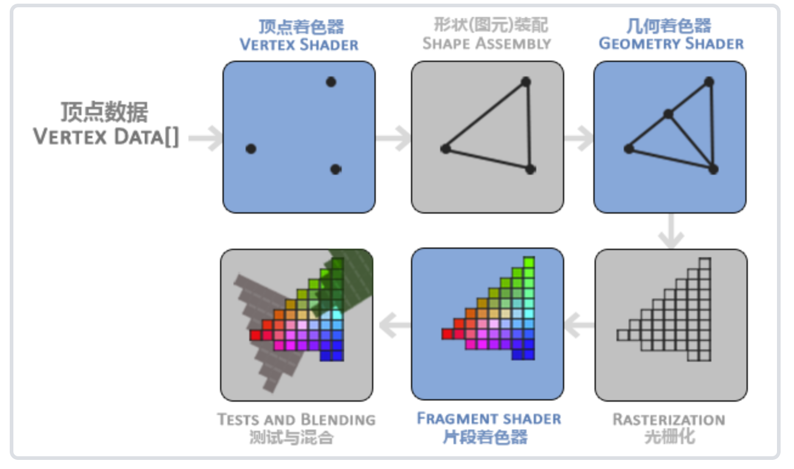
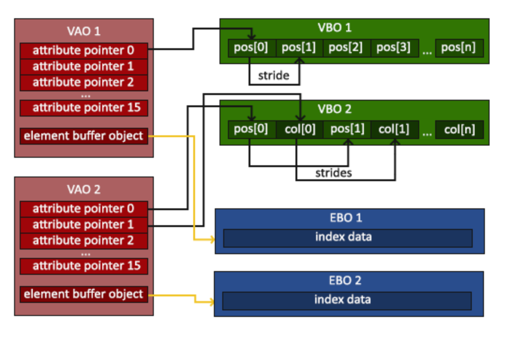
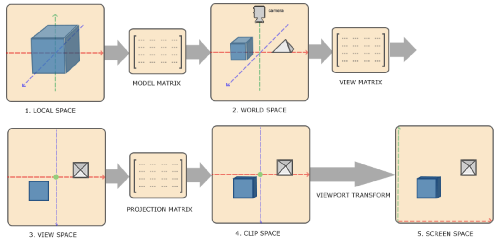

## Content
- Introduction
- 窗口 & 渲染
- 坐标系统

<br>

------
* ## Introduction 
---
### OpenGL 状态机
OpenGL自身是一个巨大的状态机(State Machine)：一系列的变量描述OpenGL此刻应当如何运行。OpenGL的状态通常被称为 <b>OpenGL上下文(Context)</b>。我们通常使用如下途径去更改OpenGL状态：`设置选项`，`操作缓冲`。最后，我们`使用当前OpenGL上下文来渲染`  
状态设置函数 与 状态使用函数  

--- 
### OpenGL 对象
在OpenGL中一个对象是指<b>一些选项的集合</b>，它代表 <b>OpenGL状态的一个子集</b>。  
比如，我们可以用一个对象来代表绘图窗口的设置，之后我们就可以设置它的大小、支持的颜色位数等等。  
可以把对象看做一个C风格的结构体(Struct)。

<br>

我们首先创建一个对象，然后`用一个id保存它的引用`（实际数据被储存在后台）。然后我们`将对象绑定至上下文的目标位置`（例子中窗口对象目标的位置被定义成`GL_WINDOW_TARGET`） 
* 使用对象的一个好处是在程序中，我们不止可以定义一个对象，并设置它们的选项，每个对象都可以是不同的设置。在我们执行一个使用OpenGL状态的操作的时候，只需要绑定含有需要的设置的对象即可

---
### GLFW库与GLAD库
GLFW是一个专门针对OpenGL的C语言库，它提供了一些渲染物体所需的最低限度的接口。它允许用户创建OpenGL上下文、定义窗口参数以及处理用户输入  

因为OpenGL只是一个标准/规范，具体的实现是由驱动开发商针对特定显卡实现的。由于OpenGL驱动版本众多，它大多数函数的位置都无法在编译时确定下来，需要在运行时查询。开发者需要在运行时获取函数地址并将其保存在一个函数指针中供以后使用  &emsp; 通过GLAD提供的封装实现这些重复操作 ( <u><b>管理OpenGL函数指针</b></u> )  

<details>
<summary> &emsp; <b>code</b> </summary>

```c++
	GLFWwindow* window = glfwCreateWindow(800, 600, "LearnOpenGL", NULL, NULL);
	if (window == NULL)
	{
		std::cout << "Failed to create GLFW window" << std::endl;
		glfwTerminate();
		return -1;
	}
	glfwMakeContextCurrent(window); 
    // 通知GLFW 将window的上下文设置为当前线程的主上下文
```
```c++
	//在调用任何OpenGL的函数前 需要初始化GLAD
	if (!gladLoadGLLoader((GLADloadproc)glfwGetProcAddress))
	{
		std::cout << "Failed to initialize GLAD" << std::endl;
		return -1;
	}
```
</details>

------
* ## 窗口&渲染
---
`glViewport(0, 0, 800, 600)`告诉OpenGL渲染窗口的尺寸大小，前两个参数控制窗口左下角的位置。第三个和第四个参数控制渲染窗口的宽度和高度（像素）。  
幕后使用glViewport中定义的位置和宽高进行2D坐标的转换  
当用户改变窗口的大小的时候，视口也应该被调整。可以对窗口注册一个回调函数`glfwSetFramebufferSizeCallback(window, framebuffer_size_callback)`  

---
双缓冲解决像素非同时绘制导致的问题：  
前缓冲保存着最终输出的图像，它会在屏幕上显示；而所有的的渲染指令都会在后缓冲上绘制。当所有的渲染指令执行完毕后，交换(Swap)前缓冲和后缓冲，这样图像就立即呈显出来了

---
### OpenGL 图形渲染管线
图形渲染管线可以被划分为两个主要部分：第一部分把3D坐标转换为2D坐标，第二部分把2D坐标转变为实际的有颜色的像素  



* 顶点着色器：主要的目的是把3D坐标转为另一种3D坐标，同时顶点着色器允许我们对顶点属性进行一些基本处理
* 图元装配阶段(Primitive Assembly)：将顶点着色器输出的所有顶点作为输入（如果是GL_POINTS，那么就是一个顶点），并所有的点装配成指定图元的形状  
* 几何着色器：把图元形式的一系列顶点的集合作为输入，它可以`通过产生新顶点构造出新的（或是其它的）图元`来生成其他形状。
* 光栅化阶段(Rasterization Stage)：`把图元映射为最终屏幕上相应的像素`，生成供片段着色器使用的片段(Fragment)。在片段着色器运行前会执行`裁切(Clipping)`，丢弃超出视图以外的所有像素。
* 片段着色器：计算一个像素的最终颜色，这也是所有OpenGL高级效果产生的地方。通常，片段着色器包含3D场景的数据（比如光照、阴影、光的颜色等等）。
* Alpha测试和混合(Blending)阶段：检测片段的对应的深度

---
### <b>VBO & VAO & EBO</b> 

在GPU上创建内存用于储存我们的顶点数据，还要`配置OpenGL如何解释这些内存`，并且指定其如何发送给显卡。   

<b>使用VBO（顶点缓冲对象）管理这个内存</b>  
`glBindBuffer(GL_ARRAY_BUFFER, VBO)`  把新创建的缓冲绑定到GL_ARRAY_BUFFER目标上，从这一刻起，使用的任何（在GL_ARRAY_BUFFER目标上的）缓冲调用都会用来配置当前绑定的缓冲(VBO)  
`glBufferData(GL_ARRAY_BUFFER, sizeof(vertices), vertices, GL_STATIC_DRAW)`把用户定义的数据复制到当前绑定缓冲。  

<br>

`glVertexAttribPointer`函数设置顶点属性指针 告诉OpenGL<b> 如何解析顶点数据（应用到逐个顶点属性上）</b>  
<b>输入数据与顶点着色器中顶点属性的对应</b>  
VAO（顶点数组对象）把这些状态配置储存在一个对象中，在绘制物体前简单地把VAO绑定到希望使用的设定上。  

<br>

元素缓冲对象EBO（也称索引缓冲对象IBO）<b>存储 OpenGL 用来决定要绘制哪些顶点的索引</b>  
在绑定VAO时，绑定的最后一个元素缓冲区对象存储为VAO的元素缓冲区对象。绑定到VAO也会自动绑定该EBO  



---
标准化设备坐标：一个 <b>x、y和z值在-1.0到1.0内</b> 的一小段空间。  
任何落在范围外的坐标都会被丢弃/裁剪。  
一旦顶点坐标已经在顶点着色器中处理过，它们就应该是标准化设备坐标了

---
### &emsp; <b>Shader</b>
当今大多数显卡都有成千上万的小处理核心，它们在GPU上为每一个（渲染管线）阶段运行各自的小程序，从而在图形渲染管线中快速处理你的数据。这些小程序即着色器( <u>Shader</u> )  
GLSL 使用 `in` 和 `out` 两个关键字定义输入输出  

`uniform` cpu向gpu发送数据  
uniform是<u><b> 全局变量 </b><</u>：uniform变量必须在每个着色器程序对象中都是独一无二的，而且它可以被着色器程序的任意着色器在任意阶段访问;无论把uniform值设置成什么，uniform会一直保存它们的数据，直到它们被重置或更新  
需要找到着色器中uniform属性的索引/位置值。当我们得到uniform的索引/位置值后，我们就可以更新它的值了  
`int vertexColorLocation = glGetUniformLocation(shaderProgram, "ourColor");`  
设置一个在渲染迭代中会改变的属性

### &emsp; o 顶点着色器  
*处理我们在内存中指定数量的顶点  转换为标准化设备坐标。*  

应该从顶点数据中直接接收输入  
使用`location`这一元数据指定输入变量，这样我们才可以在CPU上配置顶点属性。`layout (location = 0)`：顶点着色器需要为它的输入提供一个额外的layout标识，这样我们才能把它链接到顶点数据   

<br>

### &emsp; o 几何着色器  
 

<br>

### &emsp; o 片段着色器  
计算像素最后的颜色输出  
vec4 颜色输出变量  
<br>

### 着色器类

<details>
<summary> &emsp; <b>code</b> </summary>

``` c++
#ifndef SHADER_H
#define SHADER_H

#include <glad/glad.h>

#include <string>
#include <fstream>
#include <sstream>
#include <iostream>

class Shader
{
public:
    unsigned int ID;
    // constructor generates the shader on the fly
    // ------------------------------------------------------------------------
    Shader(const char* vertexPath, const char* fragmentPath)
    {
        // 1. retrieve the vertex/fragment source code from filePath
        std::string vertexCode;
        std::string fragmentCode;
        std::ifstream vShaderFile;
        std::ifstream fShaderFile;
        // ensure ifstream objects can throw exceptions:
        vShaderFile.exceptions (std::ifstream::failbit | std::ifstream::badbit);
        fShaderFile.exceptions (std::ifstream::failbit | std::ifstream::badbit);
        try 
        {
            // open files
            vShaderFile.open(vertexPath);
            fShaderFile.open(fragmentPath);
            std::stringstream vShaderStream, fShaderStream;
            // read file's buffer contents into streams
            vShaderStream << vShaderFile.rdbuf();
            fShaderStream << fShaderFile.rdbuf();
            // close file handlers
            vShaderFile.close();
            fShaderFile.close();
            // convert stream into string
            vertexCode   = vShaderStream.str();
            fragmentCode = fShaderStream.str();
        }
        catch (std::ifstream::failure& e)
        {
            std::cout << "ERROR::SHADER::FILE_NOT_SUCCESFULLY_READ: " << e.what() << std::endl;
        }
        const char* vShaderCode = vertexCode.c_str();
        const char * fShaderCode = fragmentCode.c_str();
        // 2. compile shaders
        unsigned int vertex, fragment;
        // vertex shader
        vertex = glCreateShader(GL_VERTEX_SHADER);
        glShaderSource(vertex, 1, &vShaderCode, NULL);
        glCompileShader(vertex);
        checkCompileErrors(vertex, "VERTEX");
        // fragment Shader
        fragment = glCreateShader(GL_FRAGMENT_SHADER);
        glShaderSource(fragment, 1, &fShaderCode, NULL);
        glCompileShader(fragment);
        checkCompileErrors(fragment, "FRAGMENT");
        // shader Program
        ID = glCreateProgram();
        glAttachShader(ID, vertex);
        glAttachShader(ID, fragment);
        glLinkProgram(ID);
        checkCompileErrors(ID, "PROGRAM");
        // delete the shaders as they're linked into our program now and no longer necessary
        glDeleteShader(vertex);
        glDeleteShader(fragment);
    }
    // activate the shader
    // ------------------------------------------------------------------------
    void use() 
    { 
        glUseProgram(ID); 
    }
    // utility uniform functions
    // ------------------------------------------------------------------------
    void setBool(const std::string &name, bool value) const
    {         
        glUniform1i(glGetUniformLocation(ID, name.c_str()), (int)value); 
    }
    // ------------------------------------------------------------------------
    void setInt(const std::string &name, int value) const
    { 
        glUniform1i(glGetUniformLocation(ID, name.c_str()), value); 
    }
    // ------------------------------------------------------------------------
    void setFloat(const std::string &name, float value) const
    { 
        glUniform1f(glGetUniformLocation(ID, name.c_str()), value); 
    }

private:
    // utility function for checking shader compilation/linking errors.
    // ------------------------------------------------------------------------
    void checkCompileErrors(unsigned int shader, std::string type)
    {
        int success;
        char infoLog[1024];
        if (type != "PROGRAM")
        {
            glGetShaderiv(shader, GL_COMPILE_STATUS, &success);
            if (!success)
            {
                glGetShaderInfoLog(shader, 1024, NULL, infoLog);
                std::cout << "ERROR::SHADER_COMPILATION_ERROR of type: " << type << "\n" << infoLog << "\n -- --------------------------------------------------- -- " << std::endl;
            }
        }
        else
        {
            glGetProgramiv(shader, GL_LINK_STATUS, &success);
            if (!success)
            {
                glGetProgramInfoLog(shader, 1024, NULL, infoLog);
                std::cout << "ERROR::PROGRAM_LINKING_ERROR of type: " << type << "\n" << infoLog << "\n -- --------------------------------------------------- -- " << std::endl;
            }
        }
    }
};
#endif

```
</details>

<br>

---
### &emsp; 纹理
纹理是一个2D图片（甚至也有1D和3D的纹理），它可以用来添加物体的细节  
存储图像或其他数据（送到着色器上）  
顶点关联纹理坐标（采样） 在图形的其它片段上进行片段插值（Fragment Interpolation）

纹理环绕方式 处理当纹理坐标超出范围时的输出

### 纹理过滤  
物体很大但是纹理的分辨率很低时  
`GL_NEAREST` 选择中心点最接近纹理坐标的那个像素  
`GL_LINEAR` 基于纹理坐标附近的纹理像素，计算出一个插值  
进行放大(Magnify)和缩小(Minify)操作的时候可以设置纹理过滤的选项，比如你可以在纹理被缩小的时候使用邻近过滤，被放大时使用线性过滤。我们需要使用glTexParameter*函数为放大和缩小指定过滤方式  
``` c++
glTexParameteri(GL_TEXTURE_2D, GL_TEXTURE_MIN_FILTER, GL_NEAREST);
glTexParameteri(GL_TEXTURE_2D, GL_TEXTURE_MAG_FILTER, GL_LINEAR);
```  

MIPMAP：在渲染中切换多级渐远纹理级别(Level)时，Nearest / Linear?  
MIPMAP主要是使用在纹理被缩小的情况下（`GL_TEXTURE_MIN_FILTER`）  

和之前生成的OpenGL对象一样，纹理也是使用ID引用的
```c++
unsigned int texture;
glGenTextures(1, &texture); // 纹理数量 纹理ID数组
glBindTexture(GL_TEXTURE_2D, texture); //绑定 让之后任何的纹理指令都可以配置当前绑定的纹理

// 为当前绑定的纹理对象设置环绕、过滤方式
glTexParameteri(GL_TEXTURE_2D, GL_TEXTURE_WRAP_S, GL_REPEAT);   
glTexParameteri(GL_TEXTURE_2D, GL_TEXTURE_WRAP_T, GL_REPEAT);
glTexParameteri(GL_TEXTURE_2D, GL_TEXTURE_MIN_FILTER, GL_LINEAR);
glTexParameteri(GL_TEXTURE_2D, GL_TEXTURE_MAG_FILTER, GL_LINEAR);
// 加载并生成纹理
int width, height, nrChannels;
unsigned char *data = stbi_load("container.jpg", &width, &height, &nrChannels, 0);
if (data)
{
    glTexImage2D(GL_TEXTURE_2D, 0, GL_RGB, width, height, 0, GL_RGB, GL_UNSIGNED_BYTE, data);
    glGenerateMipmap(GL_TEXTURE_2D);
}
else
{
    std::cout << "Failed to load texture" << std::endl;
}
stbi_image_free(data); // 生成纹理后 释放图像的内存
```
<b>`glTexImage2D`</b>：
* 第一个参数指定了纹理目标(Target)。设置为GL_TEXTURE_2D意味着会生成与当前绑定的纹理对象在同一个目标上的纹理（任何绑定到GL_TEXTURE_1D和GL_TEXTURE_3D的纹理不会受到影响）。
* 第二个参数为纹理指定多级渐远纹理的级别，如果你希望单独手动设置每个多级渐远纹理的级别的话。这里填0，也就是基本级别。
* 第三个参数告诉OpenGL我们希望把纹理储存为何种格式。我们的图像只有RGB值，因此我们也把纹理储存为RGB值。
* 第四个和第五个参数设置最终的纹理的宽度和高度。我们之前加载图像的时候储存了它们，所以我们使用对应的变量。
* 下个参数应该总是被设为0（历史遗留的问题）。
* 第七第八个参数定义了源图的格式和数据类型。我们使用RGB值加载这个图像，并把它们储存为char(byte)数组，我们将会传入对应值。
* 最后一个参数是真正的图像数据

如果要使用多级渐远纹理，我们必须手动设置所有不同的图像（不断递增第二个参数）。或者，直接在生成纹理之后调用`glGenerateMipmap`  

将纹理坐标添加到顶点属性，`glVertexAttribPointer` 修改顶点指针（对应顶点格式） 
顶点着色器将纹理坐标传递给片段着色器
声明一个`uniform sampler2D`把一个纹理添加到片段着色器中，把纹理赋值给这个uniform

### 纹理单元
一个纹理的位置值  

给纹理采样器分配一个位置值，这样的话我们能够在一个片段着色器中设置多个纹理  
通过使用glUniform1i设置每个采样器的方式告诉OpenGL每个着色器采样器属于哪个纹理单元
```c++
ourShader.use(); // 不要忘记在设置uniform变量之前激活着色器程序！
glUniform1i(glGetUniformLocation(ourShader.ID, "texture1"), 0); // 手动设置
ourShader.setInt("texture2", 1); // 或者使用着色器类设置
``` 
<br>

------
* ## 坐标系统 
---
### 应用不同矩阵进行坐标空间变换
*可以使不同的操作在相应坐标空间中进行*  



世界坐标变换为观察空间坐标，使得每个坐标都是从摄像机或者说观察者的角度进行观察的  
坐标到达观察空间之后，将其投影到裁剪坐标。裁剪坐标会被处理至-1.0到1.0的范围内，并判断哪些顶点将会出现在屏幕上  
最后，通过视口变换(Viewport Transform)将裁剪坐标变换为屏幕坐标。视口变换将位于-1.0到1.0范围的坐标变换到由glViewport函数所定义的坐标范围内。最后变换出来的坐标将会送到光栅器，将其转化为片段  

--- 