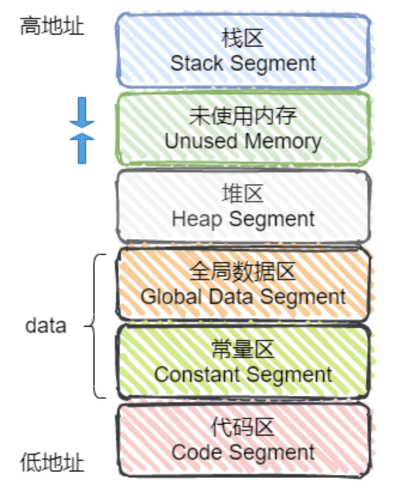

# C++ 学习笔记
记录整理《C++ Primer》与网上资料
[TOC] 

---------
## Content  
* C++内存管理  
* 变量与类型 
* 智能指针
* 迭代器
* 函数
* STL
* 异常处理
* 多线程

<br>

------
  
## C++内存管理


---
### 对象模型  
非静态数据成员被置于每一个类对象之内，静态数据成员则被存放在类对象之外；
静态和非静态成员函数都被存放在类对象外（代码区）  

在c++继承模型中，一个子类的内存大小是其基类的数据成员加上其自己数据成员大小的总和。大多数编译器对子类的内存布局是先安排基类的数据成员，然后是本身的数据成员。  

声明了virtual函数后，类将产生一系列指向虚函数的指针存放在虚表中；并且类的实例将安插一个指向虚表的指针（大多数编译器放在类实例的开始处）。  

类成员函数的this指针，是编译器将类实例的地址以第一个参数的形式传递进去的  

非virtual析构函数版本，决定继承体系中析构函数链调用的因素是指针的声明类型，virtual版本决定的因素是指针的实际类型（实际指向）；从该类开始依次调用父类析构函数  

<u>**引入virtual可能带来的副作用**</u> : &emsp; virtual会带来构造函数的强制合成（需要生成虚函数表 安排虚表指针）  
* 每个类额外增加一个指针大小的内存占用  
* 函数调用多一层间接性   

<br>  

---
### static
全局变量加static后只能在该文件所在的编译模块内访问；局部变量加static后（局部static对象）在第一次使用前分配，在程序结束时销毁，但只能在相应作用域内访问   
未初始化的全局静态变量和局部静态变量都在全局未初始化区并被默认初始化为`0`  

static 成员变量：只与类关联，不与具体对象关联；不能在类声明中初始化；定义时要分配空间；生命周期从类被加载直到类被卸载   
static 成员函数：不具有`this`指针，无法访问类对象的 非静态成员变量 和 非静态成员函数；不能被声明为const、virtual和volatile  

<br>

---
### 类型安全与类型转换
类型安全几乎等价于<b>内存安全问题</b>，代码不会试图访问自己未被授权的不该访问的内存区域  

C++的类型安全机制：
- 操作符new返回的指针类型严格与对象匹配
- C中很多以`void*`为参数的函数可以改写为C++的模板函数，而模板是支持类型检查的
- 引入const关键字代替`#define xxx`，它是有类型、作用域的
- 一些宏可以改写为inline函数，结合函数的重载，可以在类型安全的前提下支持多种类型
- C++的`dynamic_cast`使类型转换更安全，比`static_cast`涉及更多的类型检查

<br>

---
### 动态内存
程序使用动态内存出于一下原因：
- 程序不确定自己需要使用多少对象  
- 程序不确定所需对象的准确类型
- 程序需要在多个对象间共享数据（资源生命周期不单一取决于某一使用者）

<br>

---
### 内存泄漏问题
程序未能正确释放不再使用的内存  

避免内存泄漏的几种方式：
- 计数法：new或malloc时 +1，delete或free时 -1，程序结束时输出看是否为0
- **一定要将基类的析构函数声明为虚函数**
- **对象数组的释放一定要使用 `delete[]`**

检测工具：
- Linux下 Valgrind工具
- Windows下 CRT（C Run-Time）库
- 在main函数退出前，调用`_CrtDumpMemoryLeaks()`（`crtdbg.h`）

<br>

---
### new & delete
`new`实际操作：  
- 调用名为`operator new`或`operator new[]`的标准库函数，分配一块足够大的、原始的、未命名的内存空间 以便存储特定类型的对象或对象数组
- 运行相应的构造函数，并为其传入初始值
- 返回一个指向该对象的指针（创建动态数组时，仍返回元素类型的指针）

`delete`实际操作：  
- 执行对应析构函数
- 调用名为`operator delete`或`operator delete[]`的标准库函数释放内存空间（释放动态数组时，逆序销毁）

如果应用程序希望控制内存分配的过程，需要定义自己的`operator new`函数与`operator delete`函数  
编译器查找顺序：类及其基类的作用域 -> 全局作用域 -> 标准库  

<br>

---
### allocator
用于分配大块内存，但只有在真正需要时才执行对象创建操作（按需分配对象）  
避免用不上的对象的构造开销，以及不必要的赋值开销   
为 没有默认构造函数的类 实现动态分配数组  
但同时，又仍然提供一种 **类型感知的内存分配方法**  

```c++
allocator<string> alloc;
auto const p = alloc.allocate(n); //为n个未初始化的string分配内存
// allocator分配的内存是未经构造的
auto q = p; // q指向最后构造的元素后继的位置
alloc.construct(q++); // construct 接受一个指针和若干个额外参数
alloc.construct(q++, 10, 'c');
alloc.construct(q++. "hello");

while(q != p)
    alloc.destroy(--q); // 执行相应析构函数

alloc.deallocate(p, n); //释放内存
``` 

<br>

---
### 内存池
利用默认的内存管理操作符 `new`/`delete` 和函数 `malloc()`/`free()` 在堆上分配和释放内存会有一些额外的开销，且容易产生内存碎片  

在真正使用内存之前，预先申请分配一定数量、大小相等（一般情况下）的内存块留作备用；有新的内存需求时，就从内存池中分出一部分内存块，若内存块不够再继续申请新的内存  

使用allocate包装malloc、deallocate包装free   

<br>

------
## 智能指针（C++11）
---
RAII（Resource Acquisition Is Initialization） <b>将资源的生命周期绑定到对象的生命周期上</b>   
<b>用对象管理内存</b>   
通过 makexxx（工厂函数）创建  
&emsp; &emsp; 在RAII中，**资源的获取和释放被绑定到对象的 构造函数 和 析构函数 上。** 当对象被创建时，资源被获取并初始化，当对象离开作用域时，析构函数被调用，资源被释放  

使用智能指针还能确保程序在异常发生后仍可以正确释放资源  

### shared_ptr
`shared_ptr`和他人共享资源，持有者仅可以显式地释放自己共享的份额（`use_count`）但是不能释放资源；只有持有者已经是最后一个持有人地时候，释放自己份额地时候也会释放资源
- 不要使用原始指针初始化多个`shared_ptr`（它们之间不知情）
- 不要从栈的内存中（指向栈内存的指针）创建`shared_ptr`对象

可以表达 **数据结构间的共享关系**  

`reset`可以传参也可以不传参，不传参时和当前资源脱钩并减一引用计数，传参时绑定到新资源  
```c++
std::shared_ptr<T> sp = make_shared<T>(args); //安全地分配动态内存

std::shared_ptr<int> sp1(new int(10)); //资源被sp1共享，sp1引用计数 1
std::shared_ptr<int> sp2 = sp1; //资源被sp2共享，sp1、2引用计数都是2
sp1.reset();//sp1放弃共享资源，sp1自身置空，sp2引用计数变为1
sp2.reset();//sp2放弃共享资源，sp2自身置空，计数归零，资源被释放
//sp2.reset(new int(5))  sp2放弃共享资源，计数归零，资源被释放,sp2指向了新资源

shared_ptr<connection> p(&conn, end_connection); // 自定义删除其end_connection代替delete
```

与`unique_ptr`不同，`shared_ptr`不直接支持管理动态数组  

<br>

计数器递增：  
- 用一个`shared_ptr`初始化另一个`shared_ptr`
- 作为参数传递给一个函数
- 作为函数的返回值

计数器递减：  
- 给`shared_ptr`赋予一个新值
- 被销毁（如一个局部`shared_ptr`离开其作用域）

<br>

### weak_ptr 
对象的一种弱引用，<b>不增加对象的`use_count`</b>  
为了避免 `shared_ptr` 带来的环状引用  

`shared_ptr`可以直接赋值给`weak_ptr`，`weak_ptr`也可以通过调用`lock()`函数来获得`shared_ptr`   
`weak_ptr`并没有重载`operator ->`和`operator *`操作符，因此不可直接通过`weak_ptr`使用对象；典型的用法是**调用其`lock()`函数来获得`shared_ptr`实例，进而访问原始对象**  
（持有`weak_ptr`，使用时在check并获得相应的`shared_ptr`）  

<br>

### unique_ptr 
<b>独占资源（该块内存只能通过这个指针访问）</b>   
不支持普通的拷贝或赋值操作  

开销比 `shared_ptr` 小许多  
`unique_ptr`可以显示地删除资源，也可以分享独占资源或者将独占资源移交给另外地独占者

使用`std::make_unique`创建：  
```c++
std::unique_ptr<int> up1 = std::make_unique<int>(1111);
std::unique_ptr<int> up3 = std::move(up1); // 用std::move转移所有权

auto up = up3.release(); // up3放弃对指针的控制权，并将up3置空
up.reset(up2); // 释放了原来up指向的内存，并接管up2
up.reset(); // 释放
```

<br>

---
### 智能指针作为函数参数
**当函数涉及到智能指针的生存期语义的时候才使用智能指针作为传参**，否则使用普通指针或者引用  
```c++
foo(std::unique_ptr<Widget> widget);  // foo转移了资源的所有权
foo(std::unique_ptr<Widget>& widget); // foo将要对widget进行修改，指向另外的内容
foo(std::shared_ptr<Widget> widget);  // foo参与了资源的共享
foo(std::shared_ptr<Widget>& widget); // foo可能要对widget进行修改，指向另外的内容
foo(const std::shared_ptr<Widget>& widget); // foo可能要持有一份引用计数
```

<br>

---
### 智能指针与多线程 todo

------
 
## 变量与类型
---  
### 常量引用 & 引用常量 & 常量指针 & 指针常量  
| code | explain |
|--|--|
|``` const int &r ``` | 对const的引用 |
|``` int &const r ``` | 对const的引用 |  
|``` const int *p ``` | 指向常量的指针（底层const） | 
|``` int const *p ``` | 指向常量的指针 | 
|``` int *const p ``` | 指针本身是常量（顶层const） | 

在执行拷贝操作时，确保拷入和拷出的对象必须具有 <b>相同的底层const资格</b>  
（不能将一个const int * 赋值给 int *）

---
### 左值和右值 & std::move（C++11）
左值是可以放在赋值号左边可以被赋值的值；左值必须要在内存中有实体；一个左值表达式表示的是一个对象的身份。（变量是左值）  
右值当在赋值号右边取出值赋给其他变量的值；右值可以在内存也可以在CPU寄存器；一个右值表达式表示的是一个对象的值。  
*右值引用只能绑定到一个将要销毁的对象*  

一个对象被用作右值时，使用的是它的内容（值），被当作左值时，使用的是它的地址。  
- 赋值运算符需要一个（非常量）左值作为其左侧运算对象，得到的结果也仍然是一个左值
- 取地址符作用于一个左值运算对象，返回一个指向该运算对象的指针，这个指针是一个右值
- 内置解引用运算符、下标运算符、迭代器解引用运算符、string和vector的下标运算符的求值结果都是左值
- 内置类型和迭代器的递增递减运算符作用于左值运算对象，其前置版本所得的结果也是左值

左值引用绑定到返回左值的表达式   
右值引用（或 const 左值引用）绑定到返回右值的表达式  

**左值持久，右值短暂**；左值有持久的状态，而右值要么是字面常量，要么是表达式求值过程中创建的临时对象。  
我们可以自由地将一个右值引用的资源“移动”到另一个对象中（使用右值引用的代码可以自由地接管所引用的对象的资源）   

<b>通过 `std::move` 将左值强制转化为右值引用，获得一个绑定到左值上的右值引用</b>   
`std::move`  **将对象的状态或者内存所有权从一个对象转移到另一个对象**（`push_back(move(str))` 后，原str会变为空），只是转移，没有内存的搬迁或者内存拷贝  

使用移动而非拷贝的另一个原因源于IO类或unique_ptr 这样的类，这些类都包含不能被共享的资源（如指针或IO缓冲），因此这些对象不能拷贝但可以移动   

**移动构造函数（C++11）：**  
从一个右值引用创建新的对象，而无需进行深拷贝  
使用移动构造函数接管内存（转移所有权关系，将原始对象的资源直接转移到新对象中）   
```c++
StrVec::StrVec(StrVec &&s) noexcept // 移动操作（通常不分配任何资源）不应抛出任何异常 noexcept通知标准库（在标准库维护相应承诺保障时，标准库与自定义类型间的交互）
    : elements(s.elements), first_free(s.first_free), cap(s.cap)
{
    // 令s进入这样的状态，对其运行析构函数才是安全的（避免原始对象的指针导致空间释放）
    s.elements = s.first_free = s.cap = nullptr;
}
```
移动构造函数不分配任何新内存，它接管给定的源对象中的内存  

**移动赋值运算符（C++11）：**
```c++
StrVec &StrVec::operator=(StrVec &&rhs) noexcept
{
    if(this != &rhs)
    {
        free(); // 释放已有元素
        elements = rhs.elements(); // 从rhs接管资源
        first_free = rhs.first_free;
        cap = rhs.cap;

        rhs.elements = rhs.first_free = rhs.cap = nullptr; // 置rhs于可析构状态
    }
    return *this;
}
```

---
### auto（C++11）  
主要用法  
* 代替冗长复杂的变量声明
* 定义模板参数时，用于声明依赖模板参数的变量
* 模板函数依赖于模板参数的返回值   

当引用被作为初始值时，真正参与初始化的是引用对象的值  
此时编译器以引用对象的类型作为auto的类型  

auto一般会忽略顶层const &emsp; 希望auto是顶层const时，需要明确指出 ```const auto f = xxx; ```  
```auto &f = xxx``` ：将引用的类型设为auto  

还可以用于这样取出元素
```c++
    queue<tuple<int, int, int>> q;
    auto [x, y, keyState] = q.front();
```
  
---
### decltype (C++11)
推导类型（如容器的模板参数未知时）  
不会进行实际的表达式值计算  

<br>

---
### enum class (C++11)
enum class 将 { } 内的变量，加上 class 限制其在 { } 作用域内可见，是"域内枚举" (scoped enums)，可以防止命名空间污染  
```auto c = Color::yellow;```
域内的枚举成员，不能隐式的转换为广义整型；需使用类型转换符如`static_cast<>()`  

<br>

---
### nullptr（C++11）
`NULL`为整数0的宏定义  
引入`nullptr`以避免函数重载时参数类型有歧义（区分空指针和整数0）   

<br>

---
### size_t
<b>不同平台移植性问题 &emsp; 表示字节大小或数组索引</b>  
参数中带有size_t的函数通常会含有局部变量用来对数组的大小或者索引进行计算，在这种情况下，size_t是个不错的选择


size_t是 sizeof 关键字（注：sizeof是关键字，并非运算符）运算结果的类型  

---
### volatile（与多线程不相关）
关闭编译器优化，系统总是重新从它所在的内存中读取数据（保证对特殊地址的稳定访问）  
**一般用于与外部硬件交流的时候**，存储器映射的硬件寄存器通常也要加`volatile`说明，因为每次对它的读写都可能由不同意义

---
### lambda表达式（C++11）
*源于函数式编程 &emsp; 可以就地匿名定义目标函数或函数对象，不需要额外写一个命名函数或者函数对象*   

当定义一个 lambda 时，编译器生成一个与 lambda 对应的新的（未命名的）类类型；  
**向一个函数传递一个lambda** 时，同时定义了一个新的类类型和该类型的一个对象  

lambda表达式表示一个可调用的代码单元，定义了一个匿名函数（代替函数对象），并且可以捕获一定范围内的变量  
`[ capture 捕获列表 ] ( params 参数列表 ) opt 函数选项-> ret 返回值类型 { body; 函数体 };`   
* [] 不捕获任何变量。
* [&] 捕获外部作用域中所有变量，并作为引用在函数体中使用（按引用捕获）。*必须确保被引用对象在lambda执行时是存在的*
* [=] 捕获外部作用域中所有变量，并作为副本在函数体中使用（按值捕获）。*值捕获是在lambda创建时拷贝的*
* [=，&foo] 按值捕获外部作用域中所有变量，并按引用捕获 foo 变量。
* [bar] 按值捕获 bar 变量，同时不捕获其他变量。
* [this] 捕获当前类中的 this 指针，让 lambda 表达式拥有和当前类成员函数同样的访问权限。如果已经使用了 & 或者 =，就默认添加此选项。捕获 this 的目的是可以在 lamda 中使用当前类的成员函数和成员变量  

lambda 表达式的类型在 C++11 中被称为 <b>“闭包类型（Closure Type）”</b> 。它是一个特殊的，匿名的非 nunion 的类类型。可以认为它是 <b>一个带有 operator() 的类，即仿函数</b>。 因此，我们可以使用 `std::function` 和 `std::bind` 来存储和操作 lambda 表达式：  

```c++
std::function<int(int)>  f1 = [](int a){ return a; };
std::function<int(void)> f2 = std::bind([](int a){ return a; }, 123);
```

对于没有捕获任何变量的 lambda 表达式，还可以被转换成一个普通的函数指针：
```c++
using func_t = int(*)(int);
func_t f = [](int a){ return a; };
f(123);
```
需要注意的是，没有捕获变量（没有状态）的 lambda 表达式可以直接转换为函数指针，而捕获变量（有状态）的 lambda 表达式则不能转换为函数指针。
lambda 表达式可以说是就地定义仿函数闭包的“语法糖”。它的捕获列表捕获住的任何外部变量，最终均会变为闭包类型的成员变量。而一个使用了成员变量的类的 operator()，如果能直接被转换为普通的函数指针，那么 lambda 表达式本身的 this 指针就丢失掉了。而没有捕获任何外部变量的 lambda 表达式则不存在这个问题。 
<br>  

按照 C++ 标准，lambda 表达式的 operator() 默认是 const 的。按值捕获时，一个 const 成员函数无法修改成员变量的值。而 `mutable` 的作用，就在于取消 operator() 的 const  
`auto f2 = [=]() mutable { return a++; };`

· &emsp; 在priority_queue中使用lambda表达式时：  
因为在初始化priority_queue时，三个参数必须是类型名，而cmp是一个对象，因此必须通过`decltype()`来转为类型名； 因为lambda这种特殊的class没有默认构造函数，而 pq 内部排序比较的时候要使用的是一个实例化的lambda对象，通过lambda的copy构造进行实例化（pq 构造函数的时候传入这个lambda对象）  
<br>

lambda表达式还可以用于 *构造一个复杂的const对象并进行初始化*

<br>

---
### 动态类型
运行时类型识别（RTTI）   
`typeid`运算符作用于对象，获取对象类型（返回一个`type_info`的公有派生类的常量对象的引用）   
```c++
Derived* dp = new Derived;
Base* bp = dp;
if(typeid(*bp) == typeid(*dp)) {...} // 获取实际指向对象的动态类型 
if(typeid(*bp) == typeid(Derived) {...})
```
`typeid`是否需要运行时检查 决定了表达式是否会被求值（只有当类型含有虚函数时，编译器才会对表达式求值；不含虚函数时，编译器直接返回其静态类型）  
`typeid(*p)` 若`p`所指类型不含虚函数，则`p`不一定得是非空的指针；否则将需要对`*p`在运行时求值，此时`p`必须是有效的指针，若为空指针将抛出`bad_typeid`异常   

<br>

---
### 类型转换
`const_cast<type>(expression)`：  
- 改变运算对象的底层const（去掉const性质）
- 常用于有函数重载的场合中

`reinterpret_cast<type>(expression)`：  
- 为运算对象的位模式提供较低层次上的重新解释
- 很危险，不常用

`static_cast<type>(expression)`：  
- 在编译时完成
- 可用于基本数据类型之间的转换，也可用于类层次结构中的转换
- 进行上行转换（把派生类的指针/引用转换成基类的指针/引用）是安全的； 进行下行转换（把基类的指针/引用转换为派生类的指针/引用），由于没有动态类型检查，是不安全的
- static_cast不能转换掉expression的const、volitale或者__unaligned属性

`dynamic_cast<type>(expression)`：  
- 支持**运行时动态类型识别**
- 用于将基类的指针/引用安全地转换成派生类的指针/引用（想使用基类对象的指针/引用 访问某个派生类成员 或执行某个派生类操作且该操作不是虚函数时）
- 场景：*一个基类指针`bp`实际指向一个派生类对象，将其转换位派生类对象的指针以使用相关方法* `if(Derived *dp = dynamic_cast<Derived*>(bp){...} else{...})`
- 类型检查：如果转换是不安全的（如基类指针或引用实际上并不指向派生类对象），则转换会失败
- 对指针类型转换失败时返回`0`，对引用类型转换失败时抛出`std::bad_cast`
- 可以对空指针执行dynamic_cast，结果是所需类型的空指针

<br>

------
## 迭代器
<b>迭代器令算法不依赖于容器</b>  
访问元素：`(*iter) `   

使用 `find(...)` 查找：
```c++
vector<int>::iterator num = find(num_list.begin(), num_list.end(), find_num);  //返回一个迭代器指针
```

`++it`返回一个引用（不产生临时对象）； `it++`返回一个对象（会产生临时对象），效率较低  

<br>

---
### 范围库 ranges（C++ 20）
处理<b>序列</b>  
操作具有 `begin()` 和 `end()` 的范围  
提供了描述范围和对范围的操作的统一接口  

基本概念
- Range： 一个范围代表了一组元素，可以通过迭代器进行遍历。
- View： 一个View是一个轻量级的、非拥有的Range。它可以对现有的Range进行转换、过滤等操作，而不需要拷贝数据。
- Adaptor： 适配器是用于转换Range的工具。例如，可以使用filter适配器来过滤Range中的元素。

ranges中的算法是 **惰性的（懒求值）**  
ranges中的算法 **接受范围对象作为参数**，而std中的算法接受迭代器对  

使用视图views作为在范围上应用并执行某些操作的东西  
可以将各种view的关系转化用符号 `|` 串联起来  
（*允许组合多个算法和视图，形成一个管道pipeline*）  

some example：
```c++
ranges::count(str, '1');
```

<br>

------
## 函数
被定义在类内部的成员函数是自动inline的  

---
### explicit关键字
指定构造函数或转换函数 （C++11起）为显式, 即它**不能用于隐式转换和复制初始化**   
explicit 指定符可以与常量表达式一同使用，函数若且唯若 该常量表达式求值为 `true` 时 才为显式. （C++20起）    

可以限制 子类 -> 父类  

<br>

---
### const
函数前const：普通函数或成员函数（非静态成员函数）前均可加const修饰，表示函数的返回值为const，不可修改  
函数后加const：只有类的非静态成员函数后可以加const修饰，表示**该类的`this`指针为const类型，不能改变类的（非mutable）成员变量的值**  

const对象不可以调用 非const成员函数  

<br>

---
### 函数的返回
返回的值用于初始化调用位置的一个临时量，该临时量就是函数调用的结果  
  
如果函数返回引用，则该引用指示它所引对象的一个别名（不会真正拷贝对象） 没有复制返回值 而是返回的是对象本身（不要返回局部对象的引用）     
`const xx &`返回，用`xx p`接收（调用构造函数初始化p）或`const xx &p`接收

<br> 

---
### this
成员函数通过一个名为`this`的额外隐式参数（编译器传入对象本身的地址）来**访问调用它的那个对象**  

`return *this`：在非静态成员函数中返回对象本身  

<br>

---
### 运算符重载
让已有的运算符作用于自定义类类型的对象  
重载的运算符是具有特殊名字的函数：由关键字`operator`和其后要定义的运算符号共同组成  
*一般不重载 逗号、取地址、逻辑与、逻辑或*  

除了函数调用运算符`operator()`以外，其他重载运算符不能有默认实参  

可以定义为成员函数 or 非成员函数；如果一个运算符是成员函数（一般这种情况下运算符会“对对象产生影响”），其第一个（左侧）运算对象绑定到隐式的`this`指针上  

<br>

------
## STL
- datastructure
  - multiset
  - priority_queue
  - array
  - vector
  - string
  - unordered_map
- algorithm

相较于使用动态数组，使用容器的类可以使用默认版本的拷贝、赋值和析构操作  

------
## DataStructure
### map/set
查询、插入操作时间复杂度稳定为$O(logN)$   
优点：有序性   
缺点：空间占用率高，以红黑树作为内部实现时，每一个节点都需要额外保存父节点、孩子节点和红/黑性质等数据字段，使得每一个节点都占用大量的空间    

### multiset
允许重复元素（允许多个元素具有相同关键字key）  
与`unordered_xxx`不同 会对内部元素进行排序 基于红黑树  
`*s.rbegin()` 访问最大元素  
`*s.begin()` 访问最小元素

`set::lower_bound(key)` 返回指向大于等于key的下一个元素的迭代器；超过最大值时返回`s.end()`    

---  
### priority_queue  

"<" (`less<int>`) 构造大顶堆&emsp; ">"（`greater<int>`）构造小顶堆
``` c++
struct cmp {
    bool operator()(const Tweet *a, const Tweet *b) {
        return a->time < b->time;
    }
};
// 构造大顶堆 时间最大的排在最上面
priority_queue<Tweet*, vector<Tweet*>, cmp> q;
```
---
### array（C++11）
固定长度的数组  
相较于内置数组而言可以支持迭代器访问、对象赋值、拷贝、获取容量等操作，并也可以获取原始指针    

---
### vector
底层是数组，内存空间连续，遍历时有 <b>更好的空间局部性</b>  

将哈希表内容存到vector中，并根据value降序排序，按值重复存放到string中：  
``` c++
vector<pair<char, int>> vec;
for (auto &it : mp)
    vec.emplace_back(it);

sort(vec.begin(), 
    vec.end(), 
    [](const pair<char, int> &a, const pair<char, int> &b) {
        return a.second > b.second; // 降序
    }
);

string ret;
for (auto &[ch, num] : vec) {
    for (int i = 0; i < num; i++) {
        ret.push_back(ch);
    }
}
```

`vector.erase(const_iterator position);` 删除一个元素  
`vector.erase(const_iterator first, const_iterator last);` 删除范围元素  
返回一个迭代器指向下一元素  

`std::remove` 不会改变输入vector的长度。其过程相当于去除指定的字符，剩余字符往前靠；  
返回新范围的末尾迭代器的下一个（指向第一个无效值）；同`erase`搭配使用删除指定条件的元素   
如`xxx.erase(remove(xxx.begin(), xxx.end(), 0), xxx.end()); // 删除0`    

注意：当删除元素时，尾后迭代器总是失效（被删元素之前元素的迭代器、指针、引用仍有效）  
因此，添加或删除元素的程序循环必须反复调用`end()`获取最新的尾后迭代器  

<br>

### vector 容量变化
当没有空间容纳新元素时，容器分配新的内存空间，将已有元素从旧位置移动到新空间中，然后添加新元素，释放旧内存空间  
默认实现：在每次扩容时将当前容量翻倍  
（扩容后迭代器会失效）  

`reserve(n)`：分配至少能容纳n个元素的内存空间（可能更大）；当`n`小于当前容量（`capacity`）时，什么也不做，容器不会退回内存空间  

`resize(n)`：只改变容器中元素的数目，不改变容量  

<br>

---
### list
双向链表；C++11 开始有一个记录长度信息的头节点   
在随机插入数据、随机删除数据时不会导致数据搬移；所以 **在频繁的随机插入/删除的场景使用list**  
添加/删除元素不会使list的其他元素指针、引用、迭代器失效  

list 在 pop_front/pop_back 时需要判断 size 是否为`0`  

排序使用`list.sort()`  

---
### forward_list（C++11）
单向链表  

---
### string
查找：  
`find("xxx")` 返回首次出现位置（size_t类型） 若没有找到则返回 `string::npos`  
`find("xxx", n)` 从n开始查找  
`rfind("xxx")` 逆向查找  

修改：  
`erase(n)` 去掉从n开始所有字符  
`resize(n, 'x')` 改变长度，如果超过了原有长度，后面补充x  
`insert(2,"xxx")` 下标n处插入   

---
### unordered_map、unordered_set
缺点：建立较为耗时；部分情况下，性能不稳定。如当大量插入数据时，可能触发大量rehash；当哈希函数设置不合理时，冲突过多，单次查询/插入操作最坏时间复杂度达到$O(N)$  

无序容器在存储上组织为一系列桶，性能依赖于 哈希函数质量 以及 桶的数量和大小。 理想状态下哈希函数将每个特定值映射到唯一的桶，但当一个桶保存多个元素时，需要顺序查找。  

默认情况下，无序容器使用关键字类型的 `==` 运算符来比较元素，使用 `hash<key_type>` 类型的对象生成每个元素的哈希值  
STL为内置类型（包括指针）和一些标准库类型（string、智能指针等）提供了hash模板    
对于自定义类型，需要提供函数来代替 `==` 运算符和 hash计算函数  
```c++
// 自定义pair的哈希函数
struct pairHash
{
    template<class T1, class T2>
    size_t operator() (pair<T1, T2> const &pair) const
    {
        size_t h1 = hash<T1>()(pair.first); // 用默认hash分别处理
        size_t h2 = hash<T2>()(pair.second);
        return h1^h2;
    }
};
unordered_set<pair<int, int>, pairHash> visited;
```

<br>

---
## Algorithm
### accumulate
第三个参数是和的初值，其类型决定了函数中使用哪个加法运算符以及返回值的类型  

### reduce（C++17）
相比accumalate，不保证累加时的顺序   
（注意不要在`vector<bool>`上做累加）  

### sort
需要容器有随机访问迭代器（支持vector、deque等）  
传入lambda表达式：  
```c++
sort(idx.begin(), idx.end(), [&](int i, int j) {
    return heights[i] > heights[j]; // 按heights降序排序
});

ranges::sort(tasks, [](auto &a, auto &b) {return a[1] < b[1];}); // 按照tasks[i][1]升序排序
```

### nth_element
从某个序列中找到第 n 小的元素`K`，并将`K`移动到序列中第 n 的位置处，确保其前元素都比它小，其后元素都比它大  
```c++
std::nth_element(iter_first, iter_kth, iter_end);
ranges::nth_element(a, a.end() - x);
```

### unique
去除相邻重复元素（故使用前一般要先sort），将重复的元素放到容器的末尾，返回值是去重之后的尾地址  
容器实现原地去重：  
```c++
sort(xxx.begin(), xxx.end());
xxx.erase(unique(xxx.begin(), xxx.end()), xxx.end());
```

### next_permutation && next_permutation
迭代器范围内 下一/上一 全排列（默认为字典序）  
要遍历所有全排列，应确保进行迭代前已经排好序
``` c++
bool next_permutation(iterator start, iterator end, Compare comp); // 改变对象为下一全排列，若无则返回false

// example
do{
    ...
}while(next_permutation(nums.begin(), nums.end()));
```  

<br>

### lower_bound
底层为二分查找  
有序容器中，返回 `[first,last)` 中指向第一个值不小于val的位置（第一个 >= val 的位置）  
```c++
// comp可以传仿函数对象，也可以传函数指针
// 找第一个不符合 comp 规则的元素   模板中无此项时为 "<"
template <class ForwardIterator, class T, class Compare>
ForwardIterator lower_bound (ForwardIterator first, ForwardIterator last, const T& val, Compare comp);
```

<br>

---
## C++ 异常处理
异常处理机制允许程序中独立开发的部分能够在运行时就出现的问题进行通信并做出相应的处理；将问题的检测与解决过程分离开来   

C++中通过 **抛出** 一条表达式来 **引发** 一个异常；被抛出的表达式类型以及当前的调用链共同决定了哪段**处理代码（handler）** 来处理该异常（在调用链中与抛出对象类型匹配的最近的处理代码）  

执行一个`throw`时，程序的控制权从`throw`转移到与之匹配的`catch`模块；该`catch`可能是同一函数中的局部`catch`，也可能位于直接或间接调用了发生异常函数的另一个函数中，这意味着：
- 沿着调用链的函数可能会提早退出
- 一旦程序开始执行handler，沿着调用链创建的局部对象将被销毁

<br>

### 栈展开
沿着**嵌套函数的调用链**不断查找  
找到一个匹配的`catch`子句后执行完后，从与当前`catch`子句关联`try块`的最后一个`catch`子句后开始执行  

**由于栈展开可能使用析构函数，析构函数不应该抛出不能被它自身处理的异常**（*析构函数若要执行某个可能抛出异常的操作，则该操作应被置于try语句块中并在析构函数内部得到处理*）  

<br>

### 异常对象
编译器使用异常抛出表达式对异常对象进行<b>拷贝初始化</b>  
因此`throw`语句中的表达式必须拥有完全类型（类型被声明且定义）  

异常对象位于由编译器管理的空间中，编译器确保无论最终调用哪个catch子句都能访问该空间；异常处理完毕后，异常对象被销毁  

### catch
`catch`子句中的异常声明看起来像是只包含一个形参的函数形参列表；这个类型必须是完全类型，可以是左值引用，但不能是右值引用  
进入`catch`语句后，通过异常对象初始化异常声明中的参数  
类似于将派生类对象以值传递形式给一个接受基类对象的普通函数，`catch`的参数也可以使用派生类类型的异常对象进行初始化（对象会被切掉一部分）  
异常声明的静态类型将决定`catch`语句所能执行的操作  

`catch`语句中，通过`throw;`重新抛出异常。如果在改变了异常参数后重新抛出，则只有当catch异常声明是引用类型时，所做的改变才会被保留并继续传播  
`catch(...)`捕获所有异常   

### noexcept（C++11）
`noexcept`指定某个函数不会抛出异常  

<br>

------
## C++ 多线程 todo
`std::call_once`、`std::call_flag`（C++ 11）：确保某个函数或可调用对象在程序执行期间只被调用一次  
```c++
KSQLiteManager * KSQLiteManager::m_pInstance = nullptr; // 单例对象初始化
std::once_flag KSQLiteManager::m_flag; // once_flag 初始化
KSQLiteManager* KSQLiteManager::getInstance()
{
    std::call_once(m_flag, []() 
    {
            m_pInstance = new KSQLiteManager(nullptr);
    });
    return m_pInstance;
}
```

<br>

### 多线程带来的问题
- 非原子操作（一条语句可能对应多条汇编语句，甚至尽管只是简单的赋值）
- 编译器优化时的指令重排 与 现代CPU乱序执行机制（不同的`std::thread`分线程执行时，编译器并不能分析出指令重排的后果）
- 多核CPU缓存一致性

### std::thread
线程API  

### std::mutex

### std::atomic（C++11）
（实现“无锁编程”）  

原子变量是一个模板类，包含成员函数`load`和`store`，用于对其进行读操作和写操作。即使是在最低的同步等级下，也能保证多线程并行场景中对原子变量的读写是原子操作  

atomic利用 <b>CAS（Compare And Swap）思想</b> 保证原子性：
让CPU**比较内存中某个值是否和预期的值相同**，如果相同则将这个值更新为新值，不相同则不做更新  
成员函数`compare_exchange_weak()`是一个基础的CAS：其返回值为`bool`，至少接受两个参数，第一个称为`expected`，第二个称为`desired`，并且可以接受更多的`std::memory_order`作为第三、第四参数来控制同步行为   
如果`*this`和`expected`按位相等，那么则将`desired`中的值赋给`*this`，并返回`true`；否则，将`*this`中的实际值加载进`expected`，并返回`false` 

可能带来ABA问题（物理上同一个A在不同的时间上可能是两个业务状态，前面的业务状态失效并不能代表新的业务状态已失效。ABA中丢失了时间，以及时间带来的业务含义 <a href = "https://blog.csdn.net/WSYW126/article/details/53979918">AtomicInteger、Unsafe类、ABA问题</a>）  
简单的解决思路：在变量前面加上版本号，每次变量更新的时候变量的版本号都+1  

<br>

### std::memory_order（C++11）
用于描述线程间同步行为的内存模型
<b>内存序</b> 用于控制原子变量的线程间同步行为    

```c++
typedef enum memory_order {
    memory_order_relaxed, // 仅保证操作本身的原子性，不提供任何同步或 ordering 保证

    memory_order_consume, // 暂不建议

    memory_order_acquire, // 确保此操作前的写操作对于随后在相同线程中的读操作是可见的，并且对其他线程的释放操作具有同步效果
    memory_order_release, // 确保此操作后的读写操作对于在此操作之前的写操作具有同步效果，并且使得这些写操作对其他线程的获取操作可见。
    memory_order_acq_rel, // acquire-release 带此参数的读写操作既是获得操作又是释放操作。当前线程的读或写内存不能被重排到此store/load之前或之后

    memory_order_seq_cst // 确保所有线程看到的操作都是全局一致的顺序
} memory_order;
```
包括四种类型：  
- Relaxed Ordering，宽松顺序 (涉及内存序参数 <b>`memory_order_relaxed`</b>)
    只保证对目标atomic变量的`load()`和`store()`操作是原子性的  
- Release-Acquire Ordering，释放-获得顺序 (涉及内存序参数<b>`memory_order_release`</b>, <b>`memory_order_acquire`</b>, <b>`memory_order_acq_rel`</b>)
    在前者实现原子操作的基础上，atomic变量会在程序中引入多个内存屏障，限制指令重排与CPU乱序执行
    - `memory_order_acquire`用于限制`load()`，受此限制的读操作被称为 acquire 操作（获得操作），**此 load 之后的内存读写操作不能被指令重排到此 load 之前**；此外，当`load()`成功获得其他线程释放的值后，在该释放操作之前的 所有内存写入 都对本`load()`所在线程可见。
    - `memory_order_release`用于限制`store()`，受此限制的写操作被称为release 操作（释放操作），**此 store 之前的内存读写操作不能被指令重排到此 store 之后**；当前线程的所有内存写入，可见于获得该同一原子变量的其他线程
- Release-Consume Ordering，释放-消费顺序（涉及内存序参数 <b>`memory_order_consume`</b>和之前出现的 <b>`memory_order_release`</b>）
    一般不用，也不是所有编译器都支持
- Sequentially Consistent Ordering，序列一致顺序 (涉及内存序参数`memory_order_seq_cst`)
    确保所有线程看到的操作都是全局一致的顺序，提供最严格的线程同步

<br>

### shared_lock & unique_lock（C++14）

## C++ 