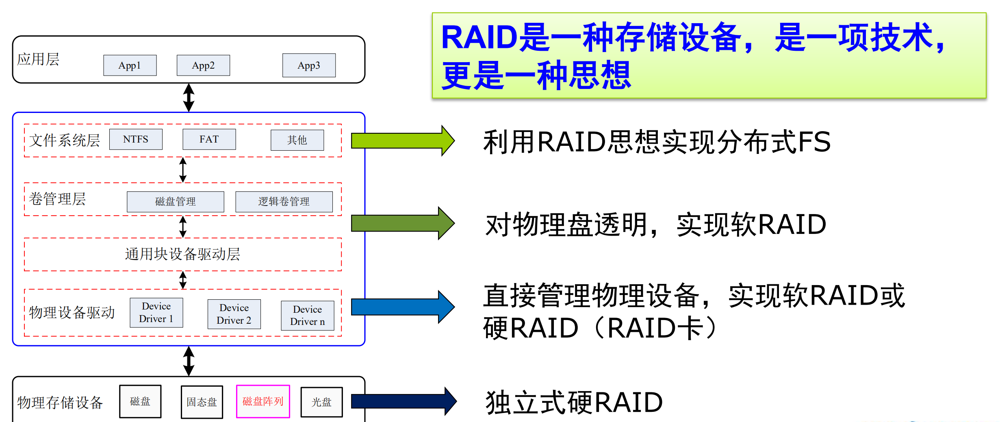

# 信息存储技术
利用具有时间稳态的物理原理和现象（磁、光、电），来实现跨越时间的信息传递  
三个条件： `具有2个或以上状态` && `状态可识别` && `状态可改变`    

---
## Content
- 存储介质
- RAID
- 存储系统体系架构
- 对象存储
- 存储虚拟化
- 软件定义存储

 

------
* ## 存储介质
---
SSD具有好的随机读性能，而小的随机写上低性能同时会磨损  
HDD在顺序读写上具有良好性能，但在随机读写上性能极低  

 

------
* ## RAID
---
多个硬盘按某种方式连接成硬盘组，OS下视为一个逻辑硬盘  

软件式RAID与硬件式RAID：是否占用主机资源（CPU & Memory）  
软RAID有关RAID的所有任务都由CPU完成  
硬RAID全面具备自己的RAID控制/处理与IO控制/处理芯片，甚至还有阵列缓冲（Array Buffer）  

   

 

RAID 基本原理与特征：
- 数据以 <b>条块化（stripe）</b>分布于多个磁盘
- 存储容量扩展，I/O性能提升
- 冗余机制 &emsp; 较高的数据可用性（即使某些部件故障仍能够为用户提供服务）
- 通过冗余信息实现数据恢复  
  
RAID 不足：
- 容量损失：存储冗余信息
- 带宽损失：冗余信息的读写
- 计算资源损失：冗余信息的更新，恢复  
  
RAID 级别：
- RAID 0：数据分割，无容错能力
- RAID 2：海明码，不具有商业生命力
- RAID 1：镜像（双拷贝）
- RAID 10：分块与镜像（在几组镜像阵列间条带化）
- RAID 01：（先条带化，再镜像）
- RAID 3：并行，位交叉，单校验盘 `奇偶校验`
- RAID 4：并行，块交叉，单校验盘 `奇偶校验`
- RAID 5：独立，循环校验盘（RAID4改进，RAID4并发写操作受限于校验盘）
- RAID 6：两个校验条带，容双盘错，块交叉，近年被广泛重视
  
STRIPING技术并不能有效地提高速度：分块大小与磁盘机械特性有关，文件的大小也各不相同。  
并行I/O提高速度的能力有限：多次读写后，数据散列在各个盘上，磁盘的机械运动成为阻碍速度提高的主要因素。  

 

SCSI：Small Computer System Interface 计算机与外部设备（特别是存储设备）间系统级接口的标准  

 

------
* ## 存储系统体系架构
---
### <b>DAS</b> Direct Attached Storage 直接连接存储  
<b>`独占式`</b>  
存储设备(通常为磁盘或磁带)通过电缆直接与计算机相连, 系统存取访问I/O请求(又称为协议或命令)直接在计算机和存储设备间进行。

---
### <b>SAN</b> Storage Area Network 存储局域网  
在网络环境下将存储设备从服务器中分离出来，用 <b>区域网</b> 连接，进行 <b>集中管理</b>  
（服务器访问存储设备的一种连接方式）  

A SAN is two or more devices communicating via a serial SCSI protocol, such as Fibre Channel, iSCSI…   

SAN的优点：
- 几乎无限的扩展能力
- 非常强健的设备连接
- 高速度、极高的传输效率
- 异构平台数据共享(需软件支持)
- 传输距离更远，可达数十公里  

 

### · &emsp; FC-SAN
基于光纤信道的传统SAN即 <b>FC-SAN</b>，FC（Fibre Channel）是介于通道和局域网之间的一种接口，构成存储专用网络的基础  
五个协议层次  

FC 访问控制：
- 软分区：使用`名称服务器`来限制在响应查询时返回给启动器的信息。该区域中的设备可以通过`全球节点名称`、`全球端口名称`或`设备所连接的交换机的域/端口`进行标识。
- 硬分区：由Fabric强制执行。交换机监控通信，并阻止任何不符合有效区域配置的帧。此阻塞将在目标设备所在的端口的传输侧执行。

 

### · &emsp; IP-SAN
扩展了SAN的距离，减少了SAN的成本  
IP以最低的成本为可容忍延迟的应用程序提供了最大的灵活性  

iSCSI 一个本地IP存储块级协议 &emsp; 在协议栈中介于TCP/IP与SCSI之间，支持在IP协议的上层运行的SCSI指令集    

---
### <b>NAS</b> Network Attached Storage 附网存储
<b>`通过网络共享存储`</b>  
NAS实际上是一种应用服务器，其内部集成了处理器和存储设备，可以直接连入TCP/IP的网络，通过TCP/IP协议向其他的计算机提供文件共享服务  
NAS使用网络和文件共享协议，实现文件归档和存储等功能  

将通用服务器从繁重的文件服务操作中解脱出来，提高了通用服务器的利用率

<b>NAS是一个专用的文件服务器:</b>  
物理连接上，将存储器直接接到网络上，不再挂在服务器后端，避免了给服务器增加I/O负载（存储设备作为独立网络节点存在于网络中）  
技术上，通过专用软件提供高性能的文件服务  
从NAS的构成看，其I/O路径在本质上仍然是传统的 `服务器-存储设备`I/O方式——文件服务器  

NAS Router 提供全局命名空间

 

------
* ## 对象存储
---
<b>`将数据作为对象进行管理`</b>  
<b>将数据通路（数据读、写）与控制通路（元数据）分离</b>  
每个对象通常包括数据本身，数量可变的元数据和全局唯一标识符OID  
OID as a flat Namespace &emsp; 同块设备相比，提供的访问接口不同  
基于对象存储设备构建存储系统，每个OSD具有一定的智能，能够自动管理其上的数据分布。  

在传统的存储系统中，块设备要记录每个存储数据块在设备上的位置。而Object维护自己的属性，简化了存储系统的管理任务，增加了灵活性。  

对象存储系统组成：
- 对象Object：包含了文件数据以及相关的属性信息，可以进行自我管理
- OSD（Object-based Storage Device）：一个智能存储设备，是Object的集合
- 文件系统：文件系统运行在客户端上，将应用程序的文件系统请求传输到MDS和OSD上 
- 元数据服务器（Metadata Server，MDS）：系统提供元数据、Cache一致性等服务
- 网络连接
  
对象存储与键值存储的不同点：
- 对象存储还允许将一组有限的属性（元数据）与每个（数据）对象相关联
- 对象存储针对大量数据（数百兆甚至千兆字节）进行了优化，而对于键值存储，其值则相对较小（千字节）
- 对象存储通常提供较弱的一致性保证，例如最终的一致性，而键值存储则提供较强的一致性

 

------
* ## 存储虚拟化
---
<b>把物理存储与逻辑视图分离</b>  
将多个不同类型、独立存在的物理存储体，通过软、硬件技术集中转化为一个逻辑上虚拟的存储单元，集中管理供用户统一使用

实现存储虚拟化的层次：
- Host Implementation（Application, OS, HBA）
- Network implementation （Switch, Router, Gateway）
- Storage implementation （Array, Library, Device） 
  
SVC SAN Volume Contoller 存储区域网体量控制

 

------
* ## 软件定义存储
---
<b>针对功能和服务与存储设备剥离，实现按需定制</b>  
将数据中心或者跨数据中心的各种存储资源<b>抽象化、池化</b>，以服务的形式提供给应用，满足应用按需(如容量、性能、QoS、SLA等)自动化使用存储的需求。  
提供自助的服务接口，用于分配和管理虚拟存储空间  

