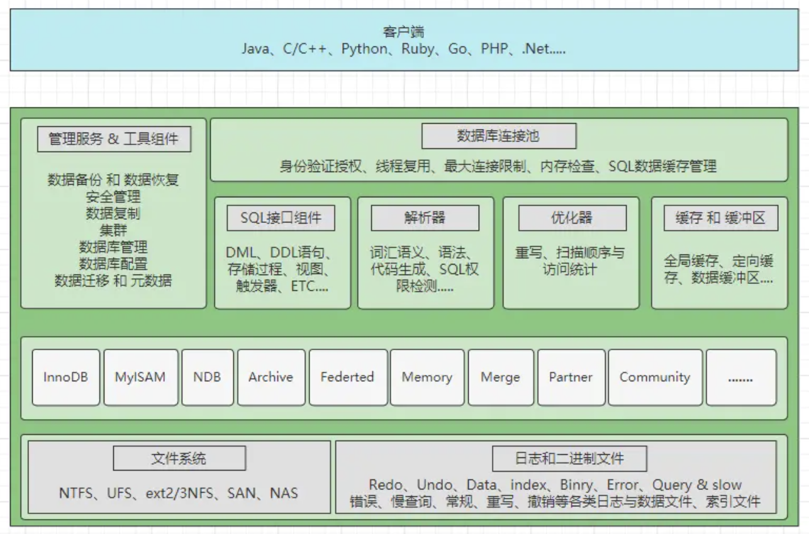

[TOC]
# Datatbase
## Content
- 关系型数据库

------
# 关系型数据库
以MySql为例

MySql架构图：  
  
- 网络连接层：主要是指数据库连接池，会负责处理所有客户端接入的工作。
- 系统服务层：主要包含SQL接口、解析器、优化器以及缓存缓冲区四块区域。
- 存储引擎层：这里是指MySQL支持的各大存储引擎，如InnoDB、MyISAM等。
- 文件系统层：涵盖了所有的日志，以及数据、索引文件，位于系统硬盘上。

只要能与MySQL建立网络连接，都可以被称为是MySQL的客户端；当一个客户端尝试与MySQL建立连接时，MySQL内部都会派发一条线程负责处理该客户端接下来的所有工作；MySQL的连接一般都是基于 TCP/IP协议 建立网络连接（半双工）  

 

## 数据库连接池
**所有的客户端连接都需要一条线程去维护**，而线程不可能无限创建；连接池相当于**线程池**，主要是为了 **复用线程、管理线程以及限制最大连接数**   
*将数据库创建出的连接对象放入到一个池中，一旦出现新的访问请求会复用这些连接*  

当一个客户端连接断开后，对于数据库连接却不会立马销毁，而是会先放入到一个缓存连接池当中  
（MySQL连接池维护的是工作线程，客户端连接池则维护的是网络连接）  

 

## SQL接口
<b>客户端连接传递SQL语句时的入口 & 数据库返回数据时的出口（处理结果集）</b>  

SQL语句类型划分：
- DML：数据库操作语句，比如update、delete、insert等都属于这个分类。
- DDL：数据库定义语句，比如create、alter、drop等都属于这个分类。
- DQL：数据库查询语句，比如最常见的select就属于这个分类。
- DCL：数据库控制语句，比如grant、revoke控制权限的语句都属于这个分类。
- TCL：事务控制语句，例如commit、rollback、setpoint等语句属于这个分类

首先会对SQL做哈希处理，根据SQL语句计算出一个哈希值，然后去「查询缓存」中比对  

存储过程：一段预先写好并编译完成的常用或复杂的SQL  
<b>触发器是一种特殊的存储过程。</b>存储过程需要手动调用后才可执行，而触发器可由某个事件主动触发执行   

 

## 解析器
客户端连接发送的SQL语句，经过SQL接口后会被分发到解析器  
词法分析、语义分析、语法树生成... &emsp; 验证SQL语句是否正确，并将SQL语句解析成MySQL能看懂的机器码指令  

 

## 优化器
生成最优执行计划，比如选择最合适的索引，选择最合适的join方式等  

优化器生成了执行计划后，维护当前连接的线程会负责根据计划去执行SQL （执行的过程实际上是在调用存储引擎所提供的API）  

 

## 缓冲区
写操作时，由于要对表数据发生更改，因此如果在缓存中发现了要操作的表存在SQL语句的缓存，则需要将整个表的所有SQL缓存清空，确保缓存的强一致性  

在真正调用存储引擎的API操作磁盘之前，首先会在内存「缓冲区」中查找有没有要操作的目标数据/目标表，如果存在则直接对缓冲区中的数据进行操作，然后MySQL会在后台以一种名为Checkpoint的机制，将缓冲区中更新的数据刷回到磁盘（与操作缓冲区的过程是异步的）。只有当缓冲区没有找到目标数据时，才会去真正调用存储引擎的API   

## 日志
「写SQL」执行的前后都会记录日志，这也是写SQL与读SQL最大的区别  
执行读SQL一般不会有状态（不会留下痕迹）  

 与「查询SQL」恰恰相反，任何一条写入类型的SQL都是有状态的，也就代表着只要是会对数据库发生更改的SQL，执行时都会被记录在日志中。首先所有的写SQL在执行之前都会生成对应的撤销SQL，撤销SQL也就是相反的操作，比如现在执行的是insert语句，那这里就生成对应的delete语句....，然后记录在undo-log撤销/回滚日志中。但除此之外，还会记录redo-log日志  
redo-log日志是InnoDB引擎专属的，主要是为了保证事务的原子性和持久性。在「写SQL」正式执行之前，就会先记录一条prepare状态的日志，表示当前「写SQL」准备执行，然后当执行完成并且事务提交后，这条日志记录的状态才会更改为commit状态   

 

------
# Redis
Redis 是一种基于内存的 key-value 数据库，读写速度非常快，常用于缓存，消息队列、分布式锁等场景   
常用作MySQL的缓存：Redis 具备「高性能」、「高并发」两种特性  

将数据分为冷热 热数据放入内存中  

数据从内存中读写  
数据保存到硬盘上防止重启数据丢失  
- 增量数据保存到aof文件
- 全量数据rdb文件

 

## Redis 数据结构
五种常见的Redis数据类型：
- String：底层数据结构实现主要是 SDS（简单动态字符串），不仅可以保存文本数据，还可以保存二进制数据；获取字符串长度的时间复杂度是 O(1)；且 Redis 的 SDS API 是安全的，拼接字符串不会造成缓冲区溢出（*在拼接字符串之前会检查 SDS 空间是否满足要求，如果空间不够会自动扩容*）
- List：底层数据结构实现为quicklist
- Hash
- Set
- ZSet

## Redis 线程模型
redis单线程处理所有操作命令（顺序执行：接收客户端请求 -> 解析请求 -> 进行数据读写等操作 -> 发送数据给客户端）   
*为「关闭文件、AOF 刷盘、释放内存」这些任务创建单独的线程来处理；* 后台线程相当于消费者；生产者把耗时任务丢到任务队列中，消费者（BIO）不停轮询这个队列，拿出任务就去执行对应的方法即可  
关闭文件、AOF 刷盘、释放内存这三个任务都有各自的任务队列  
