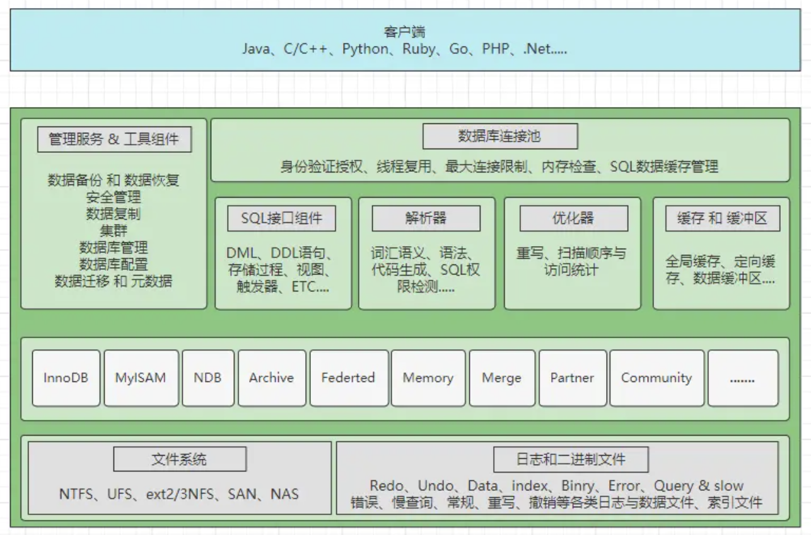
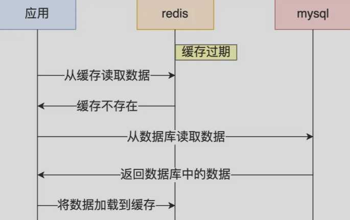
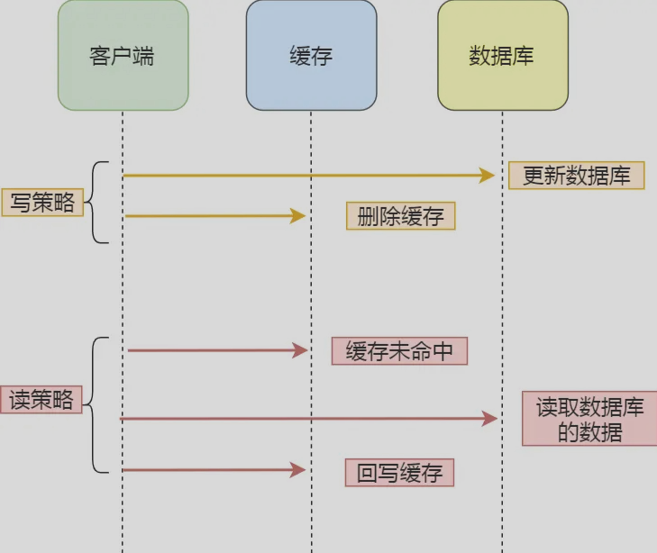

[TOC]
# Datatbase
## Content
- 关系型数据库

------
# 关系型数据库
以MySql为例

MySql架构图：  
  
- 网络连接层：主要是指数据库连接池，会负责处理所有客户端接入的工作。
- 系统服务层：主要包含SQL接口、解析器、优化器以及缓存缓冲区四块区域。
- 存储引擎层：这里是指MySQL支持的各大存储引擎，如InnoDB、MyISAM等。
- 文件系统层：涵盖了所有的日志，以及数据、索引文件，位于系统硬盘上。

只要能与MySQL建立网络连接，都可以被称为是MySQL的客户端；当一个客户端尝试与MySQL建立连接时，MySQL内部都会派发一条线程负责处理该客户端接下来的所有工作；MySQL的连接一般都是基于 TCP/IP协议 建立网络连接（半双工）  

 

## 数据库连接池
**所有的客户端连接都需要一条线程去维护**，而线程不可能无限创建；连接池相当于**线程池**，主要是为了 **复用线程、管理线程以及限制最大连接数**   
*将数据库创建出的连接对象放入到一个池中，一旦出现新的访问请求会复用这些连接*  

当一个客户端连接断开后，对于数据库连接却不会立马销毁，而是会先放入到一个缓存连接池当中  
（MySQL连接池维护的是工作线程，客户端连接池则维护的是网络连接）  

 

## SQL接口
<b>客户端连接传递SQL语句时的入口 & 数据库返回数据时的出口（处理结果集）</b>  

SQL语句类型划分：
- DML：数据库操作语句，比如update、delete、insert等都属于这个分类。
- DDL：数据库定义语句，比如create、alter、drop等都属于这个分类。
- DQL：数据库查询语句，比如最常见的select就属于这个分类。
- DCL：数据库控制语句，比如grant、revoke控制权限的语句都属于这个分类。
- TCL：事务控制语句，例如commit、rollback、setpoint等语句属于这个分类

首先会对SQL做哈希处理，根据SQL语句计算出一个哈希值，然后去「查询缓存」中比对  

存储过程：一段预先写好并编译完成的常用或复杂的SQL  
<b>触发器是一种特殊的存储过程。</b>存储过程需要手动调用后才可执行，而触发器可由某个事件主动触发执行   

 

## 解析器
客户端连接发送的SQL语句，经过SQL接口后会被分发到解析器  
词法分析、语义分析、语法树生成... &emsp; 验证SQL语句是否正确，并将SQL语句解析成MySQL能看懂的机器码指令  

 

## 优化器
生成最优执行计划，比如选择最合适的索引，选择最合适的join方式等  

优化器生成了执行计划后，维护当前连接的线程会负责根据计划去执行SQL （执行的过程实际上是在调用存储引擎所提供的API）  

 

## 缓冲区
写操作时，由于要对表数据发生更改，因此如果在缓存中发现了要操作的表存在SQL语句的缓存，则需要将整个表的所有SQL缓存清空，确保缓存的强一致性  

在真正调用存储引擎的API操作磁盘之前，首先会在内存「缓冲区」中查找有没有要操作的目标数据/目标表，如果存在则直接对缓冲区中的数据进行操作，然后MySQL会在后台以一种名为Checkpoint的机制，将缓冲区中更新的数据刷回到磁盘（与操作缓冲区的过程是异步的）。只有当缓冲区没有找到目标数据时，才会去真正调用存储引擎的API   

## 日志
「写SQL」执行的前后都会记录日志，这也是写SQL与读SQL最大的区别  
执行读SQL一般不会有状态（不会留下痕迹）  

 与「查询SQL」恰恰相反，任何一条写入类型的SQL都是有状态的，也就代表着只要是会对数据库发生更改的SQL，执行时都会被记录在日志中。首先所有的写SQL在执行之前都会生成对应的撤销SQL，撤销SQL也就是相反的操作，比如现在执行的是insert语句，那这里就生成对应的delete语句....，然后记录在undo-log撤销/回滚日志中。但除此之外，还会记录redo-log日志  
redo-log日志是InnoDB引擎专属的，主要是为了保证事务的原子性和持久性。在「写SQL」正式执行之前，就会先记录一条prepare状态的日志，表示当前「写SQL」准备执行，然后当执行完成并且事务提交后，这条日志记录的状态才会更改为commit状态   

 

------
# Redis
Redis 是一种基于内存的 key-value 数据库，读写速度非常快，常用于缓存，消息队列、分布式锁等场景   
常用作MySQL的缓存：Redis 具备「高性能」、「高并发」两种特性  

将数据分为冷热 热数据放入内存中  

数据从内存中读写  
数据保存到硬盘上防止重启数据丢失  
- 增量数据保存到aof文件
- 全量数据rdb文件

 

## Redis 数据结构
五种常见的Redis数据类型：
- String：
  - 底层数据结构实现主要是 SDS（简单动态字符串），**不仅可以保存文本数据，还可以保存二进制数据**，value 最多可容纳 512MB；
  - 包含`len`属性，获取字符串长度的时间复杂度是 $O(1)$；
  - SDS（简单动态字符串）内部编码视 value 种类共有 int、emdstr、raw 三种
  - Redis 的 SDS API 是安全的，拼接字符串不会造成缓冲区溢出（*在拼接字符串之前会检查 SDS 空间是否满足要求，如果空间不够会自动扩容*）
  - 可用于 <b>计数</b>
  - `SET` 命令有 `NX` 参数可以实现 “key 不存在才插入”，可以用来实现 <b>分布式锁</b>（一般而言，还会对分布式锁加上过期时间）`SET lock_key unique_value NX PX 10000`；解锁时，先验证是否为unique_value对应客户端操作，再删除，由 Lua 脚本来保证原子性（Redis 执行 Lua 脚本时，可以以原子性的方式执行）
  - 可用于在分布式服务端中共享用户的 Session 信息（如会话、登录状态）
- List：
  - 底层数据结构实现为 quicklist，按 先进先出 的顺序对数据进行存取
  - 常用于 <b>消息队列</b>（需求：消息保序、处理重复消息、保证消息可靠性）；
  - （消息保序） 生产者`LPUSH key value [value ...]`将消息插入到队列的头部，如果 key 不存在则会创建一个空队列；消费者`RPOP key`依次读取队列的消息，先进先出 
  - `BRPOP`命令：阻塞式读取，在没有读到队列数据时自动阻塞，直到有新的数据写入队列时，再开始读取新数据
  - （处理重复消息） 需要自行为每个消息生成一个 全局唯一ID，以供消费者记录已经处理过的消息
  - （保证消息可靠性） `BRPOPLPUSH`命令：消费者程序从一个 List 中读取消息，同时 Redis 把这个消息再插入到另一个 备份 List，以防止消费者在处理消息过程中宕机导致消息丢失
  - 但 List 不支持多个消费者消费同一条消息
- Hash
  - `(key, value)`集合，value形如`value=[{field1，value1}，...{fieldN，valueN}]`；适合用于存储对象（与对象的（对象id， 属性， 值）的结构相似）
  - 一般对象用 String + Json 存储，对象中某些频繁变化的属性可以考虑抽出来用 Hash 类型存储
- Set
- ZSet
  - 有一个 Score 属性可用来存储延迟执行的时间，以实现延迟消息队列 

 

### Redis 大key处理
大key：key 对应 value 很大，造成阻塞或内存分布不均匀    

------
## Redis 线程模型
Redis单线程处理所有操作命令（顺序执行：接收客户端请求 -> 解析请求 -> 进行数据读写等操作 -> 发送数据给客户端）   
执行命令的过程是原子的  
可以使用 String 数据类型于需要计数的场景

*为「关闭文件、AOF 刷盘、释放内存」这些任务创建单独的线程来处理；* 后台线程相当于消费者；生产者把耗时任务丢到任务队列中，消费者（BIO）不停轮询这个队列，拿出任务就去执行对应的方法即可  
关闭文件、AOF 刷盘、释放内存这三个任务都有各自的任务队列   

Redis 6.0 后采用多线程处理网络I/O；但是对于命令的执行，Redis 仍然使用单线程来处理  

 

------
## Redis 持久化
把内存中数据存储到磁盘的机制，这样在 Redis 重启就能够从磁盘中恢复原有的数据  

AOF日志：每执行一条写操作命令，就把该命令以追加的方式写入到一个文件里  
*先执行命令，再写入日志（将命令追加到 server.aof_buf 缓冲区，再通过`write()`系统调用写入AOF文件（OS内核缓冲区），再写入磁盘）*   
Redis重启时通过顺序执行AOF日志中的指令实现恢复  
- AOF重写机制：读取当前数据库中的所有键值对，然后将每一个键值对用一条命令记录到「新的 AOF文件」，实现对AOF文件的压缩  
- AOF重写由后台子进程完成
- AOF重写时，将写命令写入到 「AOF 缓冲区」和 「AOF 重写缓冲区」

RDB快照：将某一时刻的内存数据，以二进制的方式写入磁盘（RDB文件）  
- 使用`save`命令时，在主线程执行；使用`bgsave`命令时，创建一个子线程执行
- 执行`bgsave`命令时，通过`fork()`创建子进程，此时子进程和父进程是共享同一片内存数据（创建子进程时复制父进程的页表，但是页表指向的物理内存还是一个）；如果主线程执行写操作，则被修改的数据会复制一份副本（OS写时复制），此时`bgsave`子进程会把该副本数据写入 RDB文件，在这个过程中，主线程仍然可以直接修改原来的数据

混合持久化：AOF重写日志时，fork的重写子进程会先将与主线程共享的内存数据以 RDB方式写入到 AOF文件；后续主线程处理被记录在重写缓冲区里的增量命令会以 AOF方式写入到 AOF文件，写入完成后通知主进程将新的<b>含有RDB格式和AOF格式的 AOF文件</b> 替换旧的的 AOF文件   

 

------
## Redis 集群
一致性、可用性、分区容错性  

### 主从复制
<b>Redis 高可用服务的最基础的保证</b>  
将一台 主Redis服务器，同步数据到多台 从Redis服务器 上  

主从服务器之间采用的是「读写分离」的方式（从服务器一般只读；数据修改只在主服务器上进行，然后将最新的数据同步给从服务器）  

哨兵模式：哨兵节点监控主从服务器，并且提供主从节点故障转移的功能  

 

### 集群切片模式
当 Redis 缓存数据量大到一台服务器无法缓存时，将数据分布在不同的服务器上，以此来降低系统对单主节点的依赖  

先映射到哈希槽，再映射到具体节点  

 

### 集群脑裂时的问题
由于网络问题，集群节点之间失去联系（但客户端与旧主节点还保持通信），哨兵重新选取了一个主节点，在旧主节点重新恢复联系后，主从数据不同步  
会将旧主节点降级为从节点，清空掉旧主节点本地的数据，然后再向新主节点做全量同步；（此之前 **客户端向旧主节点写入的数据会丢失**）  

解决方案：主节点发现从节点下线或通信总数量小于阈值时，禁止写数据，直接返回错误给客户端  
- `min-slaves-to-write`：主节点必须要有至少 x 个从节点连接
- `min-slaves-max-lag`：主从数据复制和同步的延迟不能超过 x 秒

 

---
## Redis 过期删除
过期字典：存储 Redis 中所有 key 的过期时间   
查询 key 时，先查过期字典   

- 惰性删除：不主动删除过期键，每次访问 key 时，都检测 key 是否过期，如果过期则删除该 key（但在过期 key 一直没有被二次访问时会造成内存浪费）  
- 定期删除：每隔一段时间随机取出一定数量的 key 进行检查，并删除其中的过期 key  

Redis 运行在主从模式下时，从库不会进行过期扫描，从库对过期的处理是被动的；对从库过期键的处理依靠主服务器控制，主库在 key 到期时，会在 AOF 中新增一条 del指令同步到所有的从库   

 

## Redis 内存淘汰
### Redis LRU
<b>最久未使用</b>  
Redis在其对象结构体里加一个额外的字段，记录最后一次访问时间，以实现LRU   
随机抽取几个值，淘汰其中最久未使用的（不用为所有的数据维护一个大链表，节省了空间占用；不用在每次数据访问时都移动链表项，提升了缓存的性能）  

无法解决缓存污染问题（一次读取了以后用不上的大量数据，却被塞入缓存中）

### Redis LFU （after Redis 4.0）
<b>最近不常用</b>  
记录每个数据的访问次数（假设 *如果数据过去被访问多次，那么将来被访问的频率也更高*）  

在对象头部`lru`字段中，分为两段区域存储：高16bit 存 key 的访问时间戳，低 8bit 记录 key 的访问次数  

 

------
## Redis 缓存设计
   

缓存雪崩问题：大量数据在同一时间失效，导致大量请求直接访问数据库，使数据库压力骤增   
解决方案：在原有的失效时间基础上增加一个随机值，以打散缓存失效时间  

缓存击穿问题：热点数据失效，大量请求直接访问数据库，使数据库压力骤增  
解决方案：热点数据不设置过期时间，由后台异步更新缓存；或在热点数据准备过期前，提前通知后台进程更新缓存并重新设置过期时间  

缓存穿透问题：大量请求访问既不在缓存、也不在数据库的数据（由于业务误删或黑客恶意攻击）  
解决方案：API入口处先判断请求参数是否合理；在缓存中设置空值或默认值  

**如何设计一个缓存策略，可以动态缓存热点数据呢？（只缓存一部分热点数据）**
通过数据最新访问时间来做排名，并过滤掉不常访问的数据，只留下经常访问的数据  
*Redis 中可以用 `zadd` 方法和 `zrange` 方法来完成 排序队列 和 获取 x 个项*  

------
## 缓存更新策略
关键在于 “如何保证数据库和缓存的一致性”  

### Cache Aside 旁路缓存
用于 Redis 和 MySQL  
应用程序直接与「数据库、缓存」交互，并负责对缓存的维护  
适用于 读多写少 的场景（*当写入频繁时，缓存中的数据会被频繁地清理*）  
   

写策略：先更新数据库中的数据，再删除缓存中的数据（先写数据库再删缓存）  
读策略：命中缓存则直接返回数据；否则从数据库中读取数据，然后将数据写入到缓存，并返回给用户   

写时，不能先删除缓存再更新数据库；否则在 **“读 + 写” 并发** 的时候，会因为读不命中，再次将旧数据写回了缓存，出现缓存和数据库的数据不一致性的问题  
理论上先更新数据库再删除缓存也会出现数据不一致性的问题（但一般可以认为写数据库的操作会比写缓存的操作慢很多）   

**Q：如何保证写时的两步操作都能成功？**    
- 重试机制：引入 <b>消息队列</b>，将（删除缓存）要操作的数据加入到消息队列，由消费者来操作数据，删除成功时把数据从消息队列中移除  
- 订阅 MySQL binlog：数据库操作成功后会生成一条变更日志记录于 binlog，拿到具体要操作的数据，然后再执行缓存删除

**Q：为什么是删除缓存，而不是更新缓存？**  
- 删除缓存比更新缓存呢操作更为轻量化；且实际业务中，缓存的数据可能不是直接来源于数据表，而是多张底层表的聚合
- （Lazy Loading）不是所有的缓存数据都是频繁访问的，更新后的缓存可能会长时间不被访问