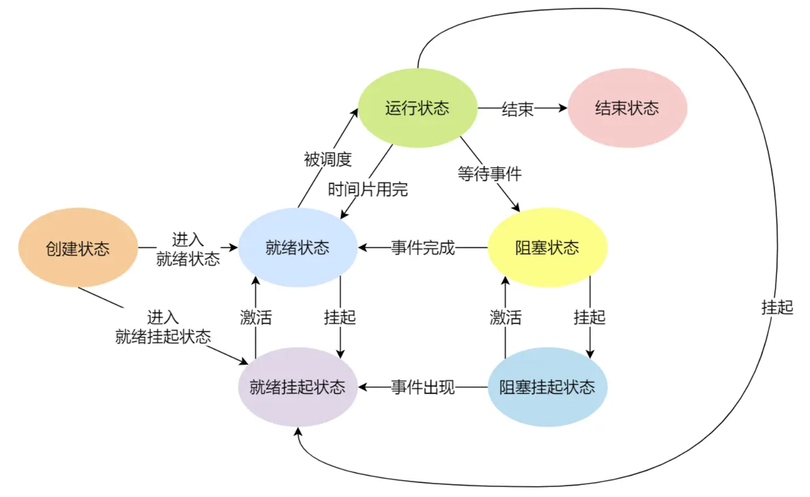
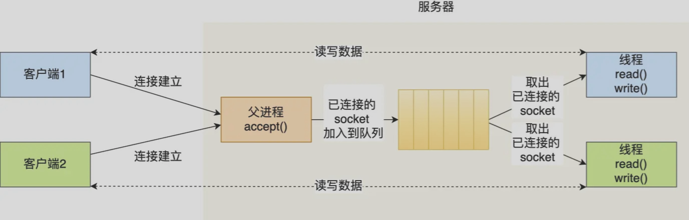
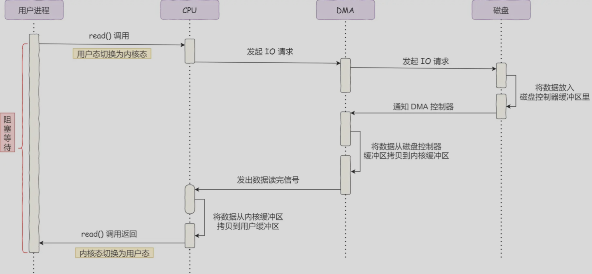

# 操作系统
内存管理、进程管理、文件系统管理、输入输出设备管理  
[TOC]

------
## Content
- 概论
- 操作系统内核
- 并发
- 虚拟化
- 持久化

------
## 概论
操作系统的基本动机：更快更好地服务更多应用  
基本方法：Building Abstractions（抽象）    
**管理软硬件资源，为程序提供服务** 的程序  
以API的形式管理共享资源（产生 进程、地址空间 等概念）   

切入的关键：什么是资源，这些资源是“怎么样的”？  

---
### 应用视角的操作系统
程序的本质是状态机（寄存器和内存的状态） （拥有严格数学定义的）    

程序的退出是由OS实现的（把系统调用参数放到寄存器中，执行syscall，操作系统接管程序）  
操作系统可以任意改变程序的状态

*关闭计算机是由OS和硬件（电源管理接口）、计算机固件（如BIOS、UEFI）交互协作实现的*   

操作系统提供令应用程序舒适的抽象（对象+API）  

<br>

---
### 硬件视角的操作系统
计算机系统中的一切都是状态机  
RESET内部状态，执行firmware代码（固件）（配置计算机系统、加载OS）  

操作系统就是一个运行在计算机硬件上的程序  

<br>

---
### 数学视角的操作系统
程序是一种“数学严格”的对象（状态 + 迁移函数）  
*编程时，应把需要保证（证明）的性质写成 assertions*   

操作系统是状态机的管理者（状态机的容器），同时也是一个状态机   

- 状态：多个“应用程序”状态机
- 初始状态：仅有一个“main”状态机
- 迁移：选择一个状态机执行一步
- 调度：状态机选择的不确定性
- I/O：系统外的输入不确定性

操作系统建模状态图  
证明一个程序的正确性（尤其在并发场景下）：在程序状态图上做BFS  

<br>

------
## 操作系统内核
应用连接硬件设备的桥梁（应用程序只与内核交互）  
现代操作系统内核一般会提供 4 个基本能力：
- 进程调度：管理进程、线程，决定哪个进程、线程使用 CPU
- 内存管理：决定内存的分配和回收
- 硬件通信：管理硬件设备，为进程与硬件设备之间提供通信能力
- 提供系统调用：如果应用程序要运行更高权限运行的服务，就需要系统调用；（用户程序与操作系统之间的接口）

内存划分为内核空间与用户空间  

内核程序执行在内核态，用户程序执行在用户态。当应用程序使用系统调用时，会产生一个中断。发生中断后，CPU 会中断当前在执行的用户程序，跳转到中断处理程序（开始执行内核程序）。内核处理完后，主动触发中断，把 CPU 执行权限交回给用户程序，回到用户态继续工作  

<br>

------
## 并发
操作系统上允许运行多个程序   

在 Linux 内核中，进程和线程都是用 `task_struct` 结构体表示的，区别在于线程的 `task_struct` 结构体里部分资源是共享了进程已创建的资源，比如内存地址空间、代码段、文件描述符等  
一般来说，没有创建线程的进程，是只有单个执行流，它被称为是主线程。如果想让进程处理更多的事情，可以创建多个线程分别去处理，但不管怎么样，它们对应到内核里都是 `task_struct`（OS内核里调度的对象）  

并发控制：  
- 互斥锁实现原子性
- 条件变量/信号量实现顺序同步

<br>

### 多处理器编程
多线程编程模型：多个共享内存的状态机  
- C语言状态机的多个线程：共享全局变量、独立的栈帧列表
- 汇编语言状态机的多个线程：共享的地址空间、独立的寄存器（SP指向不同的内存位置）

线程之间有共享内存  
线程具有独立的堆栈   

状态迁移：任意选择一个线程执行一步  

OS会自动把线程放在不同处理器上   
线程可能在不同 CPU 核心来回切换执行   
多核CPU的L3 Cache是核心之间共享的，L1、L2 Cache是每个核心独有的  

不同的处理器上，“对全局状态的观测是相对的”   
不同处理器可能看到不同的内存镜像（每个线程对应不同的副本）  

<br>

---
### 并发控制——互斥（锁）
多处理器和并发执行推翻了顺序执行的基本假设  
如何实现CPU的原子性？（“原子的”状态迁移）  

中断是每一个处理器独享的  

`lock()`、`unlock()` 实现互斥  
通过硬件实现的原子指令  
*为每一个重要的资源设置一个锁*  

评价锁：有效性、公平性、性能开销  

CPU状态迁移：从PC取指令执行或响应中断信号（中断打开时）  

（多处理器）操作系统内核中的互斥：上锁 / 解锁前后中断状态不变（关闭当前CPU的中断）  
CPU中维护对“关闭中断”的计数，以及关闭中断前的中断状态  
但对于用户线程，不能采用关中断的方式  

**自旋锁与互斥锁**：  
*自旋锁通过CPU提供的 CAS（Compare and Swap）函数 在<b>用户态</b>完成加锁和解锁操作，<b>不会主动产生线程上下文切换</b>；互斥锁加锁失败时，会从用户态陷入到内核态，让内核帮我们切换线程*  

自旋：期待锁很会被占用线程释放  
适用于临界区代码的执行期比较短的场合  

自旋锁随着线程数的上升（或CPU数的下降），性能不断下降  
一般只用于 OS内核的并发数据结构（短临界区）（一般不发生拥堵）   

Linux两阶段锁：第一阶段先自旋一段时间，如果没能获得锁，就睡眠直至锁可用  

**读写锁**：  
Read-Copy-Update方法：  
许多操作系统内核对象具有“read-mostly”特点  
可以减少对读写一致性的保证 —— copy on write（相对于全局读写顺序上，允许部分读到旧数据，只保证最终一致性）  
读写锁可以分为「读优先锁」、「写优先锁」和「公平读写锁」（根据等待获取写锁时会不会阻塞后续其他线程获取读锁）

<b>改写 = 复制</b>：有线程要改写这部分共享数据时，获取一个写锁，拷贝一份数据副本并修改（对于链表等数据结构，甚至可以只复制要修改的部分），再将数据访问的指针修改为这个新的副本     
当所有CPU都完成了一次线程切换（不会再有访问都旧版本），可以回收旧版本  

**乐观锁与悲观锁**：  
悲观锁访问共享资源前都要上锁  
乐观锁先修改，再验证这段时间内有没有发生冲突  

<br>

应用程序互斥的性能问题：
- 争抢锁的处理器越多，利用率越低
- 如果临界区较长，不如把处理器让给其他线程
- 应用程序不能关中断，可能发生当前持有某一锁的线程被切换

如何实现“让锁”？  
- 把锁的实现交给操作系统 （利用<b>操作系统管理状态机的能力</b> 标记不同状态机的“需求状态”）
- `syscall(SYSCALL_lock, &lk)`如果获得锁失败，就切换到其他线程
- `syscall(SYSCALL_unlock, &lk)`释放锁，如果有线程等待就唤醒

问题：如何保证在释放锁时，一个刚刚获得锁失败的线程能够被正确唤醒？  

<br>

---
### 并发控制——同步（条件变量、信号量）
多个线程协同完成任务（调控代码执行的实现）   
*控制并发，使得 “两个或两个以上随时间变化的量在变化过程中保持一定的相对关系”*  

同步问题的关键在于 <b>“同步的条件”</b>  
（状态机的共享状态达到某个条件）  

抽象成 “生产者-消费者问题”  
producer和consumer共享一个缓冲区  

**条件变量**：把条件用一个变量来替代，条件不满足时等待，条件满足时唤醒  
（把原本每个线程上都做的检查统一交给内核处理）  
*条件变量对应于一个显式队列，当某些执行状态（即“条件”）不满足时，线程可以把自己加入队列等待该条件；当另外某些线程改变了上述条件时，可以唤醒一个或多个等待线程（通过“在该条件上发signal”）*   
使用<b>while循环（自旋）</b>和<b>broadcast</b>：
- 总是在唤醒时再次检查同步条件（以免已被其他竞争线程改变）
- 总是唤醒所有潜在的可能被唤醒的线程（通知“全局状态发生了变更”）

```c++
mutex_lock(&mutex); // 互斥锁保证条件变量在退出循环时还成立
while(!COND) // COND 对应某些共享状态变量  while使得在唤醒时再次检查同步条件
{
    wait(&cv, &mutex);
}
assert(cond);
... // to do sth.
mutex_unlock(&mutex);
```  
`wait(&cv, &mutex)` 中实现释放锁、睡眠  
状态变量`COND`记录了线程需要知道的值（否则若先执行子进程signal（此时没有在条件变量上睡眠等待的线程），再执行父线程wait，父进程将长眠不醒）  
调用`signal`和`wait`时，总是应持有锁（避免在条件检查完进入分支后被中断）  

将总计算任务分解为若干步，分析每一步之间的依赖关系，构建<b>有向无环图</b>   
调度器（生产者）分配任务给worker（消费者）  
为每一个节点设置一个条件变量  

<br>

如何实现release-acquire？（维护 “happens-before” 关系）  
**信号量**：是一个有整数值的对象，可以在不同线程中进行获取和释放（条件为`count > 0`的条件变量）   
信号量保证消费者只唤醒生产者，反之亦然  
*可以使用信号量作为锁和条件变量*  
信号量 API：
```c++
void P(sem_t *sem)
{
    atomic {
        wait_until(sem->count > 0) {
            sem->count--;
        }
    }
}
void V(sem_t *sem)
{
    atomic {
        sem->count++;
    }
}
```
mutex 可以视为 n=1 的信号量
每个信号量都有一个计数器 <b>管理计数型资源</b>   
当能用一个整数表达同步条件时，就可以使用信号量实现  

*使用两个信号量`empty`（初始为 n）和 `fill`（初始为 0）描述“生产者-消费者”*   

<br>

---
### 协程
和线程概念相同（独立堆栈，共享内存）  
但“一直执行”（不会被OS打断），直到`yield()`主动放弃处理器（`yield()`只需保存/恢复 non-volatile的寄存器，而线程切换需要保存/恢复全部寄存器）   

<br>

---
### 死锁
必要条件：  
- 1、Mutual-exclusion互斥条件 一个口袋一个球，得到才能继续
- 2、Wait-for持有并等待条件 得到球的人想要更多的球
- 3、No-preemption不可剥夺条件 不能抢走其他人的球
- 4、Circular-chain循环等待条件

打破任何一个条件，就能够避免死锁  

在实际系统中避免死锁的方法：Lock ordering 给锁编号，按顺序获得锁（资源有序分配法）  

使用CAS指令替代加锁的方案  
通过了解全局信息（不同线程在运行中对锁的需求情况）在调度上避免死锁  

<br>

---
### 数据竞争
有两个不同线程同时访问同一内存，且至少有一个是写操作  
系统状态的结果取决于谁更快  

*用互斥锁保护共享数据 消除数据竞争*  

栈区也是共享内存  

<br>

------
## 虚拟化
进程的状态：内存 + 寄存器  

进程：虚拟化CPU  
地址空间：虚拟化内存  
文件和目录：虚拟化持久存储设备  

<br>

### 创建进程 `fork()`
父进程中返回一个`pid`，子进程中返回`0`，出错返回`-1`，创建当前进程状态机的完整副本（内存、寄存器现场），并构成父子关系（最终形成“进程树”）   

`getpid()`：获取`pid`   
`getppid()`：获取父进程`pid`  

<br>

### 运行exe文件 
Linux中“执行文件的系统调用”：  
`int execve(const char *filename, char * const argv[], char * const envp[])`   
把当前进程重置为一个可执行文件描述状态机的<b>初始状态</b>；同时，允许对新状态机设置参数（argv）和环境变量（envp）   

一般情况下，子进程继承环境变量   

`PATH`环境变量进行路径查找  

<br>

### 退出进程 `exit()`
封装了`_exit(int status)`：摧毁状态机   
多线程程序的情况？（`exit_group`）  

return语句将执行流交给调用进程（main函数中交还给系统）   

<br>

------
## 虚拟内存
地址空间：对物理内存的抽象，运行的程序看到的系统内存；包含运行的程序的所有内存状态    
为每个进程分配<b>独立的一套虚拟地址</b>，从而可以**把进程所使用的地址隔离开来**  
使得进程的运行内存可以超过物理内存大小  
允许程序可以不用将地址空间的每一页都映射到物理内存  

操作系统提供一种机制，**管理不同进程的虚拟地址和不同内存的物理地址的映射关系**  
通过 CPU 芯片中的内存管理单元（MMU）中的映射关系实现  
进程的 寄存器状态 中，保存 **进程虚拟内存根节点（一级页表）**，并维护一个缓存区域  

每个虚拟内存中的 内核地址，关联相同的物理内存  

内核管理的数据结构上，如何实现高效的内存映射？  

<br>

---
### 内存分段
每个进程的地址空间对应为一些逻辑段  
不同段具有不同的属性  
避免地址空间中不同逻辑段之间的内存浪费，支持稀疏地址空间（但实际上还需取决于程序实际使用地址空间的方式，如内存分配等）  
分段算法逻辑简单，适合用硬件实现，地址转换开销小  
代码段（只读段）可以被多个不同的进程共享  

动态重定位  
`（段选择子，段内偏移量）`   
段选择子：保存在 段寄存器 中，包含 段号 与 特权等标志位；  
段号：用作 段表 的索引  
段表：保存 段的基地址、段的界限和特权等级  

引出问题：*为大小不同的段分配物理内存会产生内存碎片 & （整理碎片空间时）与磁盘进行内存交换效率低*   
使用空闲列表管理物理内存空闲区  

<br>

### 内存分页
尽可能减少内存碎片与内存交换开销，方便物理内存空闲空间的管理  
**把整个虚拟和物理内存空间切成固定尺寸的大小**  
`（页号，页内偏移）`   
 
<b>页表存放在内存中，覆盖全部虚拟地址空间</b>   
页号：用作 页表 的索引  
页表：包含物理页每页所在 物理内存的基地址  
每个进程都有自己的虚拟地址空间的，即都有自己的页表  

*如何设计分页系统，以 减小各个进程页表带来的内存占用 和 访问页表获取物理地址带来的开销？*  

硬件必须知道当前正在运行的进程的页表的位置  
页表基址寄存器 包含页表起始位置的物理地址  

页表数据结构：  
- 有效位：将所有未使用的空间标记为无效，从而支持稀疏地址空间，节省内存  
- 保护位：控制权限
- 存在位：标识该页是在物理内存上还是已被换出到磁盘上  
- 脏位：标识是否被修改  
- 参考位：用于追踪该页是否被访问（页面替换算法中，可以用于确定常用的页）  

<br>

malloc分配的是虚拟内存，当发现这个虚拟内存没有映射到物理内存时，产生 <b>缺页中断</b>：进程访问的虚拟地址在页表中查不到时，系统会产生一个缺页异常，*进入系统内核空间分配物理内存、更新进程页表，最后再返回用户空间，恢复进程的运行*  

页与页之间是紧密排列的，不会有外部碎片  

分页使得在加载程序时，不再需要一次性都把程序加载到物理内存中，可以只 **在程序运行中需要用到对应虚拟内存页中的指令和数据时，再加载到物理内存**   

大内存页会导致每页内的浪费  

*如何去掉页表中无效的区域，只把有效的保留在内存中？*  
<b>多级页表</b>：将页表再分页，一级页表覆盖全部虚拟地址空间，在实际需要时才创建下一级页表的相应页面  
每个进程都有 4GB 的虚拟地址空间，但大多数程序使用空间远未达到 4GB；会存在部分对应的页表项都是空的，根本没有实际分配   
*对于已分配的页表项，如果存在最近一定时间未访问的页表，在物理内存紧张的情况下，OS会将该页面换出到硬盘*   
TLB未命中时，两级页表需要从内存中加载两次（一次用于页目录，一次用于页表项）  
`（页目录索引，页表索引，偏移量）`  

<br>

### 页替换、交换分区
内存空间不够时，OS会把其他正在运行的进程中的「最近没被使用」的内存页面给释放掉（暂时写在硬盘swap分区上 换出（Swap Out）；一旦需要的时候，再加载 换入（Swap In））  
- 文件页：内核缓存的磁盘数据和文件数据；回收干净页（没有修改）的方式是直接释放内存，回收脏页的方式是先写回磁盘后再释放内存  
- 匿名页：没有实际载体，如栈区、堆区数据；回收时通过Swap机制写到磁盘上

OS能够以页大小为单位读取或写入交换空间；OS需要记住给定页的硬盘地址  
交换空间的大小决定了系统在某一时刻能够使用的最大内存页数  

*许多系统会把多个要写入的页聚集或分组，同时写入到交换空间，从而提高硬盘的效率（减少寻道和旋转开销）*  

内存替换策略：
- LFU 最近不常用
- LRU 最少最近使用

<br>

### 地址转换旁路缓冲 TLB
减少虚拟内存带来的额外内存访问开销  

<b>页表缓存 TLB</b>：存放程序最常访问的页表项的 Cache  
TLB未命中时，需要额外访问一次内存（访问页表项）并载入TLB中  
缓存的成功依赖于空间和时间局部性  

TLB一般是全相联的（并行查找）  

进程上下文切换时，通过将所有TLB项有效位设置成无效，或通过地址空间标识符（与进程PID相关），系统可以确保将要运行的进程不会错误地使用前一个进程的虚拟到物理地址转换映射  
进程之间可以共享同一物理页  

<br>

### 段页式内存管理
不为进程的整个地址空间提供单个页表，而是为每个逻辑分段提供一个页表  
先将程序划分为多个有逻辑意义的段，对分段划分出来的连续空间，再划分固定大小的页  
`（段号、段内页号、页内偏移）`   

段的基址指向该段对应页表的物理地址，界限寄存器用于指示页表的结尾（有多少有效页）  
内存访问超出段的末尾将产生一个异常  

<br>

---
### 进程地址空间
进程地址空间：带访问权限的一段段内存`[start, end)`（虚拟内存），且可能对应设备/文件  

设计地址空间时需要考虑对调试的支持（如段永远不会从第0页开始，以便支持空指针判断）  

通过 <b>Memory Map系统调用</b> 管理地址空间：增加/删除/修改一段可访问的内存    

malloc(...)：  
- 小于128KB时，调用`brk()`移动堆顶指针分配内存（此类内存释放后不会马上归还给OS，而是先缓存在 malloc 的内存池里）
- 大于128KB时，调用`mmap()`在文件映射区域分配内存  

64位系统中，用户态虚拟内存空间与内核态虚拟内存空间分别占用 128T，其中低128T 分配给用户态虚拟内存空间，高 128T 分配给内核态虚拟内存空间  

调用 `fork()` 函数创建进程的时候，表示进程地址空间的 `mm_struct` 结构会随着进程描述符 `task_struct` 的创建而创建；同时，父进程的资源会拷贝填充 `task_struct` 信息（包括了 `mm_struct`）  
（Copy-On-Write）子进程继承的页表一开始与父进程页表指向相同的物理内存，但标记为只读；当要写入时，触发页错误，并由操作系统分配新的物理页、更新进程的页表条目  

内核线程和用户线程的区别就是内核线程没有相关的内存描述符 `mm_struct`；内核线程对应的 `task_struct` 结构中的 `mm` 为 `Null`；<b>内核线程之间调度是不涉及地址空间切换的，内核态虚拟内存空间是所有进程共享的</b>   
可以将调度之前的上一个用户态进程的虚拟内存空间 `mm_struct` 直接赋值给内核线程  

`mm_struct`内通过一个 `vm_area_struct` 结构的 <b>双向链表</b> 将虚拟内存空间中的这些 虚拟内存区域 VMA（段） 串联起来，实现高效遍历；再通 <b>红黑树</b> 实现高效查找  
在每个虚拟内存区域 VMA 中又通过 `vm_mm` 指针指向所属的虚拟内存空间 `mm_struct`   

<br>

### 堆内存和栈内存
栈内存：由操作系统自动分配，速度快（操作系统层实现、有专门的寄存器存放相关地址）、不会有碎片；  
栈内存的申请和释放是由编译器隐式管理的  

堆内存：由用户申请与释放，速度慢（编程语言层实现）、内存不连续且会有碎片（频繁的new/delete会产生大量碎片）  
堆内存的申请和释放由程序员显式完成  

操作系统必须记录哪些空闲内存没有使用，以便能为进程分配内存  
操作系统有一个记录堆区空闲内存地址的链表   

栈空间默认是4M（栈底、栈顶一般是预设好的），堆区一般是1G - 4G  
栈由高地址向低地址扩展，堆由低地址向高地址扩展  

获取堆区内容一般需要两次访问；第一次访问指针，第二次根据指针保持的地址访问内存  

<br>

### 动态内存分配
操作系统：管理不同进程的地址空间   
malloc：管理进程中堆的页   

实际分配时，由额外的header（通常在返回的内存之前）保存分配空间大小  

如何管理空闲空间使碎片最小化，同时尽可能减少时间和空间开销？  

常见分配策略： 
- 最佳适应算法：（优先使用小的）将空闲分区按容量递增排序，找到第一个能满足大小要求的空闲分区 （算法开销大，回收需要重新排列，碎片）
- 最坏适应算法：（避免小碎片）优先使用大的空闲分区 （算法开销大，回收需要重新排列，可能没有大分区）
- 首次适应算法：每次都从低地址开始找，找到第一个能满足大小要求的空闲分区 （算法开销小，综合来说效果最好）
- 邻近适应算法：空闲分区以地址顺序排列为循环链表，每次从上次结束的位置开始查找 （算法开销小，容易没有大分区）

大多数程序由很小的堆开始，空间耗尽时再想操作系统申请更大的空间；操作系统在执行`sbrk`系统调用时，会找到空闲的物理内存页，将它映射到请求进程的地址空间中，并返回新的堆的末尾地址  

分离空闲列表：如果某个应用程序经常申请一种（或几种）大小的内存空间，就用一个独立的列表专门管理这样大小的对象（如为锁和文件系统inode等频繁请求的内核对象创建一些对象缓存，将空闲对象保持在初始化阶段）  

伙伴系统：用二叉树管理，空闲空间被递归划分直至刚好可以满足请求的大小（缺点：内存碎片）；每对互为伙伴的块只有一位不同，这一位决定了它们在整个伙伴树中的层次  

<br>

### 多线程环境下的内存分配 TODO
不可重入？  

malloc和free通过互斥锁保证线程安全  
产生锁冲突时会有上下文切换开销  

多线程环境下，可以**为每个线程分配特定的内存池**来避免冲突  
本地线程分配器耗尽内存时，如果系统安全和允许，其他分配器可以再为它分配一个新的内存块  

<br>

---
## 物理内存管理
内核以页为基本单位对物理内存进行管理（将物理内存划分为一页一页的内存块），一页大小的内存块在内核中用 `struct page` 结构体（封装了每页内存块的状态信息）进行管理  

<br>

### 动态热插拔支持
（难点主要在于物理内存拔出的过程）  
当 mem_section offline 时, 内核会**把这部分内存隔离开, 使得该部分内存不可再被使用, 然后再把 mem_section 中已经分配的内存页迁移到其他 mem_section 的内存上**    
迁移意味着物理内存地址的变化；迁移后的物理页映射的虚拟内存地址是能变化，如何保证？   
- 用户态空间：内核通过修改相应页表项实现
- 内核态空间：直接映射区中的物理页的虚拟地址会随着物理内存地址变动而变动；将内存按照物理页是否可迁移，划分为 <b>不可迁移页、可回收页、可迁移页</b>；在可能会被拔出的内存中，只分配那些可迁移的内存页

<br>

### 非一致性内存访问 NUMA架构
所有CPU共用同一个内存容易使总线成为性能瓶颈  
内存被划分成了一个一个的内存节点（NUMA节点）；每个 CPU 都有属于自己的本地内存节点，CPU 访问自己的本地内存不需要经过总线；CPU 之间通过 QPI（Intel QuickPath Interconnect）点对点完成互联   

通过相应接口（状态）为进程设置不同的内存分配策略  

<br>

------
## 操作系统对象管理
- 进程
- 内存
- 文件（有 “名字” 的对象；字节流 （终端） 或字节序列）
  - 文件描述符：指向操作系统对象的“指针”
- 进程间通信
  - 管道：一个特殊的“文件”（流），由读者/写者共享

<br>

### 进程
三个基本状态：
- 运行状态（Running）：占用 CPU
- 就绪状态（Ready）：可运行，但其他进程处于运行状态
- 阻塞状态（Blocked）：正在等待某一事件发生（如等待输入/输出操作的完成）而暂时停止运行

当进程已经运行完成或出错时，会被 OS 作结束状态处理  
通常会把阻塞状态的进程的物理内存空间换出到硬盘（挂起），等需要再次运行的时候，再从硬盘换入到物理内存   

  

进程控制块 PCB：
- 进程描述信息：进程标识符（标识各个进程，每个进程都有一个唯一的标识符）、用户标识符（标识进程归属的用户，主要为共享和保护服务）
- 进程控制和管理信息：状态、优先级等
- 资源分配清单：有关内存地址空间或虚拟地址空间的信息，所打开文件的列表和所使用的 I/O 设备信息
- CPU 相关信息

通常通过<b>链表</b>组织各 PCB，**把具有相同状态的进程链在一起，组成各种队列**     

<br>

---
### 线程
CPU调度的最小单位  
线程之间可以并发运行且共享相同的地址空间  
独立的栈区  

- 用户线程：基于用户态的线程管理库来实现；由用户级线程库函数来完成线程的管理，包括线程的创建、终止、同步和调度等（OS不直接参与）
  - 每个进程都需要有它私有的线程控制块（TCB）列表，以跟踪记录它各个线程状态信息（PC、栈指针、寄存器），TCB 由用户级线程库函数来维护 
  - 由于OS不参与线程的调度，如果一个线程发起了系统调用而阻塞，那进程所包含的用户线程都不能执行了；且只能等待线程主动交出CPU使用权 
- 内核线程：线程对应的 TCB 放在操作系统里；一个用户创建的线程对应一个内核线程
  - 时间片分配给线程，多线程的进程获得更多的 CPU 运行时间
  - 线程的创建、终止和切换都通过系统调用的方式进行；系统开销比较大 

<br>

---
### Shell —— 操作系统的外壳
将操作系统与I/O设备连接起来  

基本功能：启动系统中的应用程序  
基于文本替换的快速工具流搭建  

<br>

### libc —— 系统调用基础上的C标准库  
- 提供对基础编程机制的抽象
- 提供对系统调用与环境的抽象
  - 所有API都可能失败；每个线程都有自己的`errno` 
  - 实现C代码和二进制代码（汇编）之间的联系（*操作系统有一个 “初始状态”，libc 调用 main 前还会继续初始化这个 “初始状态”；进程堆栈初始化时 保存状态：`argc`、`char *argv[]`、`char *envp[]`*）（System V ABI）
- 动态内存管理（操作系统本身不支持分配小段内存）
  - `malloc(...)`、`free()`在大区间 `[L, R)` 维护互不相交的区间集合

<br>

### InitialRAMFS —— 初始文件系统
系统启动后，fireware将操作系统加载到内存，把控制权交给 `init`进程   
`InitRAMFS`：`init`进程所见初始的“小世界”（系统内初始的对象）  
由`init`执行一系列系统调用 构建出完整的操作系统环境（各种系统内的对象） 
调用`switch_root`命令（底层为`pivot_root`系统调用，要求`pid==1`）将根文件系统和控制权移交给另一个程序（如 `systemd`）   
`systemd` 通过 `mount` 系统调用配置文件系统  

<br>

### 可执行文件
链接和加载中的核心概念：代码、符号、重定位  

可执行文件本质上是一个描述了初始状态的数据结构  

静态ELF加载器：将<b>多段字节序列</b>复制到地址空间中，并分别赋予 可读/可写/可执行 权限；然后跳转到指定的entry（默认为`_start`）执行  
ELF磁盘文件中的 Section 会在进程运行之前加载到内存中并映射到内存中的 Segment（内存映射）；通常是多个 Section 映射到一个 Segment  

<br>

### 动态链接
多个程序使用同一个库时，不需要往内存里加载多份副本   

编译器生成位置无关代码（PIC，所有跳转都是相对的）；目标文件包含符号表，记录所有定义和引用的符号   
链接器负责将多个目标文件链接成一个可执行文件；主要任务是符号解析和地址分配   

动态链接器额外维护一个表，符号解析（函数调用）对应查表过程  
加载 = mmap（将共享库文件映射到进程的虚拟地址空间中），但函数调用时需要额外一次查表  
链接时，收集所有符号，“生成”符号信息和相关代码  

每个进程加载动态库时，尽管库文件本身是共享的，但每个进程看到的是它们自己虚拟地址空间中的映射  

重定向的问题：跳转指令数的位数限制？共享库加载到了哪里？如何访问编译单元外的变量？  
全部采用直接跳转。对于动态链接，跳转到PLT生成的跳转指令，再二次跳转到相应位置  

<br>

------
## 系统调用指令
<b>对操作系统的函数调用</b>  
保护寄存器现场、跳转到操作系统代码  
（软中断的一种）   
在另一个栈中执行，执行时可以直接访问IO设备和内核数据结构，结束后执行`sysret`  

x86中CR3寄存器指向页基地址（标志如何构建出“虚拟环境”）  

<br>

## 调度
操作系统为每一个 thread 维护一个数据结构，并维护其现场（寄存器状态）  
操作系统可以选择任何一个寄存器现场放到CPU上执行   

当前执行的状态对应一个`context`   
```c++
Context *on_interrupt(Event ev, Context *ctx)
{
  // save context
  current->context = *ctx;

  // thread schedule
  current = current->next;

  // restore current thread's context
  return &current->context;
}
```

进程的上下文切换不仅包含了虚拟内存、栈、全局变量等用户空间的资源，还包括了内核堆栈、寄存器等内核空间的资源  
（保存到内核空间中）  

分页机制允许处理器将虚拟页号映射到一个任意的物理页号 —— 这个机制允许我们 在进程之间共享页面，甚至实现页面的按需调度和 copy-on-write  
xv6的实现：在地址空间最顶端，进程和操作系统共享两个页面 （跳板代码trampoline 和 寄存器状态trapframe）  

<br>

### 进程调度与线程调度
（gpt 待考证）  
进程调度：操作系统决定**哪个进程应该被分配 CPU 资源**的过程，典型的调度算法包括：  
- 时间片轮转调度：将每个进程分配一个固定的时间片，时间片用完后，调度器会切换到下一个进程
- 优先级调度：根据进程的优先级决定调度顺序，优先级高的进程会被优先调度
- 多级反馈队列调度：根据进程的行为动态调整其优先级，从而更有效地管理系统资源

进程调度发生在需要切换上下文的时刻，比如时间片用完、进程被阻塞、I/O 完成等情况  

线程调度：决定在**同一进程内哪个线程应该被分配 CPU 资源**的过程：
- 用户级线程调度：线程库在用户态中实现调度逻辑，不需要操作系统内核参与；这种方式下线程切换非常快，但如果一个线程阻塞，则整个进程都会阻塞
- 内核级线程调度：操作系统内核负责调度线程，大多数现代操作系统（如 Linux、Windows）采用这种方式

操作系统通常采用统一调度机制，将进程和线程视为调度实体，在同一调度框架下处理  
如果选择了不同的进程：操作系统会执行进程切换，涉及到保存当前进程的状态，切换页表，恢复新进程的状态等   
如果选择了同一进程的不同线程：操作系统执行线程切换，保存当前线程的上下文，恢复新线程的上下文   

<br>

---
### 多级反馈队列 MLFQ
关键：调度程序如何在运行过程中学习进程的特征，从而做出更好的调度决策？  
（区分 “长作业” 与 “交互式任务”）  

MLFQ有许多独立的队列，每一个队列有不同的优先级，优先执行高优先级的工作：  
- 初始时为最高优先级
- 用完时间片时，降低到下一优先级
- 如果在时间片内主动释放CPU（如进行IO请求），则优先级不变
- 经过一段时间，就将系统中所有工作重新加入最高优先级队列
- 调度程序记录一个进程在某一层中消耗的总时间，（在多次调度中）用完这个配额时，降低到下一优先级

<br>

---
## 进程间通信
关键在于 如何借助内核空间  

### 管道
<b>内核里面的一串缓存</b> 传输数据是单向的  
生命周期随进程  
通信数据遵循先进先出原则   
*不适合进程间频繁地交换数据*  

匿名管道是操作系统内核中的一个匿名文件，只存在于内存中  
使用 fork 创建子进程，创建的子进程会复制父进程所持有的匿名管道的文件描述符  

<br>

### 消息队列
<b>保存在内核中的消息链表</b> 发送数据时分成一个个独立的数据单元   
生命周期随内核  
*不适合比较大数据的传输，且存在用户态与内核态之间的数据拷贝开销*  

消息体是用户自定义的数据类型（不像管道是无格式的字节流数据），消息的发送方和接收方约定好消息体的数据类型   

<br>

### 共享内存、信号量
<b>拿出一块虚拟地址空间，映射到相同的物理内存中</b>  
（最快的方案）

使用 <b>信号量</b>（一个整型的计数器） 防止多进程竞争共享资源，实现进程间的互斥与同步  
两个原子操作：
- P 操作：把信号量减去 1，相减后如果信号量 < 0，则表明资源已被占用，进程需阻塞等待；否则表明还有资源可使用，进程可正常继续执行
- V 操作：把信号量加上 1，相加后如果信号量 <= 0，则表明当前有阻塞中的进程，于是会将该进程唤醒运行；否则表明当前没有阻塞中的进程

P 操作是在进入共享资源之前，V 操作是在离开共享资源之后；这两个操作**必须成对出现**  

<br>

### 信号机制
为响应各种各样的事件，以及异常情况下的通知（通知接收进程）  
唯一的异步通信机制  
信号处理程序是在用户态下运行的   

当一个进程要进入或退出一个低优先级睡眠状态时，或一个进程即将从核心态返回用户态时`signal_handler`处理相应的信号   

<br>

### Socket
基于不同的通信协议（创建 Socket 的时候，可以指定网络层使用的是 IPv4 还是 IPv6，传输层使用的是 TCP 还是 UDP）  
可以实现跨网络与不同主机上的进程之间通信  
*用于网络通信的接口。提供抽象，使得应用程序能够通过统一的 API 与底层的网络协议栈进行交互*  

- `socket()`：创建基于特定协议的socket
- `bind()`：绑定一个 IP 地址和端口（内核将数据发送给端口对应的进程）
- `listen()`：监听（对应 TCP 状态图中的 listen）
- `accept()`：从内核（全连接队列）获取客户端的连接；如果没有客户端连接，则会阻塞等待客户端连接的到来
- `connect()`：客户端指明服务端的 IP 地址和端口号，发起连接

TCP Socket分为两类，对应 半连接 和 全连接   

Linux中 Socket 以文件形式存在，有对应的文件描述符  
Socket 文件的 `inode` 指向了内核中的 Socket 结构，在这个结构体里有两个队列（发送队列和接收队列）；队列内以链表保存一个个 `struct sk_buff`，表示各个层的数据包   

<br>

### 网络服务的多用户场景
服务器肯定承载连接数受限于：单个进程能打开的文件描述符数量 & 系统内存（每个连接在内核中的数据结构）  

使用<b>多线程模型</b>   
**使用线程池的方式 避免线程的频繁创建和销毁**  
新连接建立时，父进程（只需关心「监听 Socket 」）将已连接的 Socket 放入到一个队列里  
线程池里的线程负责从队列中取出「已连接 Socket 」进行处理  
*由于队列是全局的，为了避免多线程竞争，线程在操作这个队列前要加锁*  
  

进一步扩展：使用 <b>I/O 多路复用</b>（一个进程/线程处理多个文件I/O）  
如何维护进程/线程关注的 Socket 集合？   
系统调用函数`epoll`在内核里使用 <b>红黑树</b> 关注进程所有待检测的 Socket；并使用事件驱动机制，内核里维护了一个 <b>链表</b> 记录就绪事件，只将有事件发生的 Socket 集合传递给应用程序  

<br>

## 设备IO交互
### 设备交互的方法
- 明确的I/O指令（老方法；调用者指定一个存入数据的特定寄存器和一个代表设备的特定端口）  
- 内存映射I/O（将设备寄存器作为内存地址提供，访问设备寄存器对应于读写该内存地址；不需要新指令）  

<br>

### DMA 控制器
直接内存访问（Direct Memory Access）：在进行 I/O 设备和内存的数据传输时，**将数据搬运的工作全部交给 DMA控制器**，CPU 不再参与任何与数据搬运相关的工作  
OS告诉DMA数据在内存中的位置，要拷贝的大小以及要拷贝到哪个设备   
DMA任务完成后，抛出一个中断以告诉OS  
（CPU 不再参与 “将数据从磁盘控制器缓冲区搬运到内核空间” 的工作；这部分工作全程由 DMA控制器完成）   
   

### 零拷贝技术
目的：优化文件传输的性能   
文件远程传输的场景中，避免不必要的用户态切换与数据拷贝（数据实际可以不用搬运到用户空间）   
**不在内存层面上拷贝数据（不通过CPU搬运数据）**；所有的数据都通过 DMA 来进行传输的  

传统 I/O 传输中发生了两次系统调用 `read()` 和 `write()`，共发生了 4 次用户态与内核态的上下文切换（每次系统调用都得先从用户态切换到内核态，等内核完成任务后，再从内核态切换回用户态）；同时，发生了 4 次数据拷贝（两次通过DMA、两次通过CPU）  

假设一个从磁盘中读取文件再通过网络发送的过程  
使用 `mmap()` 替换 `read()`（mmap + write）：
- **`mmap()` 可以直接把内核缓冲区里的数据映射到用户空间**
- 调用`mmap()`后，DMA把磁盘的数据拷贝到内核的缓冲区。随后应用进程跟操作系统内核「共享」这个缓冲区；从而操作系统内核与用户空间就不需要再进行任何的数据拷贝操作  
- 应用进程调用`write()`，操作系统直接将内核缓冲区的数据拷贝到 socket 缓冲区中（发生在内核态，由 CPU 搬运）
- 最后把内核 socket 缓冲区里的数据拷贝到网卡的缓冲区（由 DMA 搬运）
- （还是两次系统调用，没有减少上下文切换次数，只减少了一次拷贝）

使用 `sendfile()`：  
- `ssize_t sendfile(int out_fd, int in_fd, off_t* offset, size_t count)`；参数为目的端和源端的文件描述符、源端偏移量、复制数据长度，返回实际复制数据的长度
- 减少了一次系统调用（两次上下文切换）和一次数据拷贝
- 可以直接把内核缓冲区里的数据拷贝到 socket 缓冲区里，不再拷贝到用户态
- 若网卡支持SG-DMA，网卡的 SG-DMA 控制器可以将内核缓存中的数据直接拷贝到网卡的缓冲区里（不需要将数据从操作系统内核缓冲区拷贝到 socket 缓冲区中，再减少了一次数据拷贝）

<br>

------
## 持久化
## 文件系统
操作系统中负责管理持久数据的子系统  
磁盘上的数据结构  

- 提供文件访问的API
- 能够保存关于它正在存储的每个文件的信息（文件元数据）

Linux的思想：一切皆文件（不仅普通的文件和目录，就连块设备、管道、socket 等，也都是统一交给文件系统管理的）  
Linux 文件系统会为每个文件分配两个数据结构：<b>索引节点</b> 和 <b>目录项</b>，主要用以记录文件的元信息和目录层次结构  
- 索引节点inode：文件的唯一标识，记录<b>文件的元信息</b>；存储在硬盘中（由文件系统保存的持久数据结构）
- 目录项dentry：记录文件的名字、索引节点指针以及与其他目录项的层级关联关系；由内核维护的数据结构，不存在磁盘

目录项和索引节点是多对一关系（一个文件可以有多个别名）  
对于文件而言，普通文件在磁盘里面保存的是文件数据，而目录文件在磁盘里面保存子目录或文件  

磁盘划分：  
- 超级块：用来存储文件系统的详细信息，比如块个数、块大小、空闲块等（文件系统挂载时加载到内存）
- 索引节点区：用来存储索引节点（文件被访问时加载到内存）
- 数据块区：用来存储文件或目录数据

文件系统的基本操作单位 —— 数据块  

<br>

### 虚拟文件系统 VFS
定义了一组所有文件系统都支持的 数据结构 和 标准接口  

文件描述符：指向操作系统对象的“指针”   
（进程不能够直接访问操作系统内部的资源和对象，需要通过文件描述符，并通过系统调用访问）  
文件描述符为每个进程私有，同时绑定着文件操作的权限类型  

每个正在运行的进程已经打开了3个文件：标准输入、标准输出、标准错误  

文件访问（open）的`offset`：文件的读写自带 “游标”，省去了进程保存文件读/写的位置    
Linux实现中，`fork()`时父子进程共用`offset`，以避免异步写操作时的同步需求  
对于每个进程打开的文件，操作系统都会跟踪一个“当前”偏移量，这决定在文件读取或写入时，下一次读取或写入开始的位置  

`write()`会先写入内存buffer中；操作系统需要提供额外的控制API`fsync()`，以实现强制将左右脏数据写入磁盘后响应返回  

<br>

### 目录
目录文件的块中保存的是目录里的各文件信息（文件名和`inode`（ext2/UNIX文件系统；`inode`存放文件的底层存储相关信息））  
通常使用 <b>哈希表</b> 映射文件名  

永远不能直接写入目录（只能通过在其中创建文件、目录或其他对象类型等方式间接更新）；目录的格式被视为文件系统元数据  

刚刚创建的空目录实际已有两个条目：`.`引用自身、`..`引用父目录  

<br>

### 软链接和硬链接
给文件取别名  
- 硬链接：多个目录项中的索引节点指向一个文件（同一个`inode`）（由于`inode`属于某一特定文件系统，硬链接是不可用于跨文件系统的）；只有删除文件（`unlink()`）的所有硬链接以及源文件时（文件系统中对应inode的引用计数为0），系统才会彻底删除该文件   
- 软链接（符号链接）：创建一个新文件，其内容是另外一个文件的路径
  - 主要源于硬链接的局限性：不能创建目录的硬链接（否则目录树中可能出现环）、不能硬链接到其他磁盘分区中的文件（inode只在当前文件系统中唯一，不能跨文件系统）  

<br>

### 文件 I/O
缓冲 I/O：利用标准库的缓存实现文件的加速访问，而标准库再通过系统调用访问文件（减少了系统调用的次数）  
非缓冲 I/O：直接通过系统调用访问文件，不经过标准库缓存  

非直接 I/O（默认）：读操作时，数据从内核缓存中拷贝给用户程序，写操作时，数据从用户程序拷贝给内核缓存，再由内核决定什么时候写入到磁盘  
直接 I/O：直接经过文件系统访问磁盘；不会发生内核缓存和用户程序之间数据复制  

I/O 操作可分为 1、数据准备的过程；2、数据从内核空间拷贝到用户进程缓冲区的过程  
*阻塞 I/O 会阻塞在「过程 1 」和「过程 2」，而 非阻塞 I/O 和 基于非阻塞 I/O 的多路复用 只会阻塞在「过程 2」，异步 I/O 则在「过程 1 」和「过程 2 」都不会阻塞*    

<br>

### Page Cache 及缓存一致性
本质是 <b>由 Linux 内核管理的内存区域（内核缓冲区）</b>   
**缓存最近被访问的数据；实现 “预读”；**  
由多个 page 构成；磁盘数据的内存缓存    
*通过 mmap 以及 buffered I/O 将文件读取到内存空间实际上都是读取到 Page Cache 中*  

Page Cache 与 Buffer Cache：
- Page Cache 用于缓存文件的页数据（逻辑概念，与文件系统同级）
- Buffer Cache 用于缓存块设备（如磁盘）的块数据（物理概念，与块设备驱动程序同级）；维护块指向页的指针  

*大文件的传输不应该使用 PageCache；因为可能由于 PageCache 被大文件占据，而导致 “热点”小文件无法利用到 PageCache； 传输大文件时，应使用异步 I/O + 直接 I/O*  

<b>一致性问题：内存中的数据与磁盘中的数据不一致</b>   
文件一致性其实包含了两个方面：数据一致 + 元数据一致    
Linux实现：  
- 写穿：向用户层提供特定接口，应用程序可主动调用接口来保证文件一致性
- 写回：系统中存在定期任务（表现形式为内核线程），周期性地同步文件系统中的文件脏数据块 （引入可靠性问题？）

<b>多线程架构</b>上，Linux 中存在一个管理线程和多个刷新线程（每个持久存储设备对应一个刷新线程）：
- 管理线程：监控设备上的脏页面情况，若设备一段时间内没有产生脏页面，就销毁设备的刷新线程；若监测到设备上有脏页面需要回写且尚未为该设备创建刷新线程，创建刷新线程处理脏页面回写
- 刷新线程：每个设备保存脏文件链表，对应该设备上存储的脏文件的`inode`节点

（回写时机：应用程序主动调用回写接口 or 管理线程周期性地唤醒设备上的回写线程 or 些应用程序/内核任务发现内存不足时要回收部分缓存页面）  

<br>