# Go Language
---
## 语言特性
- 高性能、高并发
- 丰富的标准库
- 完善的工具链
- 所有编译结构静态链接，部署方便快捷
- 快速编译
- 跨平台
- 垃圾回收

---
## 基本语法
`var xxx type` 定义变量  
`xxx := abc` 定义局部变量并初始化  
if 后无括号  
可以在 case xxx: 里写条件分支  
切片：  
```go
s := make([]string, 2)
s[0] = "a"
s[1] = "b"
s = append(s, "d")
c := make([]string, len(s))
copy(c, s)
```
map:  `m := make(map[string]int) `   

在函数返回值中添加 `err error` 传递错误信息  

<br>

---
## GO 并发&协程
并发：多个线程在单核上运行（时间切片）  
并行：多个线程直接在多核上运行  
Go语言能够充分发挥多核优势，更适合高并发场景  

协程：用户态    
线程：内核态（更消耗 <b>系统资源</b>） 可以并发地运行多个协程  

在函数调用前添加 `go` 关键字，创建协程运行  

协程间提倡 <b>通过通信共享内存</b> （通道）  
`make(chan 类型, [大小])`  
<b>带缓冲的channel</b> 可以解决生成和消费速度不平衡的问题  

共享内存 存在多个goroutine同时操作一块内存的情况  
`sync.Mutex`  

`sync.WaitGroup` 协程间同步（实现阻塞）  
内部维护一个计数器 提供`Add`、`Done`、`Wait`三个方法   
```go
func ManyGoWait() {
	var wg sync.WaitGroup
	wg.Add(5) // 计数器增加delta  Add(delta int)
	for i := 0; i < 5; i++ {
		go func(j int) {
			defer wg.Done() // 计数器减1
			hello(j)
		}(i)
	}
	wg.Wait() // 阻塞至计数器为0
}
```

<br>

---
## GO 依赖管理
不同环境（项目）依赖库的版本不同，如何控制依赖库的版本？  
GOPATH -> Go Vendor -> Go Module  

<b>GOPATH</b>： go语言的环境变量（工作区）  
bin： 项目编译的二进制文件  
pkg： 项目编译的中间产物，加速编译  
src： 项目编译的源码（项目代码直接依赖于src下的源码）  
问题：无法实现package的多版本控制  

<b>Go Vendor</b>： 项目目录下增加vendor文件，所有依赖包以副本存放在 $ProjectRoot/vendor 下  
问题：无法控制依赖的版本（直接依赖源码 不能标识版本）  

<b>Go Module</b>：通过 <b>go.mod 文件</b> 管理依赖包版本 &emsp; 通过 `go get/go mod` 指令工具管理依赖包  
- 配置文件，描述依赖：go.mod
- 中心仓库管理依赖库（缓存、依赖分发）：Proxy（从Proxy中获取依赖）
- 本地工具：go get/mod

Proxy 保证了依赖的稳定性（相对于直接从第三方代码平台）  
需要配置 <b>GOPROXY环境变量</b>  

go mod 指令：
- init：初始化 创建go.mod文件
- download：下载模块到本地缓存
- tidy：增加需要的依赖，删除不需要的依赖  

基础的后端分层结构模型：  
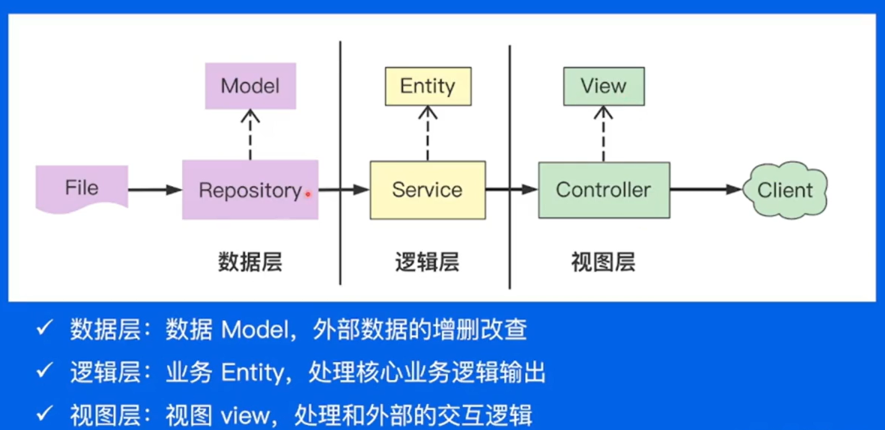  

<br>

---
## GO 错误和异常处理
优先使用 `errors.New` 来创建匿名变量来直接表示该错误。有格式化需求时使用 `fmt.Errorf`  
复杂错误（错误嵌套）在 `fmt.Errorf` 中使用 `%w` 关键字来将一个错误 wrap 至其错误链中

使用 `errors.Is` 可以判定错误链上的所有错误是否含有特定的错误  
使用 `errors.As` 在错误链上获取特定种类的错误

`error` 尽可能提供简明的上下文信息链，方便定位问题  

`panic` 一般不在业务逻辑中使用（如果当前 goroutine 中所有 deferred 函数都不包含 recover 就会造成整个程序崩溃）。用于真正异常（不能继续下去）的情况：当程序启动阶段发生不可逆转的错误时，可以在 init 或 main 函数中使用 panic   
`recover` 生效范围：在当前goroutine的被defer的函数中  

<br>

---
## GO 性能优化建议
<b>预分配内存</b> 尽可能在 `make()` 创建切片（slice）、map 时提供初始容量信息（`make([]int, 0, size)` &emsp; `make(map[int]int, size)`）   

切片的本质是一个数组片段的描述，包括：数组指针、片段的长度、片段的容量（不改变内存分配情况下的最大容量）  
切片操作并不复制切片指向的元素   
在已有切片基础上创建一个新的切片（ 如 `origin[len(origin)-2:]` ）会复用原切片的底层数组，如果只是要用一小部分，会导致大内存没有被释放   
建议：`make` 一个新切片，再调用 `copy` 拷贝原切片的部分（用copy代替re-slice）  

<br>

使用 `strings.Builder` 或 `bytes.Buffer` 处理拼接字符串（两者也都可以预分配内存），不要直接用 `+`（字符串底层是不可变类型，占用内存大小固定，每次`+` 都会重新分配内存）  
`strings.Builder` 和 `bytes.Buffer` 底层都是`[]byte`数组，内部维护了扩容策略  
`bytes.Buffer` 转化为字符串重新申请了一块空间， `strings.Builder` 直接将底层的 []byte 转换为字符串类型返回   

<br>

空结构体实例不占用内存空间，可作占位符  
`m := make(map[int]struct{})` 实现 Set  

<br>

通过 atomic 包 维护<b>原子变量</b>  
上锁是操作系统实现的，属于系统调用，`sync.Mutex` 一般用于保护一段逻辑  
atomic 操作是通过硬件实现的   
对于非数值系列，可以使用 `atomic.Value`，`atomic.Value` 能承载一个 `interface{}`  

<br>

---
### 性能优化 
- 业务代码优化
- SDK
- 基础库
- 语言运行时系统优化
- OS

<br>

---
## 自动内存管理（GC）
Mutator：业务线程，分配新对象，修改对象指向关系  
Collector：GC线程，找到存活对象，回收死亡对象的内存空间  

GC算法：
* Serial GC：只有一个 Collector  
* Parallel GC：支持多个 Colletors同时回收   
* Concurrent GC：Collector(s) 和 Mutator(s)可以同时执行  
  Collector(s) 必须感知到对象指向关系的改变 （已标记为存活的对象所指向的对象必须要标记） 

<br>

* ### 追踪垃圾回收 Tracing Garbage Collection
<b>对象被回收的条件：指针指向关系不可达的对象</b>  
标记根对象：静态变量、全局变量、常量、线程栈等  
标记：找到所有可达对象（<b>求指针指向关系的传递闭包</b>）  
清理所有不可达对象：清理策略  
&emsp; Copying GC：将存活对象复制到另外的内存空间  
&emsp; Mark-sweep GC：将死亡对象的内存标记为“可分配”（使用freelist管理空闲内存）  
&emsp; Mark-compact GC：移动并整理存活对象（原地整理对象）  
<b>根据对象的生命周期，使用不同的标记和清理策略</b>  

<br>

* ### 分代GC &emsp; Generational GC
基于分代假说（Generational hypothesis）：most objects die young.  
每个对象都有“年龄”：经历过 GC 的次数  
目的：对年老和年轻的对象制定不同的GC策略，降低整体内存管理的开销  
不同年龄的对象处在heap的不同区域  

年轻代：由于存活的对象少，可以使用 Copying GC；GC 吞吐率高  
年老代：趋于一直活着，反复复制开销大，可以使用 Mark-sweep GC  

<br>

* ### 引用计数 Reference Counting
<b>每个对象都有一个与之关联的引用数目</b>  
对象存活：当且仅当引用数大于0  

优点：内存管理的操作被平摊到程序运行中 & 不需要了解 runtime 的实现细节  
缺点：
- 维护开销大，通过<b>原子操作</b>保证对引用计数操作的原子性和可见性  
- 无法回收环形引用  
- 内存开销：每个对象都引入额外内存空间  
- 回收（大数据结构）内存时依然可能引发暂停  

<br>

---
## Go内存分配
Go 内存分配 ———— <b>提前将内存分块</b> mspan 再继续划分为小块   
noscan mspan：分配不包含指针的对象 ———— GC不需要扫描  
scan mspan：分配包含指针的对象 ———— GC需要扫描  

Go 内存分配 ———— <b>对内存做多级缓存</b>  
借鉴 TCMalloc（Thread Caching）  
mcache 管理一组 mspan，每个p包含一个 mcache用于快速分配，为绑定与p上的g分配对象   
当 mspan 中没有分配对象（mspan为空）时，不会直接释放归还给 OS，而是会被缓存到 mcentral 中供其他 mcache 使用  

分配路径长  
优化方案：Balanced GC  
每个 g 绑定一大块内存（1KB），称作 goroutine allocation buffer（GAB）  
GAB 用于 nospan 的小对象（< 128B）分配  
使用<b>三个指针 start，end，top</b> 维护GAB   
使用 Bump Pointer（指针碰撞）风格作对象分配，<b>只需移动指针</b>，且不需与其他 g 互斥  
GAB 对 go内存管理来说是一个大对象（<b>把多个小对象的分配合并成一个大对象的分配</b>）  
问题：只有一个小对象时，也导致 GAB 占用的内存延迟释放  
方案：移动存活的对象（<b>用 Copying GC 管理小对象</b>）；当 g 的 GAB 总大小超过一定阈值时，将 GAB 中存活的对象复制到另外分配的 GAB 中，原先的 GAB 可以释放  

<br>

---
## 编译器和静态分析（编译优化）
静态分析：不执行代码，推导程序的行为，分析程序的性质  
控制流：程序执行的流程（代码块组成控制流图）  
数据流：数据在控制流上的传递  

过程内分析：仅在函数内部进行分析  
过程间分析：考虑过程调用时参数传递和返回值的数据流和控制流  

### Go 编译器优化  
函数内联（Inlining）：消除函数调用开销；把过程间分析转化为过程内分析  

逃逸分析：分析代码中指针的动态作用域（指针在何处被访问）  
- 从对象分配处出发，沿着控制流，观察对象的数据流  
- 是否 作为参数传递给其他函数；传递给全局变量；传递给其他goroutine；传递给已逃逸的指针所指的对象  

<b>未逃逸的对象可以在栈上分配</b>，分配与回收的速度更快，并减少了在 heap 上的分配，降低了 GC 负担  

<br>

---
### GORM 数据库操作
* GORM 查询数据  

Go 语言中实现 <b>对象和数据库映射</b> 的框架

使用 First 获取第一天（主键升序）时，注意查询不到数据时会返回 ErrRecordNotFound  
使用 Find 查询多条数据，查询不到数据时不会返回错误  
使用 struct 作为条件时，只会构造非零值作为条件；可使用 Map 构造含0的条件或使用 Select  
 
* GORM 更新数据  
  
使用 struct 更新时，只会更新非零值；可使用 Map 更新或使用 Select 选择字段  

### Kitex RPC操作
<b>使用IDL定义服务与接口</b>  
抽象出基础服务，可以复用  

如果我们要进行 RPC ，就需要知道对方的接口是什么，需要知道传什么样的参数与返回值的类型。通过 IDL 来约定双方的协议  

### Hertz HTTP框架
<b>对外提供 API，实现接口聚合</b>

<br>

---
## 规则引擎
规则引擎是一种嵌入在应用程序中的组件。实现了 <b>将业务决策从应用程序代码中分离出来</b>，并使用预定义的语义模块编写业务决策。接受数据输入，解释业务规则，并根据业务规则做出业务决策   

输入：计算规则、商品价格、用户标签、商品属性...  
输出：获得的积分  
规则简单容易配置、可扩展  

<b>数据输入：</b>
- 支持接受使用预定义的语义编写的规则作为策略集
- 接受业务的数据（如价格、标签）作为执行过程中的参数  

<b>规则理解：</b>
- 能够按照预先定义的词法、语法、优先级、运算符等正确理解业务规则所表达的语义

<b>规则执行：</b>
- 根据执行时输入的参数对策略集的规则进行正确的解释和执行
- 对执行过程中的数据类型进行检查，确保执行结果正确

---
### 规则引擎的实现（编译原理）
理解：词法分析、语法分析  
执行：抽象语法树（唯一地表示一个表达式）  
输入输出：参数注入、类型检查（遍历树）  

词法分析 将源代码字符串转换成词法单元（切分表达式）  
通过 <b>有限自动机</b> 识别token   

语法分析 在词法分析基础上识别表达式（token流）的语法结构   
转换成抽象语法树，每一个节点（子树）代表一个语法单元   
BNF范式在语法定义时就蕴含了一定的优先级信息  
递归下降算法：自顶向下构建语法树，不断对token进行语法展开  
对优先级的表达：
```go
type precedence struct {
	validSymbols []Symbol; // 当前优先级支持的运算符类型
	nextPrecedence *precedence; // 更高优先级的
	planner planner; // 当前优先级的处理函数
}
```

语法树执行  
预先定义好每种操作符（语法树节点）的执行逻辑 后序遍历二叉树

类型检查  
类型综合：根据子表达式的类型构造父表达式的类型   
类型检查可以发生在表达式的编译阶段（构造语法树阶段），需要提前声明参数的类型；也可以发生在执行的阶段   
在一个节点的左右节点执行完成后，分别校验左右子节点的类型是否符合 <b>对应操作符的类型检查预设规则</b>  

<br>

---
## 架构
有关软件整体结构和组件的抽象描述；指导整个软件系统各方面的设计  
实现一个软件的<b>方法选择</b>  

单机架构（运维需要停服）   
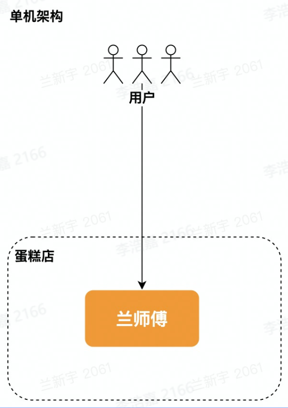  

单体架构：分布式部署   
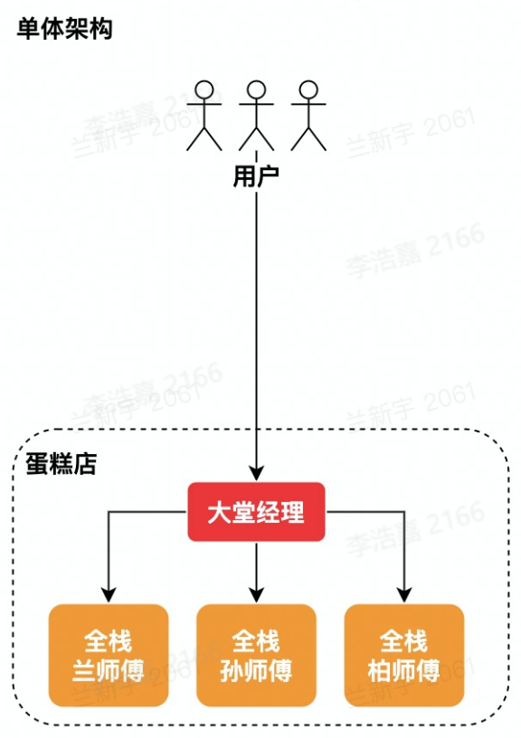  

垂直应用架构：按应用垂直切分  
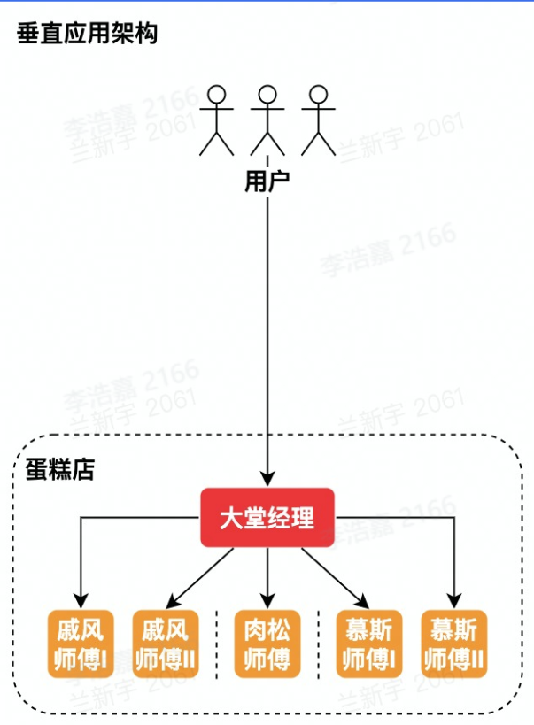  

SOA（Service-Oriented Architecture）架构：
- 将应用的不同功能单元抽象为服务  
- 定义服务间的 <b>通信标准</b>

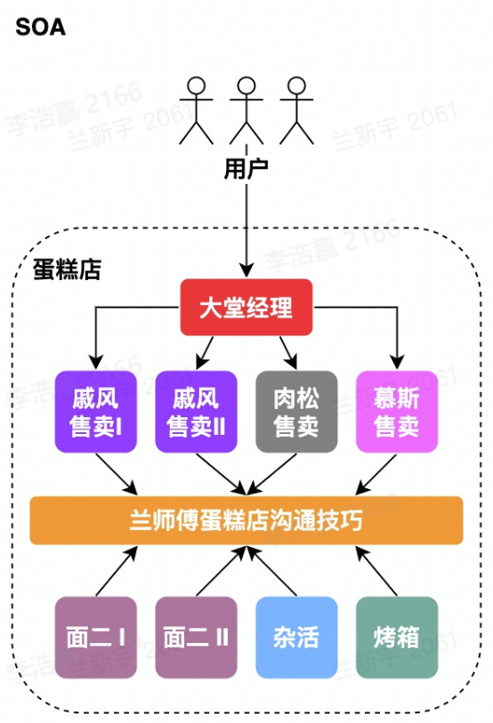  

问题：
- 数据一致性
- 高可用（如何合作？）
- 治理（容灾）
- 解耦 vs 过微  

微服务架构：SOA的去中心化演进方向   
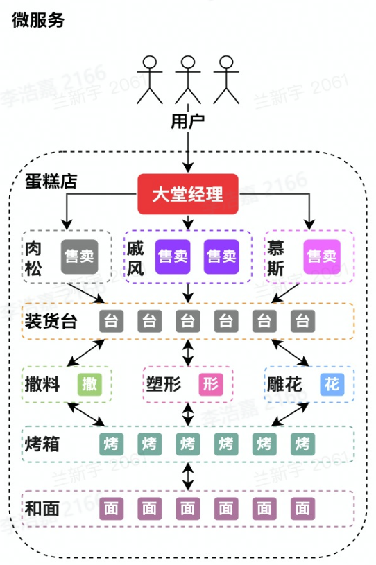  

---
## 企业级后端架构 
云计算：通过软件自动化管理，提供计算资源的服务网络  
基础：
- 虚拟化技术（整租 vs 合租） 
- 编排方案（管理资源的状态）  

架构：
- IaaS（Infrastructure as a Service） 屏蔽物理资源
- PaaS（Platform as a Service） 对资源的“装修”
- SaaS（Software as a Service）
- FaaS（Function as a Service） 更轻量级的函数服务  

通信标准：
- HTTP（Restful API）
- RPC（Thrift，gRPC）  

### 云原生微服务架构
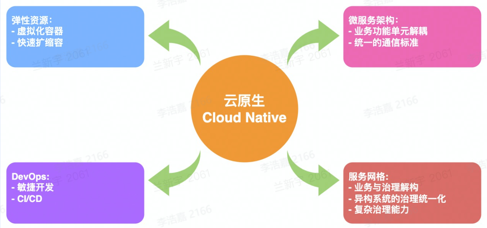    

<br>  

微服务中间件 HTTP vs RPC：考虑 性能；服务治理；协议可解释性   
HTTP处理端上调用   
业务层无需关心网络通信相关，这些交给中间件（框架）处理  
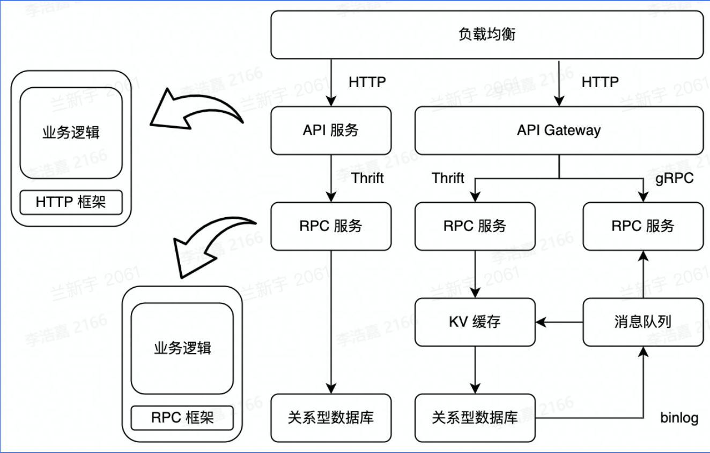

<br>
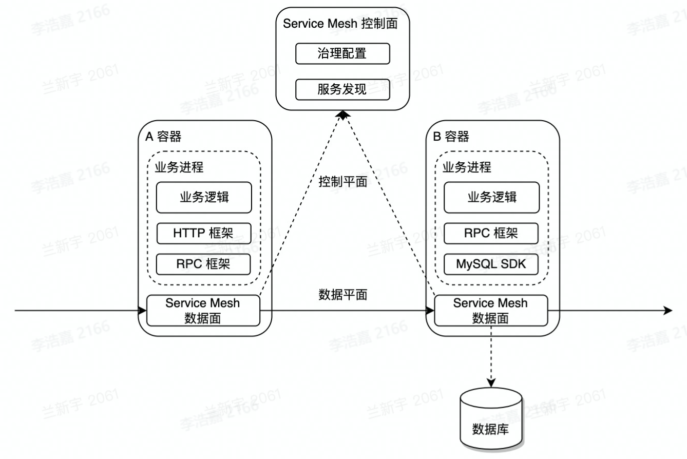  

服务网格：将通讯进一步与业务解耦（变为在数据面层）
- 微服务之间通讯的中间层
- 高性能网络代理
- 业务代码与治理（流量层面的逻辑）解耦  

---
### 企业级后端架构的挑战 
**离在线资源并池** 提供更多的弹性资源   

**自动扩缩容**（利用在线业务的潮汐性）  

**微服务亲和性部署**  
将满足亲和性条件的容器调度到同一台宿主机  
微服务中间件和服务网格通过共享内存通信   
服务网格控制面（中心化的控制面）实施灵活、动态的流量调度  

**流量治理**  
基于微服务中间件 & 服务网格的流量治理  

**CPU水位负载均衡**（打平异构环境算力差异）  

<br>

---
## 分布式理论
衡量故障：正确性、时间、状态、原因  
六种故障模型，从处理的难易程度分类
- Byzantine failure：节点可以任意篡改发送给其他节点的数据，是最难处理的故障
- Authentication detectable byzantine failure (ADB)：节点可以篡改数据，但不能伪造其他节点的数据
- Performance failure：节点未在特定时间段内收到数据，即时间太早或太晚
- Omission failure：节点收到数据的时间无限晚，即收不到数据
- Crash failure：节点停止响应，持续性的故障
- Fail-stop failure：错误可检测，是最容易处理的故障

TCP在工程上近似解决两节点间通信（两节点共识）问题  

逻辑时钟为分布式事务定义时间戳

CAP理论：一致性（多个副本间）、可用性、分区容错性  

数据库事务ACID理论：原子性（Atomicity）、一致性（Consistency）（事务的一致性）、隔离性（Isolation）和持久性（Durability）  
事务是数据库系统中非常重要的概念，它是数据库管理系统执行过程中的一个逻辑单元，它能够保证一个事务中的所有操作要么全部执行，要么全都不执行

<br>

### 两阶段提交
为了使分布式系统架构下的所有节点在进行事务提交时保持一致性  
pre阶段 + commit阶段  
participants宕机：（某节点本地执行不成功）回滚事务  
coordinator宕机：（不知道数据库此时状态）新起coordinator，查询状态后重复两阶段提交   

### 三阶段提交
cancommit阶段 + precommmit阶段 + commit阶段  
先询问是否可以执行（避免无意的写日志操作，防止资源浪费）  

### MVCC
悲观锁：操作数据时直接锁住，直到操作完成后释放  
乐观锁：只在执行更新时，判断别人是否修改，只有在冲突时才放弃操作  
MVCC维护一份数据的多个版本，<b>为每个修改保存一个版本</b>（与事务的时间戳相关）   

---
## 微服务框架

<br>

---
### 系统设计
秒杀业务的特点：
- 瞬时流量高
- 读多写少
- 实时性要求高  

秒杀的挑战：
- 资源成本
- 反欺诈（倒买倒卖）
- 高性能
- 防止超卖
- 流量管控
- 扩展性
- 鲁棒性

设计高并发系统：
- 服务无状态
- 批量写入（降低系统压力）
- 最终一致性

<br>

---
## 分布式定时任务
定时任务是指系统为了 <b>自动</b> 完成特定任务，<b>实时、延时、周期性</b> 完成特定任务的过程  
分布式定时任务是把分散的、可靠性差的定时任务（业务）纳入统一的 <b>平台</b> ，并实现集群管理调度和分布式部署的一种定时任务的管理方式  

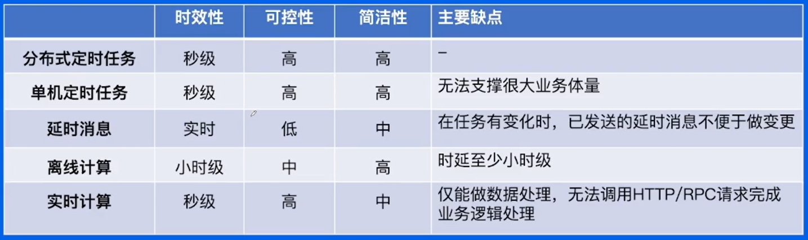  

执行方式：
- 单机任务：随机触发一台机器完成任务（计算量小、并发度低的任务）  
- 广播任务：广播到所有机器执行同一个任务  
- Map任务：一个任务可以分出多个子任务（计算量大，单机无法满足）
- MapReduce任务：Map任务的扩展，可以汇总计算子任务的结果   

### 整体架构
分布式定时任务要解决的核心问题：  
&emsp;&emsp; <b>触发（什么时间点）、调度（如何协调机器、调度任务）、执行</b>  
核心组件：
- 触发器Trigger &emsp; 解析任务规则、生成触发事件
- 调度器Scheduler &emsp; 分配任务、管理任务生命周期、管理资源调度
- 执行器Executor &emsp; 干活  
- 控制台Admin &emsp; 提供任务管理和干预的功能  

数据流：  
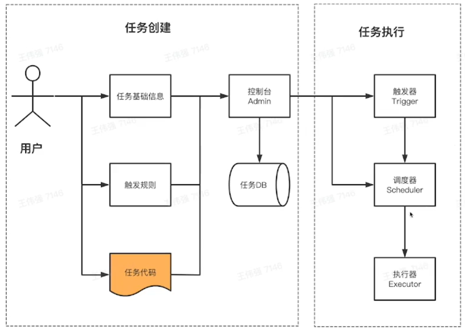  

功能架构：  
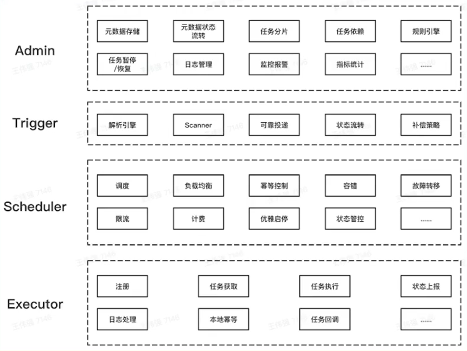  

E-R图：  
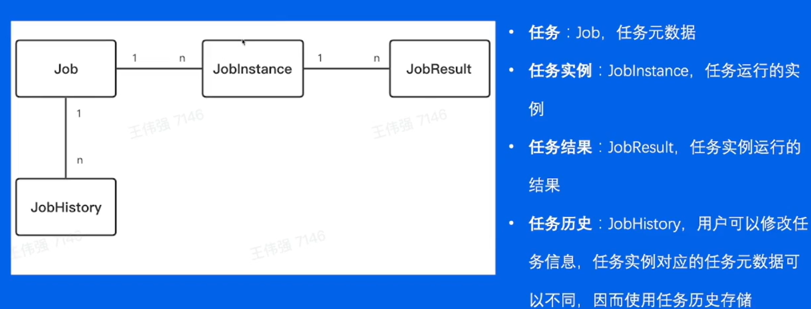  
任务元数据：基础信息Who、触发时机When、执行行为What、执行方式How  
任务实例：Job_id关联元数据、触发时机、状态&结果、过程信息  

<br>

### 触发器
设计约束：需支持大量任务；需支持秒级调度；周期任务需要多次执行；需保证秒级扫描的高性能，避免资源浪费   

多级时间轮  

Trigger集群模式如何避免多次触发：
- 数据库行锁方式 &emsp; 触发调度先先更新数据库JobInstance状态 &emsp; 效率低，节点越多性能越差  
- 分布式锁方式 &emsp; 尝试抢占分布式锁，抢锁成功才触发调度 可用Redis锁或Zookeeper锁  

<br>

### 调度器
核心问题：资源来源、资源调度、任务执行   

资源来源：业务系统（在线服务）提供 or 定时任务平台提供（消耗更多机器资源、接口调用权限问题、但可以避免相互影响并支持动态扩缩容）  

资源调度：节点选择问题
- 随机节点执行
- 广播执行
- 分片执行

资源调度：任务编排（任务的前序条件）  
使用有向无环图进行任务编排  

资源调度：故障转移（确保部分执行单元任务失败时，任务最终成功）  
分片任务基于一致性Hash策略分发任务，当某Executor异常时，调度器会将任务分发到其他Executor  

调度器可以集群部署，做到完全的无状态（哪一个来调度都可以）  
靠消息队列的重试机制保障任务一定会被调度  

<br>

### 执行器
先通过机器注册 注册到调度中心  
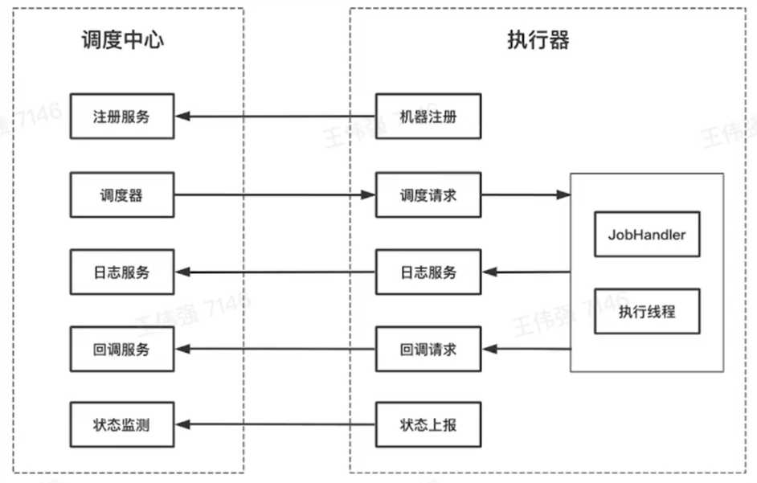  

基于注册实现执行器的弹性扩缩容  

<br>

---
## 消息队列
保存消息的容器 本质上是一个队列 需要支持 <b>高吞吐、高并发、高可用</b>  

### Kafka
创建Kafka集群 -> 新增topic -> 编写生产者逻辑 -> 编写消费者逻辑  

- Topic：逻辑队列（每一个不同的业务场景，对这个业务来说，所有数据存于Topic中）；内部partition分区，不同分区的消息可以并发处理   
- Cluster：Broker的物理集群，每个集群中可以建立多个不同的Topic  
- Producer：生产者，负责将业务消息发送到Topic中  
- Consumer：消费者，负责消费Topic中的消息  
- ConsumerGroup：消费者组，不同组的Consumer消费进度互不干涉   

Offset：消息在partition中的相对位置（也是ID）  
Replica：每个partition具有多个副本 Leader负责对外  

Producer发送消息时，可以采用 <b>批量发送&数据压缩</b>  

Broker中的消息文件结构：  
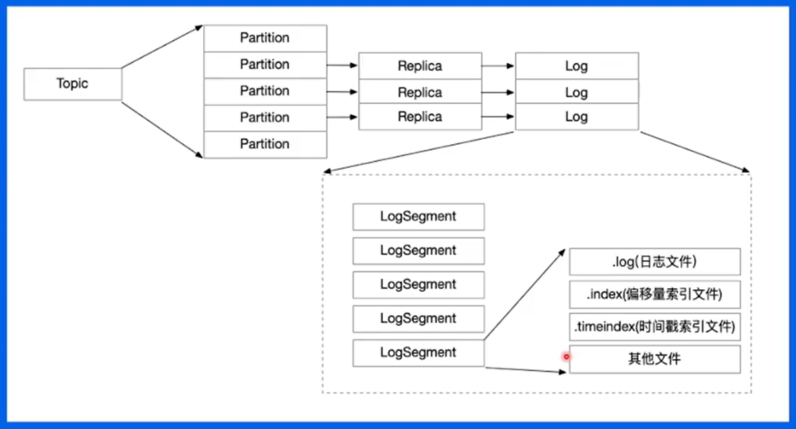  
副本最终以日志的形式写到磁盘上  
消息有过期机制  
日志将切分成有序的日志段  
Broker采用顺序写（末位添加），减少磁头运动寻道时间，提高写入效率  

Consumer通过发送 FetchRequest 请求消息数据，Broker会将指定Offset处的消息，按照时间窗口和消息大小窗口发送给Consumer  
<b>Broker拿到FetchRequest后如何处理、响应？</b>  

ConsumerGroup中partition的分配问题（组内Consumer分别拉取哪些partition）  
手动设置分配存在容灾问题，且扩缩容时麻烦（会带来数据中断）  
自动分配 需要ConsumerRebalance  

<br>

### BMQ
存算分离 底层增加分布式存储系统  

<br>

### RocketMQ
面向低延时场景、业务峰值（秒杀）场景  

较Kafka多一个 Tag字段 可以丰富消费的场景  
存在ProducerGroup 以支持事务消息  

NameServer提供路由  

通过最终一致性保证事务  
事务消息（类似两阶段提交）：  
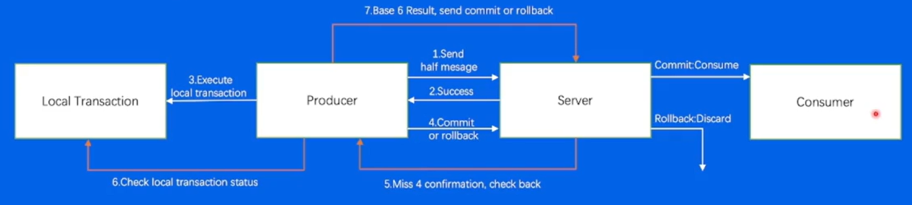  

<br>

---
## RPC框架
远程函数调用  
RPC需要解决的问题（与本地调用的区别）：
- 函数映射（本地时函数指针，但RPC是对于两个不同进程，不共享地址空间）
- 数据转换成字节流（参数传递）
- 网络传输（如何保证高效稳定）

IDL文件：约定的规范 &emsp; 通过一种中立的方式描述接口，使得不同平台上运行的对象和用不同语言编写的程序可以互相通信  
生成代码：通过编译器工具把IDL文件转换成对应语言的静态库  
编解码：内存表示与字节序列的相互转化  
通信协议：规范数据在网络传输中的内容和格式，通常还包含额外的元数据  
网络传输：通常基于成熟的网络库，TCP/UDP  

TLV编码：
- Tag：标签（类型）
- Length：长度
- Value：值（也可以是一个TLV结构）

协议层  
一个特殊字符作为每个协议单元结束的提示  
变长协议 由不定长部分与定长部分组成 定长部分需要描述不定长部分的长度  

协议构造：
- LENGTH：数据包大小，不包含自身  
- HEADER MAGIC：标识版本信息，协议解析时快速校验
- SEQUENCE NUMBER：表示数据包的seqID，可用于多路复用，在单个连接内递增
- HEADER SIZE：头长度
- PROTOCOL ID：编解码方式
- TRANSFORM ID：压缩方式
- INFO ID：传递一些定制的meta信息
- PAYLOAD：消息体

稳定性保障（衡量指标：请求成功率）：
- 熔断：保护调用方，防止被调用的服务出现问题影响整个链路  
- 限流：保护被调用方，防止大流量把服务压垮
- 超时控制：避免资源浪费在不可用节点上  

<br>

---
## 存储与数据库
数据的持久化：校验数据的合法性 -> 修改内存（用高效的数据结构组织数据） -> 写入存储介质（以寿命&性能友好的方式）  

存储系统：一个提供了读写、控制类接口，能够安全有效地把数据持久化的软件  

<br>

### 关系型数据库
关系 = <b>集合</b> = 任意元素组成的若干有序对  
反映了事物间的关系 描述两个实体间的联系   

关系代数 = 对关系作运算的抽象查询语言 （并、交、笛卡尔积）  

关系型数据库在存储系统基础上，<b>对结构化数据友好，支持事务（ACID特性），支持复杂查询语言</b>  

### 非关系型数据库
不要求严格的结构化 不一定支持事务与复杂查询语言  

<br>

### 单机存储 —— 本地文件系统 Linux
文件系统的管理单元：文件  
文件系统遵循VFS的统一抽象接口  

Linux文件系统关键数据结构：
- Index Node：记录文件元数据（如id、大小、权限、磁盘位置等）的节点 文件的唯一标识 &emsp; inode总数在格式化磁盘时就固定了  
- Directory Entry：记录文件名、inode指针、层级关系（parent） &emsp; 是内存结构 与inode是n对1关系  

### 单机存储 —— Key-Value存储
常见使用方式：`put(k,v)` `get(k)`  
常用数据结构：LSM-Tree（某种程度牺牲读性能，追求写入性能）  

### 分布式存储
分布式存储 = 在单机存储基础上实现了分布式协议 涉及大量网络交互  
### HDFS核心特点
- 支持海量数据存储
- 高容错性
- 弱POSIX语义（并非支持POSIX全集）
- 使用普通x86硬件

### Ceph核心特点
- <b>一切皆对象</b>，基于对象发展了很多高级接口（块存储、文件存储）
- 数据写入采用 <b>主备复制</b>（先写入主节点，再由主节点作链状的冗余复制）
- <b>数据分布模型</b> 采用 CRUSH算法（核心思想：哈希 + 权重 + 随机）

<br>

### 单机数据库
事务在单机上执行，也可能通过网络交互实现分布式事务  
### 关系型
使用SQL交互  
核心组件：
- Query Engine：负责解析query，生成查询计划
- Txn Manager：负责事务并发管理
- Lock Manager：负责锁相关的策略（锁管理、锁调度）
- Storage Engine：负责组织内存/磁盘数据结构（高性能读写、淘汰）
- Replication：负责主备同步

关键内存数据结构：B -Tree、B+ -Tree、LRUList  
关键磁盘数据结构：WriteAheadLog（RedoLog）、Page  

### 非关系型
交互方式各不相同  
没有关系约束后、schema相对灵活  

### 从单机到分布式  
单机数据库主要问题：容量、弹性、性价比  

<br>

---
## RDBMS 关系型数据库
事务Transaction：一组SQL语句组成的一个程序执行单元，需要满足ACID特性  
- 原子性Atomicity：事务中的操作要么都发生，要么都不发生
- 一致性Consistency：事务不能破坏关系数据的完整性以及业务逻辑的一致性（状态必须合法）
- 隔离性Isolation：一个事务不能影响其他事务
- 持久性Durability：事务完成后，该事务对数据库的更改持久地保存在数据库中，不会因为宕机等问题丢失

高并发、高可靠、高可用  

关系模型 <b>所有的数据都是一张二维表</b>（无论是实体，还是实体的联系）  
<b>每一行数据代表一个实体或者一个关系</b>

一个关系型数据库系统的关键:
- SQL引擎：解决SQL执行问题
- 存储引擎：解决存储问题
- 事务引擎：解决事务ACID问题

### SQL引擎
### 解析器Parser —— 词法分析、语法分析、语义分析  
### 优化器Optimizer —— 基于规则的优化 / 基于代价的优化  
### 执行器Executor  
拆分成不同算子，一面对用户千变万化的SQL
- 火山模型：每个Operator调用Next操作，访问下一层Operator，获得下层Operator返回的一行数据，计算处理后返回给上层   
优点：每个算子独立抽象实现，相互之间没有耦合，逻辑结构简单  
缺点：每计算一条数据有多次函数调用开销（CPU效率不高） 
- 向量化：每次一批数据（Batch N 行）&emsp; 函数调用次数1/N；CPU cache命中率更高；可以利用CPU的SIMD（single Instruction Multi Data）机制
- 编译执行：动态编译技术 编译成一个执行函数

<br>

### 存储引擎
InnoDB存储引擎：  
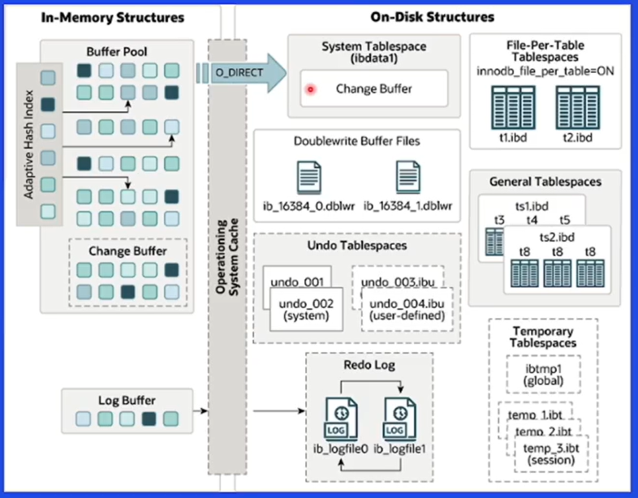
### In Memory 部分
Buffer Pool：数据缓存  
把整个BufferPool分成各个Instance 降低页面访问的冲突
通过HashMap定位block  
LRU算法实现淘汰机制  

Log Buffer：用于写日志

### On Disk 部分
系统表 存储元信息（描述数据库中的表和用户）  
普通的表 存数据  
Undo表

Page：  
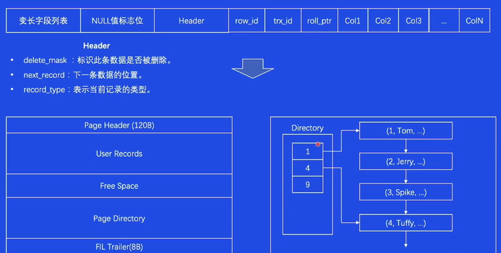  

B+树构建索引  
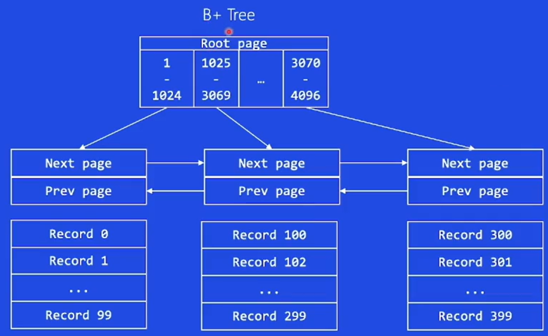  
页面内页目录先通过二分法定位到对应槽，然后遍历该槽的分组中的记录找到指定记录   
节点间双向链表连接以适合范围查询  

<br> 

### 事务引擎
保证原子性 —— UndoLog：逻辑日志，记录数据的增量变化  
保证隔离性 —— MVCC:读写互补阻塞 降低死锁概率  
保证持久化 —— 通过RedoLog保证事务持久化（提交前先写）  

<br>

### Sharding分库分表解决大容量问题
业务数据水平拆分  
代理层实现数据路由（定位数据在哪个服务器上）

<br>

---
## Redis
将数据分为冷热 热数据放入内存中  

数据从内存中读写  
数据保存到硬盘上防止重启数据丢失  
- 增量数据保存到aof文件
- 全量数据rdb文件

redis单线程处理所有操作命令（顺序执行）  

Redis 的 string 数据结构  
设计目标：节省空间、快速读取、快速变更  
二进制存储 可以存字符串、数字、二进制数据  
通常和 `expire`（有效期） 配合使用  
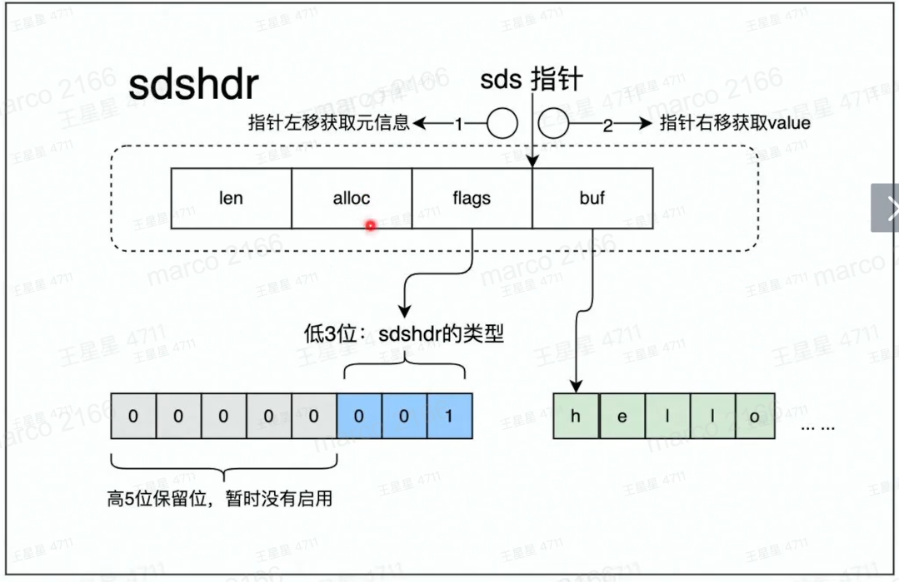  

### 消息通知（推送到ES引擎） 
使用list作为消息队列  
监听队列头是否有数据可以取出来  

Quicklist：双向链表 + listpack（在一个节点存储很多数据）  
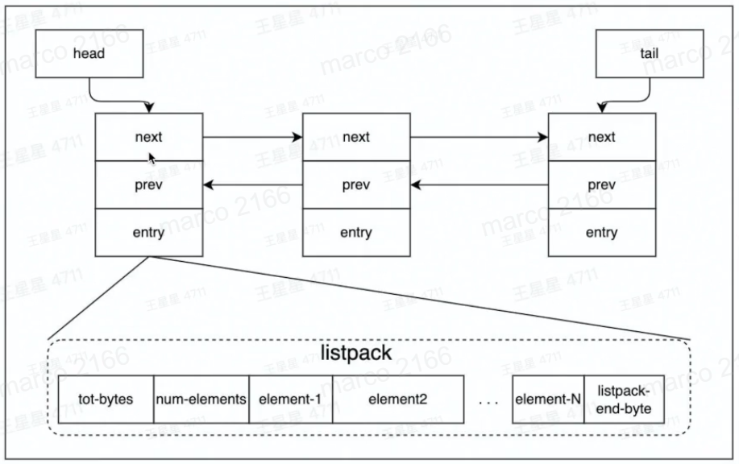  

### 使用Hash结构（dict）缓存计数  
使用`pipeline`打包命令，一次 set\get 多个key  

<b>可以一次取多个数据，其中每个数据项可以单独变更</b>  

Hash结构 = 槽位 + 单向链表拉链  
当拉链变得很长时，需要增加槽位  
渐进式rehash：将迁移过程平摊到每一次用户访问中（不会阻塞用户请求）   
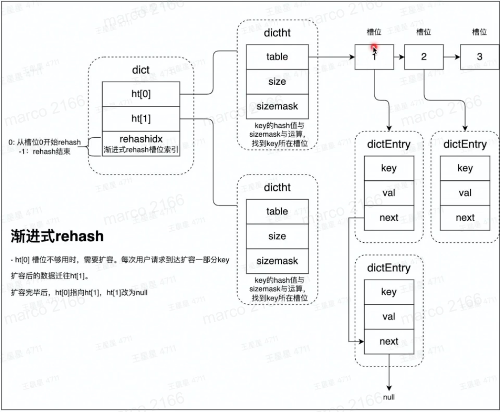  

### zset实现实时排序
跳跃表skiplist（多层链）  
结合dict后，实现通过key操作跳表  
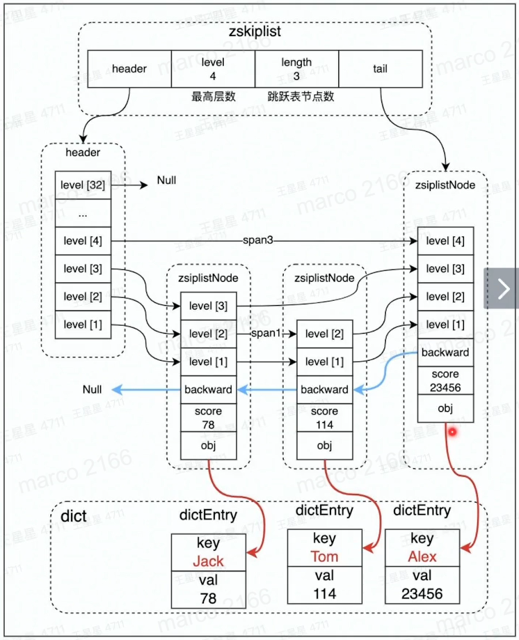  

<br>

### 通过时间戳生成key 实现限流
redis key作为限流计数（`Incr`实现递增）  

### 分布式锁
使用redis的 `setnx`（利用redis的单线程性质）  
存在的问题：  
- 业务超时解锁
- 主备切换临界点（锁可能还未同步）
- 集群脑裂，出现多个主节点时

### 消除大Key
- 拆分成小key 如将一个String拆分成多个String（需要额外解析工作）
- 将value压缩后写入redis
- 对于集合类结构hash、list、set，可以：
  - 拆分：用hash取余，位掩码决定放在哪个key中
  - 区分冷热：如榜单场景使用zset，只缓存前十页，后续放在DB里

### 解决热Key
- 业务服务侧设置localcache
- 拆分 更新时需要更新多个key，存在数据不一致的风险

redis访问代理负责热key发现和localcache
